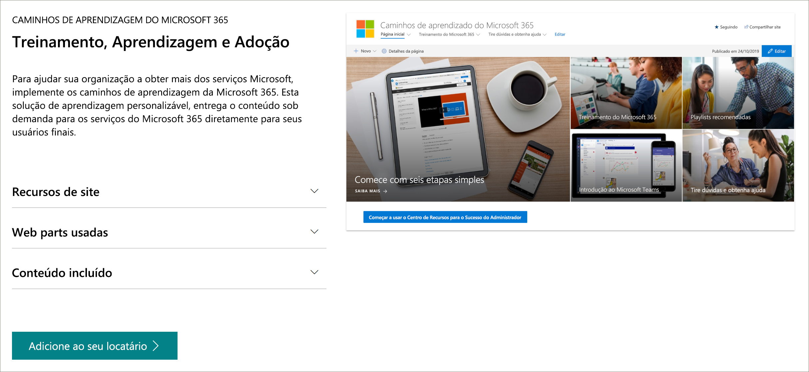

# Caminhos de aprendizado do Microsoft 365Microsoft 365 learning pathways 
Os caminhos de aprendizado do Microsoft 365 são uma solução de aprendizado sob demanda e personalizável, projetada para aumentar o uso e a adoção dos serviços do Microsoft 365 em sua organização.Microsoft 365 learning pathways is a customizable, on-demand learning solution designed to increase usage and adoption of Microsoft 365 services in your organization.    

> [!IMPORTANT]
> Em resposta aos comentários dos clientes, os caminhos de aprendizado agora oferecem suporte multilíngue para nove idiomas.In response to customer feedback, learning pathways now offers multilingual support for nine languages. Para obter informações e instruções sobre como habilitar o suporte multilíngue para os caminhos de aprendizado, leia os seguintes tópicos:For information and instructions about how to enable multilingual support for learning pathways, read the following topics: 
>- [Visão geral do suporte multilíngue para caminhos de aprendizadoOverview of multilingual support for learning pathways](custom_overview_ml.md) 
>- [Opções de configuração para os caminhos de aprendizagemSetup options for learning pathways](custom_setupoptions.md)  

## Treinamento personalizado sob demanda da MicrosoftOn-demand, custom training from Microsoft

Os caminhos de aprendizado do Microsoft 365 oferecem:Microsoft 365 learning pathways offers:

- **Um site de comunicação do SharePoint Online totalmente personalizável** - o portal de treinamento das rotas de aprendizado pode ser personalizado para adicionar a ajuda, o suporte e o conteúdo da comunidade da sua organização**A fully customizable SharePoint Online communication site** - The learning pathways training portal can be customized to add your organization's help, support, and community content
- **Fácil provisionamento** - forneça caminhos de aprendizado do Serviço de Provisionamento do SharePoint Online com apenas algumas etapas simples**Easy provisioning** - Provision learning pathways from the SharePoint Online Provisioning Service with just a few easy steps
- **A capacidade de criar suas próprias listas de reprodução de treinamento** - com os caminhos de aprendizado, você pode criar listas de reprodução de treinamento direcionadas para atender às necessidades exclusivas do seu ambiente**The ability to create your own training playlists** - with learning pathways, you can create targeted training playlists to meet the unique needs of your environment
- **Conteúdo atualizado** - os caminhos de aprendizado fornecem conteúdo por meio de um catálogo de conteúdo online da Microsoft, para que o conteúdo do seu site seja atualizado regularmente**Up-to-date content** - Learning pathways provides content through a Microsoft online content catalog, so the content at your site is regularly updated

> [!VIDEO https://www.microsoft.com/videoplayer/embed/RE42hMy]

## Serviço de livro de aparência do SharePointSharePoint look book service
Os caminhos de aprendizado podem ser provisionados do serviço de livro de pesquisa do SharePoint.Learning pathways can be provisioned from the SharePoint look book service. Quando os caminhos de aprendizado do Microsoft 365 são provisionados, as organizações obtêm um site de comunicação do SharePoint Online projetado para ser um portal de treinamento pronto para uso, juntamente com uma Web part de caminhos de aprendizado conectada a um catálogo online de conteúdo de treinamento.When Microsoft 365 learning pathways is provisioned, organizations get a SharePoint Online communication site designed to be an out-of-the box training portal, along with a learning pathways Web part connected to an online catalog of training content. 

## 4 etapas simples4 Easy Steps
Vamos começar a criar uma experiência de caminhos de aprendizado para o seu ambiente.Let's get started creating a learning pathways experience for your environment.
1. Leia a [visão geral do suporte multilíngue para os caminhos de aprendizado](custom_overview_ml.md).Read the [Overview of multilingual support for learning pathways](custom_overview_ml.md). 
2. Escolha uma [opção de configuração](custom_setupoptions.md) e provisione os caminhos de aprendizado do Microsoft 365.Choose a [setup option](custom_setupoptions.md) and provision Microsoft 365 learning pathways.  
3. Adapte os caminhos de aprendizado ao seu ambiente.Tailor learning pathways for your environment.
4. Compartilhe caminhos de aprendizado com os usuários usando nossas [ferramentas de adoção](driveadoption.md).Share learning pathways with your users using our [adoption tools](driveadoption.md).

## Comentários e SuporteFeedback and Support

As rotas de aprendizado do Microsoft 365 são um projeto de código aberto com suporte da nossa [lista de problemas online](https://aka.ms/CustomLearningHelp) no GitHub.Microsoft 365 learning pathways is an open source project supported through our [online issues list](https://aka.ms/CustomLearningHelp) on GitHub. A solução dos caminhos de aprendizado e seus componentes não são cobertos por nenhum contrato de suporte existente da Microsoft.The learning pathways solution and it's components are not covered by any existing Microsoft support contract.  
## Teste de linkLink Test
Este é um [teste de link interno](custom_setupoptions.md).This is an [internal link test](custom_setupoptions.md). Este é um [teste de link externo](https://adoption.microsoft.com/).This is an [external link test](https://adoption.microsoft.com/).
Este é um [teste de link de redirecionamento](https://aka.ms/CustomLearningHelp).This is a [redirect link test](https://aka.ms/CustomLearningHelp).

## Recursos adicionaisAdditional Resources
Você pode usar o site dos caminhos de aprendizado do Microsoft 365 para fornecer links para quaisquer fóruns de comunidade de usuários novos ou existentes.You can use the Microsoft 365 learning pathways site to provide links to any new or existing user community forums. Considere iniciar um grupo de usuários interno, se você ainda não tiver um, para permitir que as pessoas compartilhem histórias de sucesso e aprendam umas com as outras.Consider starting an internal user group, if you don't have one already, to enable people to share their success and learn from each other.  Se você não tiver tempo para criar um grupo de usuários interno, você e seus funcionários poderão ingressar na [Comunidade de Campeões do Microsoft Office 365](https://aka.ms/O365Champions) para treinamento mensal, associação à comunidade online e acesso antecipado a ferramentas e recursos do Office 365.If you don't have time to nurture an internal user group, you and your employees can join the [Microsoft Office 365 Champion community](https://aka.ms/O365Champions) for monthly training, membership in the online community, and early access to tools and resources for Office 365.