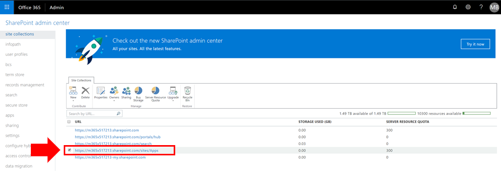
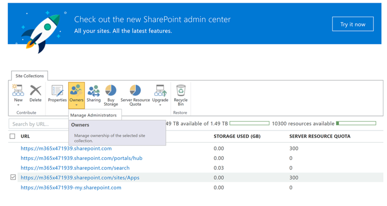
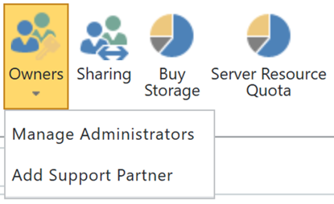

# Exibir ou adicionar um administrador ao catálogo de aplicativos do SharePoint OnlineView or Add an Administrator to your SharePoint Online App Catalog

Para instalar o CLO365 com êxito, a pessoa que está fazendo o provisionamento da solução precisa ser listada como administrador do catálogo de aplicativos de locatário.To successfully install CLO365, the person doing the provisioning of the solution needs to be listed as an administrator of the tenant app catalog.

1. No portal administração do Office 365, acesse o Centro de Administração do SharePoint OnlineFrom the Office 365 Administration portal go to the SharePoint Online Admin Center
1. **Selecione** a URL do Catálogo de Aplicativos na lista de sitesappadmin_url.png**Select** the App Catalog URL from the site collection list 
1. Confirme se o instalador CLO365 está listado como um dos administradores do catálogo de aplicativos.Confirm that the CLO365 installer is listed as one of the app catalog administrators.

Se seu nome de usuário estiver listado, você poderá retornar ao provisionamento do site de Aprendizagem Personalizada.If your user name is listed you can return to provisioning the Custom Learning site.  Se não concluir as próximas etapas.If not complete the next steps. 

## Adicionar um AdministradorAdd an Administrator

1. No Centro de Administração do SharePoint, selecione a caixa de seleção ao lado da URL do catálogo de aplicativos e selecione a caixa de seleção Proprietários.From the SharePoint Admin Center select the checkbox next to the app catalog URL and select the Owners drop-down box.

1. Selecione Gerenciar Administradores no menu suspenso Select Manage Administrators from the drop down menu 
1. Adicione o indivíduo correto como administrador de conjunto de sites e clique em OK para salvar suas alterações.Add the correct individual as a Site Collection Administrator and click OK to save your changes.
