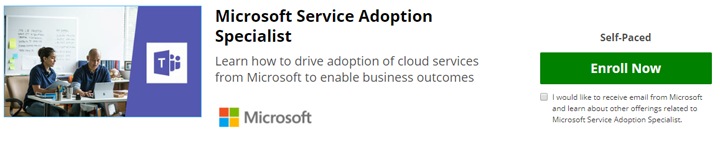

# Validar suas habilidades-tornar-se um especialista de adoção de serviçoValidate your Skills - Become a Service Adoption Specialist

Se a adoção do serviço fizer parte de sua função ou se você quiser se aprofundar no treinamento formal deste tópico, poderá inscrever-se no curso online fornecido pela Microsoft em nosso site de parceiros, EdX.org.If service adoption is a part of your role or you want to go deeper with formal training on this topic you can enroll in the online course provided by Microsoft on our partner site, EdX.org. 

Este [curso online de especialista em adoção de serviço](https://aka.ms/AdoptionCert) é **gratuito para auditoria**.This [Service Adoption Specialist on-line course](https://aka.ms/AdoptionCert) is **free to audit**.  Se quiser receber o certificado do EdX para conclusão, é necessário ter uma taxa de $99.If you'd like to receive your EdX certificate for completion a fee of $99.00 is required.  Este curso foi criado pelo [Karuana Gatimu](https://linkedin.com/in/karuanagatimu) da engenharia do Microsoft Teams com entrada de vários especialistas em ti da Microsoft e de ti da Microsoft.This course was authored by [Karuana Gatimu](https://linkedin.com/in/karuanagatimu) of Microsoft Teams Engineering with input from multiple Microsoft MVP's and Microsoft IT experts.  As práticas recomendadas contidas no foram coletadas de observar o setor como um todo e são complementares a uma educação formal de gerenciamento de alterações na organização.The best practices contained within have been gathered from observing the industry as a whole and are complimentary to a formal organizational change management education.  

Orientações práticas, ferramentas e conteúdo adicional estão contidos neste curso que permitirá que você valide seu skils nesse recurso de negócios importante.Practical guidance, tools and additional content are contained in this course that will allow you to validate your skils in this important business capability.  

Saiba mais em nosso [comunicado](https://aka.ms/AdoptionCertAnnouncement) sobre a publicação deste curso.Learn more in our [announcement](https://aka.ms/AdoptionCertAnnouncement) about the publication of this course. 

Junte-se à nossa comunidade online de usuários corporativos e profissionais de https://aka.ms/DriveAdoptionti aprendendo sobre a adoção em.Join our online community of business users and IT Professionals learning about adoption at https://aka.ms/DriveAdoption. 