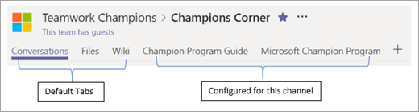

# Encontrando seus campeõesFinding your Champions 

É provável que você já saiba quem é seus campeões, mesmo se não tiver um programa formal.It is likely you already know who your champions are, even if you do not currently have a formal program.  São as pessoas que:These are people who:

Geralmente são vistas a ajudar as pessoas com a tecnologia existente a ensinar e a aprender sobre novas tecnologias podem ser vozes sobre as limitações das soluções atuais estão prestes a experimentar novas coisas, mesmo antes de outros colegas de trabalhoAre often seen helping others with existing technology Enjoy teaching and learning about new technology May be vocal about the limitations of current solutions Are keen to try new things, even before other co-workers

> [!NOTE]
> Os campeões são diferentes de pessoas que gostam de testar o novo software apenas para a tecnologia.Champions are different from people who enjoy testing new software for the technology alone. Os campeões prosperam em **ajudar outras pessoas** independentemente do contexto.Champions thrive on **helping others** regardless of context. 

## Comece pequeno e cresçaStart small and grow

Se sua organização não tiver um programa Champion atual ou se você quiser Reinvigorate-lo, você deve enviar um convite para um pequeno grupo de pessoas conhecidas que se encaixam no perfil acima.If your organization does not have a current Champion program or you would like to reinvigorate the one you have send an invitation to a small group of known people who fit the above profile.  Reúna juntos para discutir os objetivos do novo programa e obter seus comentários.Gather then together to discuss the goals of the new program and get their feedback. Campeões verdadeiros como ter sua voz ouvidos e sentem-se parte da criação de algo.True Champions like to have their voice heard and feel as if they are a part of creating something.  

## Fornecer estruturaProvide structure

Os programas de campeão bem-sucedidos têm um líder e uma programação regular para cumprir e discutir os problemas atuais.Successful champion programs have a leader and a regular schedule to meet and discuss current issues.  As reuniões mensais no mínimo são uma parte importante da criação de uma cultura positiva na Comunidade e na estimular o crescimento.Monthly meetings at a minimum are an important part of creating a positive culture in the community and fostering growth.  

Você também pode usar o Microsoft Teams para criar um hub para o programa de especialistas em equipe.You can also use Microsoft Teams to create a hub for your Teamwork Champions' program.  Um exemplo para essa estrutura de equipe pode ser encontrado neste [artigo](https://docs.microsoft.com/en-us/MicrosoftTeams/teams-adoption-your-first-teams).An example for that team structure can be found in [this article](https://docs.microsoft.com/en-us/MicrosoftTeams/teams-adoption-your-first-teams).

