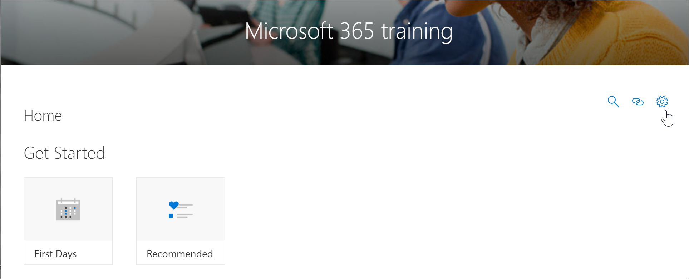

# Acessar a página de administração de aprendizado personalizada

A página Administração de aprendizado personalizada é o ponto de controle central para a administração da Web Part de aprendizado personalizado. A página de administração de aprendizado personalizada só está disponível para administradores do SharePoint. Os usuários com privilégios de membro visitando o site não verão a opção **administrar playlist** . Além disso, somente os administradores terão a capacidade de abrir a página Administração de aprendizado personalizada do item de menu do SharePoint **Home** .  

> [!IMPORTANT]
> As alterações feitas na página Administração de aprendizagem personalizada, como ocultar uma subcategoria ou lista de reprodução de produtos, serão refletidas em todas as instâncias da Web Part. Além disso, é recomendável que apenas um administrador no momento faça alterações na página de administrador de aprendizado personalizada, já que o aprendizado personalizado não fornece a detecção de colisão se várias pessoas estiverem usando a administração de aprendizado personalizada ao mesmo tempo.  

## Acesso a partir da Web Part de aprendizado personalizado-método preferido
Como mostraremos neste exemplo, a abertura da página de administração de aprendizado personalizada da Web Part é o método preferido, pois ela abre a página de administração em uma nova janela do navegador. Com esse método, é fácil virar de frente e para trás entre as páginas com guias para verificar ou modificar seu trabalho.  

1. Na home page de aprendizado personalizado, clique no bloco **treinamento do Office 365** .
2. Clique no menu **Personalizar sistema de aprendizado** e, em seguida, clique em **administrar playlist**. 

## Acesso a partir do item de menu de aprendizado personalizado
Em vez de navegar para uma página com uma Web Part, os administradores podem acessar a página Administração de aprendizado personalizada no item de menu da **página inicial** do SharePoint. 

- Na home page de aprendizado personalizado, clique no menu **página inicial** e, em seguida, clique em **Administração de aprendizado personalizada**.

