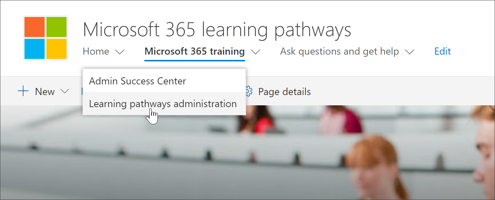

# Acessar a página Administração de Caminhos de Aprendizagem

A administração de caminhos de aprendizagem é gerenciada a partir da página CustomLearningAdmin.aspx. Esta página de administração só está disponível para Administradores do SharePoint. Os usuários com privilégios de membro visitando o site não verão **o** ícone de engrenagem de administração na Web Part. Além disso, somente administradores terão a capacidade de abrir a página de administração a partir do item de **menu** Administração de caminhos de aprendizagem no menu **Home** do SharePoint. 

> [!IMPORTANT]
> As alterações feitas na página Administração de Aprendizagem Personalizada, como ocultar uma subcategoria de produto ou uma playlist, serão refletidas em todas as instâncias da Web Part. Além disso, é recomendável que apenas um administrador faça alterações na página de administração, já que o Aprendizado Personalizado não fornece detecção de colisão se várias pessoas estão usando a página ao mesmo tempo.  

## Acesso da Web Part Caminhos de aprendizagem - método preferencial
Abrir a página Administração da Web Part é o método preferencial, pois abre a página em uma nova guia do navegador. Com esse método, é fácil virar para frente e para trás entre as páginas guias para verificar ou modificar seu trabalho.  

1. Na página Inicial dos caminhos  de aprendizado do Microsoft 365, clique no pacote de treinamento do **Office 365.**
2. Clique no **ícone Administração** na Web Part, conforme mostrado no exemplo a seguir.

## Acesso do item de menu Home
Em vez de navegar até uma página com uma Web Part, os administradores podem acessar a página Administração a partir do item de menu **Home** do SharePoint. 

- Na home page Caminhos de Aprendizagem do Microsoft 365, clique no **menu** Página Inicial e clique em Administração de Aprendizagem **da Microsoft.**

