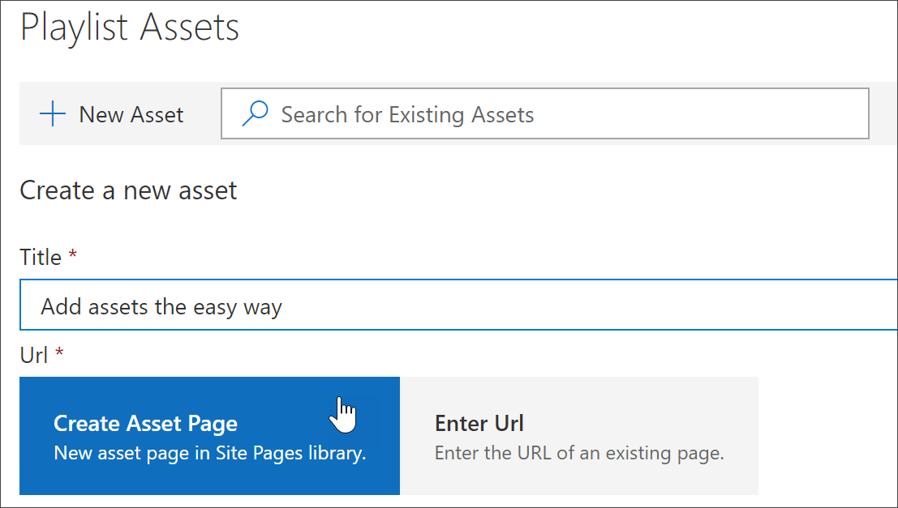
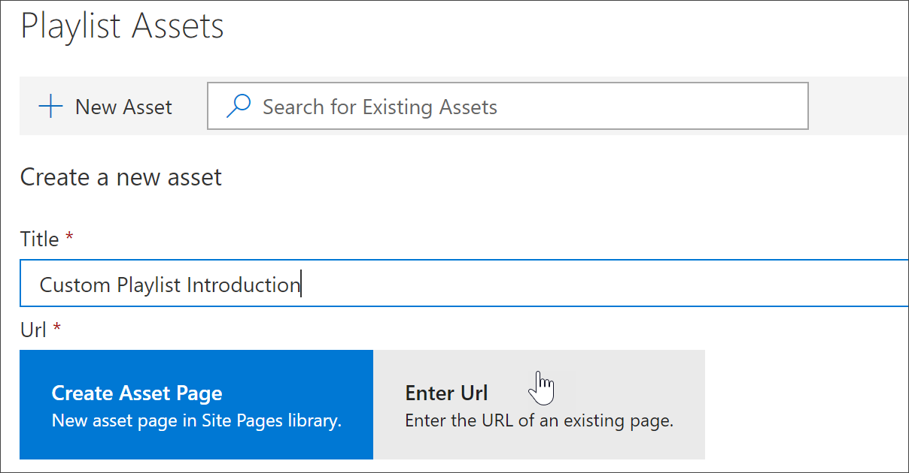
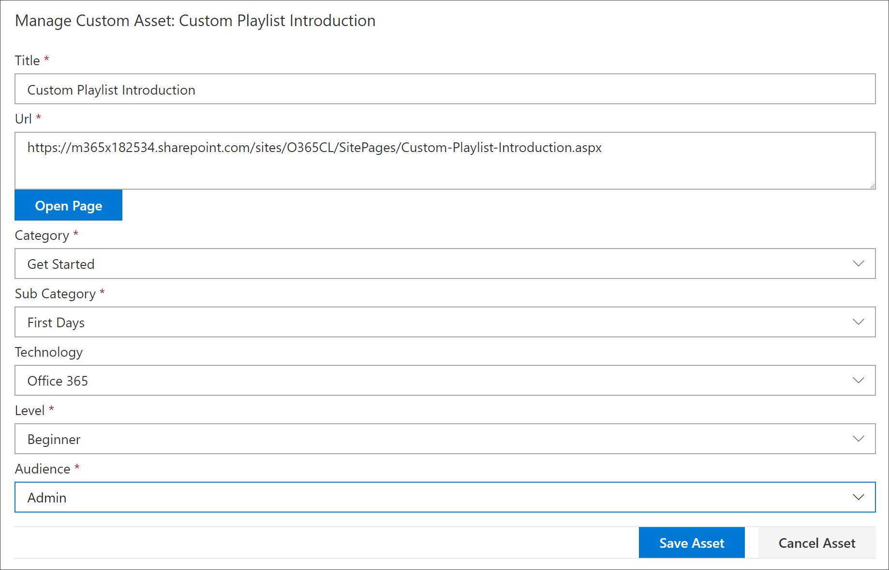
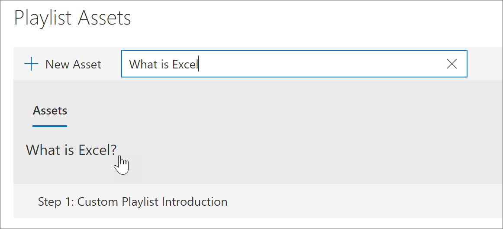
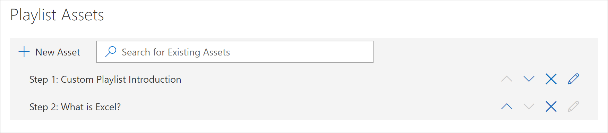
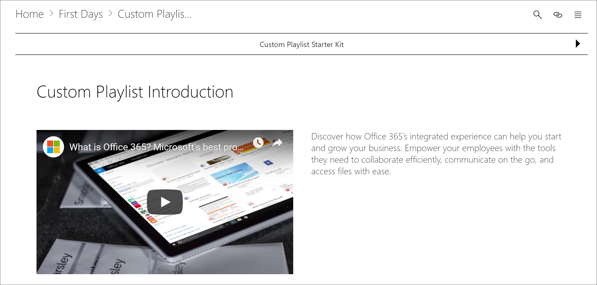

# Adicionar ativos a uma lista de reprodução personalizada

Com os caminhos de aprendizado, você pode adicionar os seguintes ativos a uma lista de reprodução:

- **Ativos de cursores de aprendizado microsoft 365 existentes** -estes são ativos que fazem parte do catálogo do Microsoft Online ou de ativos que sua organização já adicionou aos caminhos de aprendizado.
- **Novos ativos** -esses são ativos que você adiciona aos caminhos de aprendizado criados a partir de páginas do SharePoint que você cria ou ativos do SharePoint que já estão disponíveis em um site do SharePoint em sua organização. 

> [!TIP]
> Se um ativo da playlist da Microsoft não atender às suas necessidades, crie uma nova lista de reprodução e adicione os ativos da Microsoft e quaisquer ativos recém-criados à lista de reprodução para criar a experiência desejada. Você não pode modificar as listas de reprodução de caminhos de aprendizado fornecidas pela Microsoft, mas é possível adicionar ativos fornecidos por cursores de aprendizado a uma lista de reprodução personalizada.   

## Criar um novo ativo para uma lista de reprodução

Há duas opções para adicionar um novo ativo a uma lista de reprodução.

- **Criar página de ativos** -com esta opção, os caminhos de aprendizado irão gerar uma nova página do SharePoint em branco para você e adicioná-lo à lista de reprodução. Você pode adicionar conteúdo à página e salvá-lo.  
- **Insira a URL** -com esta opção, você cria a página com antecedência ou você já tem a página disponível e especifica a URL para adicionar a página à lista de reprodução.

### Criar página de ativo 
Com a opção **criar página de ativos** , você fornece um título para o ativo e, em seguida, clica em criar página de ativos para criar e abrir uma nova página do SharePoint para edição. 

1.  Se a lista de reprodução ainda não estiver aberta para edição, na página **Administração de aprendizado personalizada** , clique na lista de reprodução que você deseja editar. 
2. Para adicionar um novo ativo a uma lista de reprodução, clique em **novo ativo**. 
3. Insira um título. Neste exemplo, insira "Adicionar ativos a uma lista de reprodução" e, em seguida, clique em **criar página de ativos**.

4. Clique em **abrir página**.
5. Clique no ícone **Editar** e, em seguida, clique em **Editar Web Part** na área título.
6. Em **layout**, clique em **simples**. 
7. Adicione uma nova seção de uma coluna e, em seguida, adicione um texto de exemplo à página para que ele se pareça com o exemplo a seguir. 

7. Clique em **Publicar**.
8. Retorne à página **Administração de aprendizado personalizada** . 
9. Preencha o restante das propriedades do ativo e clique em **salvar ativo.**

### Insira a URL
Com a opção **Inserir a URL** , você fornece um título para o ativo e, em seguida, clica em **Inserir a URL** para especificar a página do SharePoint que você deseja adicionar à lista de reprodução. 

1.  Se a lista de reprodução não estiver aberta para edição, na página **Administração de aprendizado personalizada** , clique na lista de reprodução que você deseja editar. 
2. Para adicionar um novo ativo a uma lista de reprodução, clique em **novo ativo**. 
3. Insira um título. Neste exemplo, digite "introdução à playlist personalizada" e, em seguida, clique em **Inserir URL**. 

4. Insira a URL da página do SharePoint que você criou em uma seção anterior [criar páginas do SharePoint para listas de reprodução personalizadas ](custom_createnewpage.md) e preencha o restante dos campos, conforme mostrado na ilustração a seguir.

5. Clique em **salvar ativo**. 

## Adicionar um ativo existente a uma lista de reprodução

Ativos existentes consistem em ativos de cursores de aprendizado fornecidos pela Microsoft ou ativos que já foram adicionados aos caminhos de aprendizado por sua organização. 

- Na caixa de **pesquisa** , insira uma frase de pesquisa e, em seguida, selecione um ativo nos resultados da pesquisa. Neste exemplo, insira "o que é o Excel?" para adicionar um tópico introdutório do Excel à lista de reprodução.

## Editar, mover e excluir ativos
Você pode editar ativos personalizados criados, mas não ativos da Microsoft. No entanto, você pode remover todos os ativos de uma lista de reprodução e alterar os ativos da ordem. 

### Editar um ativo
- Clique no botão Editar de um ativo, modifique o ativo e clique em salvar ativo. 

### Mover um ativo em uma lista de reprodução
- Clique na seta para cima ou para baixo à direita do ativo para mover a ordem de ativos na lista de reprodução

### Remover um ativo de uma lista de reprodução
- Clique no ícone remover da playlist X para o ativo. 

## Exibir a playlist em ação
Agora que você adicionou ativos a uma lista de reprodução, vamos fechar a lista de reprodução e vê-lo em ação. 

1. Clique em **fechar playlist**.
2. Clique na guia com a página de **treinamento do Office 365** .
3. Atualize a página e, em seguida, clique em **primeiro dias** em **introdução**.
4. Clique em **Starter Kit de cursores de aprendizado** para exibir sua primeira playlist em ação. 

