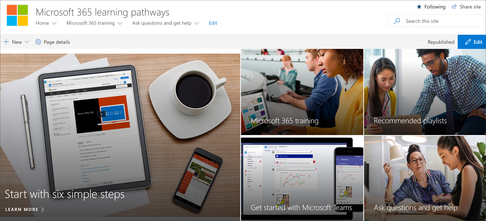

# Adicionar site de aprendizado personalizado de proprietários

O site de aprendizado personalizado para o Office 365 está hospedado em seu locatário do Office 365, portanto, você precisará entrar no Office 365, se ainda não estiver conectado, para acessar o site. 

## . 

1.  Abra o navegador da Web e navegue até office.com ou o local de entrada da sua organização. 
2.  Entre com seu nome de usuário e senha.
3.  Navegue até o local do site. Se você não o tiver disponível, poderá encontrá-lo no email que você recebeu do serviço de provisionamento PnP. Selecione SharePoint na home page do Office 365 e, em seguida, selecione o site de **aprendizado personalizado para o office 365** . Você pode ter um nome diferente. 
5. Clique no bloco de **treinamento do Office 365** para ver o pacote completo de playlist de treinamento disponível com o aprendizado personalizado e para verificar se o aprendizado personalizado está funcionando conforme o esperado. 

## Exibir todo o conteúdo de aprendizado personalizado
A página de treinamento do Office 365 hospeda a Web Part de aprendizado personalizada configurada para mostrar todos os treinamentos disponíveis para aprendizado personalizado. 

1. Role para baixo na página para exibir todas as categorias e subcategorias.
2. Faça um pouquinho dos pneus. Clique em algumas subcategorias e, em seguida, clique em algumas listas de reprodução para saber como o conteúdo de aprendizado personalizado é organizado. 

## Adicionar proprietários ao site
Como administrador de locatários, é improvável que você seja a pessoa que personaliza o site, portanto, você precisará atribuir alguns proprietários ao site. Os proprietários têm privilégios administrativos no site para que eles possam modificar as páginas do site e remarcar o site. Eles também podem ocultar e mostrar o conteúdo fornecido por meio da Web Part de aprendizado personalizado. Eles também terão a capacidade de criar uma lista de reprodução personalizada e atribuí-las às subcategorias personalizadas.  

1. No menu **configurações** do SharePoint, clique em **permissões do site**.
2. Clique em **configurações de permissão avançadas**.
3. Clique em **aprendizagem personalizada para proprietários do Office 365**.
4. Clique em **novo** > **Adicionar usuários a este grupo**, adicione as pessoas que você deseja que sejam proprietários e clique em **compartilhar**.

