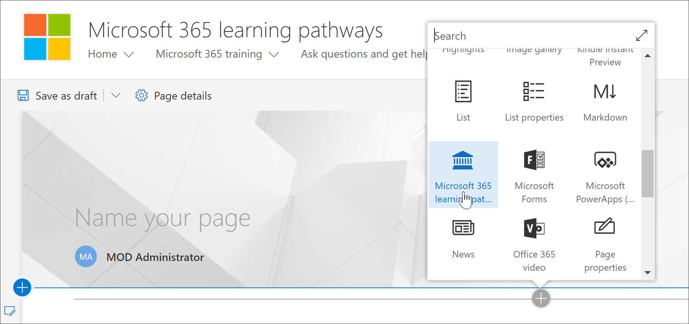
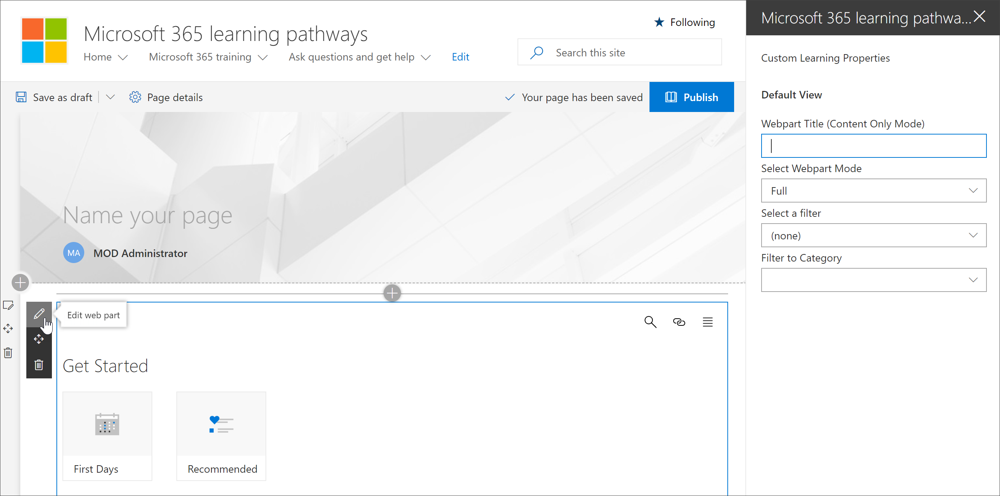

# Adicionar e editar a Web Part de aprendizado personalizada

O aprendizado personalizado oferece flexibilidade para adicionar a Web Part de aprendizado personalizado a uma página do SharePoint e, em seguida, filtra o conteúdo da Web Part para atender aos objetivos de aprendizado da página. Por exemplo, você pode criar uma página "fazer a mudança para o OneDrive" e, em seguida, adicionar a Web Part e configurá-la para mostrar listas de reprodução de migração do OneDrive personalizadas criadas especialmente para sua organização.

1.  Clique no ícone de engrenagem do SharePoint e, em seguida, clique em **Adicionar uma página**.
2.  Clique em **Adicionar uma nova seção (+)** no lado esquerdo da página e, em seguida, clique em **uma coluna**.
3.  Clique **+** em e selecione **aprendizagem personalizada para a** web Part do Office 365. 

## Editar a Web Part de aprendizado personalizado
Você pode editar a Web Part de aprendizado personalizada para mostrar todo o conteúdo de aprendizado personalizado disponível ou uma categoria, subcategoria, lista de reprodução ou ativo específico. 

1.  Clique em **Editar Web Part**.

2. No painel Propriedades de aprendizado personalizado, filtre a Web Part para o seguinte. 

- Modo WebPart: completo
- Filtro: subcategoria
- Subcategoria: Excel

3. Agora, a página deve ter uma aparência semelhante à seguinte imagem: 

## Adicionar um título e publicar a página
1. Na área título da página, digite "criar sua própria experiência".
2. Clique no ícone **Editar Web Part** na área título, selecione **sem formatação** em **layout**e, em seguida, feche o painel **Propriedades** .
3. Clique em **publicar**.
