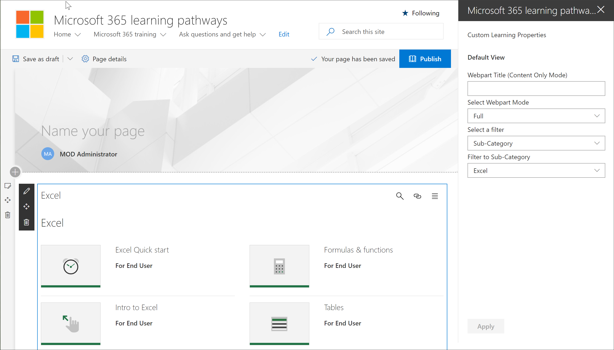

# Adicionar e editar a Web Part de cursores de aprendizado da Microsoft 365Add and Edit the Microsoft 365 learning pathways web part

Os caminhos de aprendizado da Microsoft 365 oferecem a flexibilidade para adicionar a Web Part de cursores de aprendizado da Microsoft 365 a uma página do SharePoint e, em seguida, filtrar o conteúdo da Web Part para atender aos objetivos de aprendizado da página.Microsoft 365 learning pathways gives you the flexibility to add the Microsoft 365 learning pathways web part to a SharePoint page, and then filter the contents of the Web part to meet the learning objectives for the page. Por exemplo, você pode criar uma página "fazer a mudança para o OneDrive" e, em seguida, adicionar a Web Part e configurá-la para mostrar listas de reprodução de migração do OneDrive personalizadas criadas especialmente para sua organização.For example, you could create a "Make the Switch to OneDrive" page, then add the Web part and configure it to show custom OneDrive migration playlists created especially for your organization.

1.  Clique no ícone de engrenagem do SharePoint e, em seguida, clique em **Adicionar uma página**.Click the SharePoint Gear icon, and then click **Add a page**.
2.  Clique em **Adicionar uma nova seção (+)** no lado esquerdo da página e, em seguida, clique em **uma coluna**.Click **Add a new section (+)** on the left-hand side of the page, and then click **One Column**.
3.  Clique em **+** e selecione Web Part de **cursores de aprendizado Microsoft 365** .Click **+**, then select **Microsoft 365 learning pathways** web part. 

## Editar a Web Part de aprendizado personalizadoEdit the Custom Learning web part
Você pode editar a Web Part de cursores de aprendizado da Microsoft 365 para mostrar todo o conteúdo de aprendizado personalizado disponível ou uma categoria, subcategoria, lista de reprodução ou ativo específico.You can the edit the Microsoft 365 learning pathways web part to show all the available Custom Learning content or a specific category, subcategory, playlist, or asset. 

1.  Clique em **Editar Web Part**.Click **Edit web part**.

2. No painel Propriedades de aprendizado personalizado, filtre a Web Part para o seguinte.In the Custom Learning Properties pane, filter the Web part for the following. 

- Modo WebPart: completoWebpart Mode: Full
- Filtro: subcategoriaFilter: Subcategory
- Subcategoria: ExcelSubcategory: Excel

3. Agora, a página deve ter uma aparência semelhante à seguinte imagem:Your page should now look something like the following image: 

## Adicionar um título e publicar a páginaAdd a title and publish the page
1. Na área título da página, digite "criar sua própria experiência".In the title area of the page, type "Create your own experience".
2. Clique no ícone **Editar Web Part** na área título, selecione **sem formatação** em **layout**e, em seguida, feche o painel **Propriedades** .Click the **Edit web part** icon in the Title area, select **Plain** under **Layout**, and then close the **Properties** pane.
3. Clique em **Publicar**.Click **Publish**.
