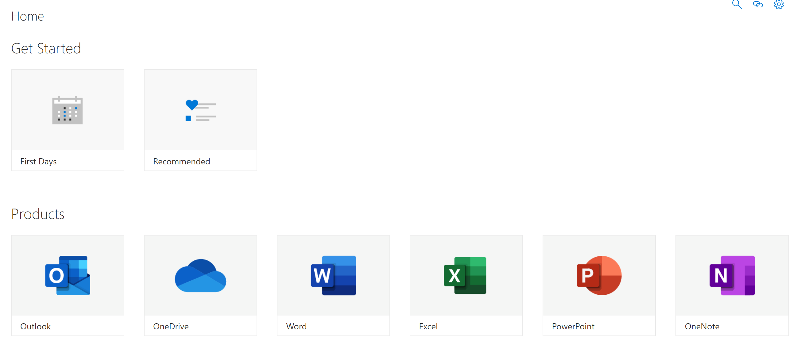

# Conheça as páginas de Aplicativo do SharePoint

Os caminhos de aprendizagem fornece duas SharePoint de aplicativos que você deve conhecer como administrador. Essas duas páginas não são editáveis e não devem ser excluídas. 

- CustomLearningAdmin.aspx
- CustomLearningViewer.aspx

## CustomLearningAdmin.aspx

A página CustomLearningAdmin.aspx fornece recursos administrativos para caminhos de aprendizagem, incluindo ocultar e mostrar conteúdo e criar e editar subcategorias e playlists. Vamos abranger esta página e sua funcionalidade em mais detalhes nas seções posteriores.

### Exibir CustomLearningAdmin.aspx

1. Clique no SharePoint **Configurações** e clique em **Páginas de Site de** Conteúdo do  >  **Site.** 
2. Clique **em CustomLearningAdmin.aspx**. 

## CustomLearningViewer.aspx
A página CustomLearningViewer.aspx fornece um visualizador para exibir o conteúdo dos caminhos de aprendizado na Web Part. Por exemplo, se você copiar um link de Playlist e compartilhá-lo com um colega de trabalho, o link, quando clicado, leva o usuário para a página Visualizador e exibe o conteúdo vinculado. 

### Exibir CustomLearningViewer.aspx

1. Clique no SharePoint **Configurações** e clique em **Páginas de Site de** Conteúdo do  >  **Site.** 
2. Clique **em CustomLearningViewer.aspx**. 

