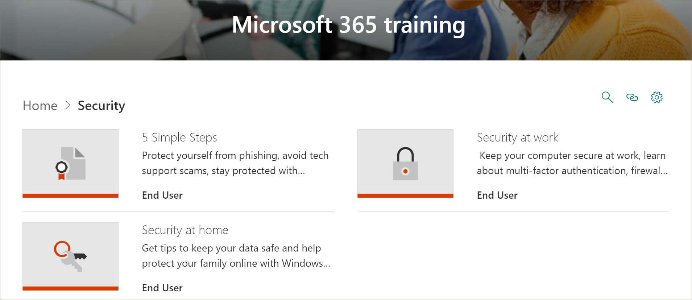

# Atualizações de conteúdo do Microsoft 365 Learning Pathways
Os percursos de aprendizagem se esforçam para aderir a um ciclo de atualização de conteúdo trimestral. Para saber mais sobre como as atualizações de conteúdo são aplicadas e como gerenciar atualizações de conteúdo, consulte [Manage Content Updates](custom_contentupdatesmanage.md). 

## Atualizações de conteúdo de março de 2021
A seguir, lista as atualizações de conteúdo para março de 2021. 

### Local de trabalho híbrido
Para ajudar as organizações a fazer a transição para um local de trabalho híbrido, onde os funcionários trabalham de casa e no escritório, fornecemos playlists para ajudar os usuários a executar reuniões mais eficazes, criar ambientes de reunião inclusivos, colaborar de forma assíncrona e alcançar grandes públicos com eventos ao vivo. A subcategoria de local de trabalho híbrida inclui as seguintes playlists e ativos.

#### Executar reuniões efetivas
- Executar reuniões efetivas
- Reuniões híbridas
- Considerações sobre o espaço de reunião híbrido
- O que fazer antes, durante e após reuniões híbridas
- Agendar reuniões efetivas
- Planejar e conduzir reuniões efetivas
- Envolva sua audiência antes, durante e após reuniões híbridas
- Lista de verificação de reunião
- Reduzir a fatiga de reunião

#### Criar ambientes de reunião inclusivos
- Criar ambientes de reunião inclusivos
- Tornar reuniões e conteúdo relacionado acessível para todos
- Limitar distrações em reuniões
- Criar empatia entre fusos horário

#### Colaboração e coautoridade assíncronas
- Reduzir ou substituir reuniões por colaboração assíncrona
- Colaborar e coautor de conteúdo compartilhado
- Práticas recomendadas para colaborar no Microsoft 365
- Coautor arquivos do Microsoft 365
- Colaboração e coautoria de documentos
- Colaborar com o SharePoint, o Teams e o OneDrive
- Colaborar no Teams
- Usar bibliotecas de documentos no SharePoint
- Solucionar erros comuns de coautor

#### Alcançar grandes audiências com eventos ao vivo
- Usar eventos ao vivo para alcançar grandes públicos
- Começar a usar o Microsoft Teams para eventos ao vivo
- Planejar e agendar um evento ao vivo no Teams
- Organizar um live even

### Microsoft Teams
O Microsoft Teams foi atualizado com o seguinte conteúdo.

#### Gerenciar a playlist de reuniões
A playlist Gerenciar reunião tem o novo ativo a seguir.
- Dicas para reuniões do Teams

#### Teams na lista de reprodução de ir
A playlist do Teams em ir foi atualizada com os novos ativos a seguir.
- Iniciar um canal em uso
- Criar um canal em uso
- Gerenciar notificações em uso

#### Gerenciar agendamentos de equipe com turnos
A playlist Gerenciar agendamentos de equipe com Turnos foi adicionada com os seguintes ativos.
- O que é Shifts
- Turnos para gerentes
- Criar um agendamento de turnos
- Gerenciar uma agenda de turnos
- Turnos para funcionários firstline

#### Walkie Talkie, Tasks e Praise
A playlist Walkie Talkie, Tasks e Praise foi adicionada com os ativos a seguir.
- Walkie Talkie
- Usar o aplicativo Tarefa no Teams
- Tarefas para gerentes
- Tarefas para funcionários da Linha de Frente
- Comunicação e Elogio

#### Criar aprovações
A playlist Criar aprovação foi adicionada com os ativos a seguir.
- O que é aprovações?
- Criar uma aprovação
- Criar uma aprovação de um chat

### Listas
Uma nova subcategoria e uma lista de reprodução de listas foram adicionadas aos caminhos de aprendizado.

#### Começar com listas
A playlist Começar com Listas tem os novos ativos a seguir.
- Criar uma lista a partir do aplicativo Lists
- Criar uma lista em um canal do Teams
- Adicionar ou editar itens de lista
- Criar ou alterar a exibição de uma lista
- Editar um modo de exibição de lista
- Encontre e gerencie sua lista
- Compartilhar uma lista ou item de lista
- Controlar informações comerciais

### Formulários
A lista de reprodução Criar um formulário e exibir resultados foi atualizada com os novos ativos a seguir.

#### Criar um formulário e exibir resultados
- Criar um novo formulário ou um quiz
- Compartilhar um formulário para obter respostas
- Exibir resultados do formulário
- Usar a lógica de ramificação em seu formulário
- Adicionar seções à sua pesquisa ou questionário

### Excel
O Excel nos caminhos de aprendizado foi atualizado com o seguinte conteúdo.

#### Introdução ao Excel
A playlist Introdução ao Excel tem o novo ativo a seguir.
- Criar uma lista de menus suspensos

#### Tipos de dados vinculados
Uma nova lista de reprodução de tipos de dados vinculados foi adicionada aos caminhos de aprendizado com os seguintes ativos. 
- Converter texto em um tipo de dados da Organização
- Usar o Seletor de Dados para especificar tipos de dados da Organização
- Exibir e inserir dados de um tipo de dados da Organização

#### Fórmulas e funções
Dois novos ativos foram adicionados à lista de reprodução Fórmulas e funções.
- Função XLOOKUP
- Função CORRESP

### SharePoint
Todas as listas de reprodução e ativos do SharePoint foram atualizadas. As listas de reprodução atualizadas incluem:
- SharePoint Online Quick Start
- Introdução ao SharePoint Online
- Criar sites, postagens e listas
- Compartilhar e sincronizar com o SharePoint

## Atualizações de conteúdo de setembro de 2020
A seguir, lista as atualizações de conteúdo para setembro de 2020. 

### Segurança
Uma nova subcategoria de segurança foi adicionada com playlists e ativos para ajudar os usuários a trabalhar com mais segurança no escritório e em casa. 

#### Playlist "Cinco etapas simples"
- Proteger-se contra phishing
- Evitar esquemas de suporte técnico
- Trabalhar de casa com mais segurança
- Manter seu computador atualizado
- Mantenha-se protegido com a segurança do Windows

#### Playlist "Segurança em casa"
- Dicas para manter seus dados seguros
- Mantenha seu computador seguro em casa
- Ajudar a proteger sua família online com o Windows Security   

#### Playlist "Segurança no Trabalho"
- Manter o computador seguro no trabalho
- O que é Autenticação Multifatar?
- Proteção de rede e firewall na segurança do Windows
- Impedir alterações nas configurações de segurança com a Proteção contra Adulteração

### Playlist "Começar com o Teams"
Uma nova playlist "Começar com o Teams" foi adicionada à subcategoria "Começar/Primeiros Dias" para ajudar os usuários a se levantarem e executarem com o Teams. A playlist inclui:
- Bem-vindo ao Microsoft Teams  
- Obter sua equipe em funcionamento
- Trabalhar em canais  
- Carregar e compartilhar arquivos 
- Iniciar e fixar chats  
- Participar de uma reunião do Teams 
- Gerenciar reuniões 
 
### Noções básicas do Microsoft 365
Na categoria Produtos, a subcategoria "Office 365 Basics" foi atualizada para a categoria "Noções básicas do Microsoft 365". Os ativos aposentados na categoria "Office 365 Basics" ainda estarão disponíveis se eles foram adicionados a uma playlist personalizada.

#### Playlist "Get started"
- O que é o Microsoft 365?
- Entrar
- Office.com

#### Playlist "Criar e salvar"
- Usando os aplicativos da área de trabalho
- Usando Office.com aplicativos
- Salvar arquivos na nuvem
- Sincronizar arquivos sob demanda com o OneDrive

#### Playlist "Compartilhar e colaborar"
- Compartilhar arquivos no Microsoft 365
- Coautoria
- Use @mentions
- Acompanhamentos

#### Playlist "Trabalhar com o Microsoft Teams"
- Bem-vindo ao Microsoft Teams
- Visão geral de equipes e canais
- Criar e formatar uma postagem
- Iniciar e fixar chats
- Fazer chamadas
- Participar de uma reunião do Teams
- Dicas para reuniões melhores

#### Playlist "Obter o máximo do Windows"
- Encontre seus documentos, aplicativos e muito mais com a Pesquisa
- Microsoft Edge
- Microsoft Search no Bing

#### Playlist "Trabalhar de qualquer lugar"
- Aplicativo móvel do OneDrive
- Aplicativo móvel do Outlook

#### Playlist "Recursos legais do Microsoft 365"
- Designer do PowerPoint
- Ideias no Excel
- Editor no Word
- Tornar seu conteúdo acessível

### Playlist "Criar um gráfico" no Access
Uma subcategoria "Criar uma playlist de gráfico" foi adicionada à subcategoria "Products\Access".  
- Criar um gráfico de colunas
- Criar um gráfico de barras
- Criar um gráfico de linha
- Criar um gráfico de pizza
- Criar um gráfico de combinação

### Atualizações do Teams
A subcategoria "Product\Microsoft Teams" foi atualizada com os seguintes ativos. 

#### Playlist "Gerenciar reuniões"
- Participar de uma reunião do Teams
#### Playlist "Trabalhar com postagens e mensagens"
- Criar e formatar uma postagem

### Planner 
Os ativos a seguir foram adicionados à lista de reprodução "Use Planner" em "Products\Planner".
#### Usar playlist do Planner
- To Do vs Planner
- Consulte suas tarefas do Planner em Fazer
- Usar o Aplicativo tarefas no Teams

### Word
O ativo a seguir foi atualizado na playlist "Compartilhar e coautor com o Word".

#### Playlist "Compartilhar e coautor com o Word"
- O ativo "Colaborar em documentos do Word com coautor em tempo real" foi atualizado. 

### Office na Web
O ativo a seguir foi atualizado na playlist "Office for the Web: Word for the Web".

#### Playlist "Office for the Web: Word for the Web"
- Transcrever suas gravações

### PowerPoint (novo, atualizado)
Os ativos a seguir foram atualizados ou adicionados às listas de reprodução Products\PowerPoint. 

#### Playlist "Texto & tabelas com o PowerPoint"
- Alterar tinta manuscrita para formas, texto ou matemática no PowerPoint (novo)

#### Apresentar lista de reprodução de apresentação de slides
- Gravar uma apresentação (atualizado)

### Guias de Início Rápido do Office (atualizados)
As guias de Início Rápido do Office para todos os produtos do Office foram atualizadas. 

## Atualizações de conteúdo de abril de 2020
 Em resposta aos eventos atuais, a Atualização de Conteúdo de abril de 2020 fornece playlists de aprendizado e recursos projetados para habilitar o trabalho remoto em sua organização. Adicionamos um novo conjunto de playlists do Work remotamente e atualizamos o conteúdo do Microsoft Teams, especialmente para reuniões do Teams. Também adicionamos um novo conjunto do Office para as listas de reprodução da Web e adicionamos novos ativos do Microsoft Forms. Também fornecemos uma lista de recursos de Trabalho Remoto para administradores.  
 
 Para saber mais sobre como as atualizações de conteúdo são aplicadas e como gerenciar atualizações de conteúdo, consulte [Manage Content Updates](custom_contentupdatesmanage.md). A seguir, lista as atualizações de conteúdo de abril de 2020 do Microsoft 365. 

### O Office 365 foi renomeado para o Microsoft 365
O Office 365 foi renomeado para o Microsoft 365. A alteração de nome é refletida em todo o conteúdo dos caminhos de aprendizado do Microsoft 365. 

### Playlists novas ou atualizadas
As listas de reprodução a seguir foram adicionadas ou atualizadas.  

#### Trabalhar remotamente (2 novas playlists/11 novos ativos)
Uma nova subcategoria Work remotamente foi adicionada aos caminhos de aprendizado que apresenta as seguintes playlists e ativos: 

##### Trabalhar remotamente (cinco novos ativos)
- Trabalhar remotamente com o Office 365
- Introdução ao Office.com
- Comunicar ou reunir
- Armazenar seus arquivos de trabalho
- Alternativas avançadas
##### Práticas recomendadas para colaborar com o Office 365 (6 novos ativos)
- Introdução
- Compartilhar
- Coautoria
- Chat em arquivos
- Meet
- Celular

### Teams (nove novos ativos/seis ativos atualizados)
Várias atualizações foram feitas no conteúdo do Teams. 
#### Colaborar em equipes e canais (um ativo novo/um atualizado)
- Criar e usar canais privados (novos)
- Mostrar ou ocultar canais (atualizados)
#### Iniciar chats e chamadas (duas novas/uma atualizadas)
- Iniciar e fixar chats (novo)
- Ocultar chats, excluir mensagens (novo)
- Fazer chamadas (atualizadas)
#### Explorar aplicativos e ferramentas (um novo)
- Usar aplicativos (novo)
#### Trabalhar com postagens e mensagens
- Postar uma mensagem em vários canais (novo)
#### Gerenciar reuniões (três novos/quatro ativos atualizados)
- Ingressar em uma reunião do Teams (novo)
- Criar reuniões instantâneas com o Meet agora (atualizado)
- Reunir em um canal (novo)
- Gerenciar reuniões (novo)
- Mostrar sua tela durante uma reunião (atualizada)
- Mostrar slides do PowerPoint (atualizado)
- Mover durante uma reunião do Teams (atualizado)
#### Trabalhar com postagem e mensagens (uma nova)
- Postar uma mensagem em vários canais (novo)

### Office na Web
O Office para a Web fornece um conjunto de playlists para cenários em que os usuários querem criar, compartilhar e colaborar com o Office na Web. Esse conjunto de conteúdo também é valioso para organizações que estão fazendo a mudança do Google G Suite para o Microsoft 365.
#### Começar (cinco novos ativos)
- Introdução
- Encontre-o com a Pesquisa
- Criar novos documentos
- Voltar ao trabalho
- Arquivos recomendados
#### Outlook para a Web
- Conheça o Outlook para a Web
- Criar uma resposta ao email
- Organizar sua Caixa de Entrada
- Criar uma assinatura e uma resposta automática
- Agendar um compromisso ou reunião
- Criar uma edição de um contato
- Pesquisar emails, contatos e eventos
#### Word para a Web
- Conheça o Word para a Web
- Alterar o layout do documento
- Inserir tabelas e imagens
- Colaborar online
- Coisas legais no Word para a Web
#### Excel para a Web
- Conheça o Excel para a Web
- Criar fórmulas
- Inserir uma tabela dinâmica
- Obter informações com ideias
- Colaborar
- Economizar tempo com o Preenchimento Flash
- Pintar uma imagem com formatação condicional
#### PowerPoint para a Web
- Conheça o PowerPoint para a Web
- Inserir imagens, formas e muito mais
- Animação e transições
- Criar uma apresentação com outras pessoas
- Quando você estiver pronto para apresentar
- Projetando slides
#### Compartilhar seus documentos
- Compartilhar seus documentos
- Criar um link compartilhável
- Proteger seus documentos somente para pessoas específicas
- Compartilhar com alguém fora da sua organização 

### Microsoft Forms 
Por solicitação, também há alguns novos ativos forms. 
#### Formulários (quatro novos ativos) 
- Criar um formulário 
- Compartilhar um formulário 
- Exibir resultados de um formulário 
- Perguntas frequentes sobre o Microsoft Forms 

### Recursos adicionais para dar suporte a funcionários remotos
Você pode usar os caminhos de aprendizado para criar uma página de aterrissagem em seu site de caminhos de aprendizado para dar suporte a funcionários remotos. Ou você pode adicionar a Web Part de caminhos de aprendizado a uma página de suporte existente em seu site de caminhos de aprendizagem e filtrar a Web Part para mostrar as playlists Trabalhar Remotamente. Aqui está uma lista de alguns dos principais recursos da Microsoft para dar suporte ao trabalho remoto em sua organização. 
- [Como implementar o Microsoft Teams](/microsoftteams/how-to-roll-out-teams)
- [Conferências e reuniões no Microsoft Teams](/microsoftteams/deploy-meetings-microsoft-teams-landing-page)
- [Dar suporte a funcionários remotos usando o Microsoft Teams](/microsoftteams/support-remote-work-with-teams)
- [Perguntas frequentes: Suporte para sua força de trabalho remota](/microsoftteams/faq-support-remote-workforce)
- [As 9 principais maneiras como a MICROSOFT ESTÁ habilitando o trabalho remoto para seus funcionários](https://www.microsoft.com/microsoft-365/blog/2020/03/12/top-9-ways-microsoft-it-enabling-remote-work-employees/)
- [Treinamento do Microsoft Teams](/microsoftteams/training-microsoft-teams-landing-page)
- [Educação: Centro de Educação da Microsoft](https://education.microsoft.com) 
- [Educação: começar a aprender remotamente](https://education.microsoft.com/resource/4c0c02c0)

Para obter mais informações sobre como personalizar os Caminhos de Aprendizagem, consulte [Personalizar caminhos de aprendizagem.](custom_overview.md) 

## Atualizações de conteúdo de novembro de 2019
Bem-vindo à atualização de conteúdo dos caminhos de aprendizado do Microsoft 365. A partir da atualização de novembro de 2019, forneceremos um inventário atualizado do catálogo de caminhos de aprendizagem trimestralmente. Para a atualização de novembro de 2019, as novas subcategorias e playlists de conteúdo a seguir foram adicionadas ao catálogo de caminhos de aprendizado. Para saber mais sobre como as atualizações de conteúdo são aplicadas e como gerenciar atualizações de conteúdo, consulte [Manage Content Updates](custom_contentupdatesmanage.md).    

### Teams
Várias novas playlists foram adicionadas à subcategoria do Teams.
- Trabalhar com postagens e mensagens (quatro ativos)
- Carregar e encontrar arquivos (dois ativos)
- Configurar e participar de eventos ao vivo (quatro ativos)
- Gerenciar seu feed de atividades (dois ativos)
- Equipes em circulação (dois ativos)

### Centro de Sucesso do Microsoft 365
Adicionamos uma subcategoria do Centro de Sucesso dos caminhos de aprendizado do Microsoft 365 à experiência de caminhos de aprendizado. O Centro de Sucesso fornece as seguintes playlists.
- Novidades, O que mudou (três ativos)
- Planejar seu conteúdo de aprendizagem (dois ativos)
- Personalizar caminhos de aprendizado (oito ativos?)
- Impulsionar a adoção de caminhos de aprendizagem (um ativo)
- Medir o impacto dos caminhos de aprendizado (um ativo)

### Outlook
As listas de reprodução a seguir foram adicionadas à subcategoria do Outlook. 
- Outlook mobile: Gerenciar sua caixa de entrada (oito ativos)
- Outlook mobile: Pessoas e conexões (cinco ativos)
- Outlook mobile: Pesquisa e compartilhamento (quatro ativos)

### OneDrive
Os ativos de vídeo a seguir foram adicionados para o OneDrive. 
- Configurar seu iPhone ou iPad foi adicionado à playlist Introdução ao OneDrive
- Ativar o Backup do OneDrive foi adicionado à playlist Gerenciar seus arquivos com o OneDrive

### Planner
As seguintes playlists e ativos foram adicionados ao catálogo.  
- Início Rápido do Planner (seis ativos)
- Usar o Planner (oito ativos)

### Acessibilidade
A subcategoria Acessibilidade do conteúdo foi adicionada com as seguintes playlists. 
- Visão geral e recursos de acessibilidade do Microsoft 365 (três ativos)
- Criar mensagens de email mais acessíveis no Outlook (três ativos)
- Criar documentos do Word mais acessíveis (oito ativos)
- Criar planilhas do Excel mais acessíveis (três ativos)
- Criar slides mais acessíveis no PowerPoint (cinco ativos)

### Sway
A subcategoria sway do conteúdo foi adicionada com as seguintes playlists. 
- Início Rápido do Sway (quatro ativos)
- Compartilhar e acessar o Sway (cinco ativos)
- Adicionar conteúdo ao Sway (11 ativos)
- Personalizar Sway (cinco ativos)

### Access
- Acessar Início Rápido (quatro ativos)
- Introdução ao Access (três ativos)
- Criar um banco de dados do Access (dois ativos)
- Adicionar tabelas (dois ativos)
- Usar relações (cinco ativos)
- Adicionar e editar dados (dois ativos)
- Gerenciar dados com consultas (cinco ativos)
- Criar formulários (um ativo)
- Criar relatórios (dois ativos)
- Proteger bancos de dados (um ativo)