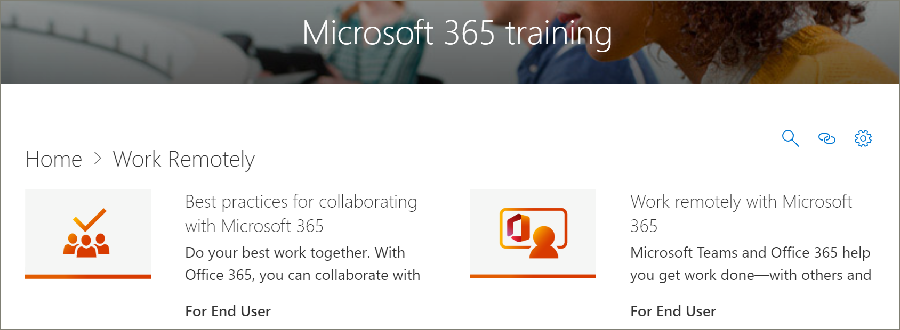

# Cursores de aprendizagem do Microsoft 365 atualizações de conteúdoMicrosoft 365 Learning Pathways Content Updates
Os caminhos de aprendizado se empenham em aderir a um ciclo trimestral de atualização de conteúdo.Learning pathways strives to adhere to a quarterly content update cycle. A lista a seguir as atualizações de conteúdo de abril de 2020.The following list the content updates for April 2020.

## Atualizações de conteúdo de abril de 2020April 2020 Content Updates
 Em resposta a eventos atuais, a atualização de conteúdo de abril de 2020 oferece playlists de aprendizado e recursos projetados para habilitar o trabalho remoto em sua organização.In response to current events, the April 2020 Content Update provides learning playlists and resources designed to enable remote work in your organization. Adicionamos um novo conjunto de trabalhos de listas de reprodução remotamente, atualizamos significativamente o conteúdo do Microsoft Teams, especialmente para reuniões do Teams, adicionamos um novo conjunto de sites do Office para as playlists da Web e adicionamos novos ativos do Microsoft Forms.We’ve added a new set of Work remotely playlists, significantly updated the Microsoft Teams content, especially for Teams meetings, added a new set of Office for the web playlists, and added new Microsoft Forms assets. Como parte da atualização, também fornecemos uma lista de recursos de trabalho remotos para administradores.As part of the update, we've also provided a list of Remote Work resources for administrators.  
 
 Para saber mais sobre como as atualizações de conteúdo são aplicadas e como gerenciar atualizações de conteúdo, consulte [Manage Content updates](custom_contentupdatesmanage.md).To learn more about how content updates are applied, and how to manage content updates, see [Manage Content Updates](custom_contentupdatesmanage.md). A seguir, as seguintes listas o curso de abril de 2020 Microsoft 365 Learning atualiza as atualizações de conteúdo.The following lists the April 2020 Microsoft 365 learning pathways content updates. 

### O Office 365 foi remarcado para a Microsoft 365Office 365 was rebranded to Microsoft 365
O Office 365 foi remarcado para a Microsoft 365.Office 365 has been rebranded to Microsoft 365. A alteração do nome é refletida no conteúdo dos caminhos de aprendizado do Microsoft 365.The name change is reflected throughout the Microsoft 365 learning pathways content. 

### Playlists novas ou atualizadasNew or Updated Playlists
As seguintes playlists foram adicionadas ou atualizadas.The following playlists have been added or updated.  

#### Trabalhar remotamente (2 novas playlists/11 novos ativos)Work remotely (2 new playlists/11 new assets)
Uma nova subcategoria de trabalho foi adicionada aos caminhos de aprendizado que apresenta as seguintes playlists e ativos:A new Work remotely subcategory was added to learning pathways that features the following playlists and assets: 

##### Trabalhar remotamente (5 novos ativos)Work remotely (5 new assets)
- Trabalhar remotamente com o Office 365Work remotely with Office 365
- Introdução ao Office.comGet started at Office.com
- Comunicar ou atenderCommunicate or meet
- Armazenar seus arquivos de trabalhoStore your work files
- Alternativas avançadasAdvanced alternatives
##### Práticas recomendadas para colaboração com o Office 365 (6 novos ativos)Best practices for collaborating with Office 365 (6 new assets)
- IntroduçãoGet started
- CompartilharShare
- CoautoriaCo-author
- Chat em arquivosChat in files
- CumpraMeet
- MobileMobile

### Teams (9 novos ativos/6 ativos atualizados)Teams (9 new assets/6 updated assets)
Uma variedade de atualizações foram feitas no conteúdo do Microsoft Teams.A variety of updates have been made to Teams content. 
#### Colaborar em equipes e canais (1 ativo novo/1 atualizado)Collaborate in teams and channels (1 new/1 updated asset)
- Criar e usar canais privados (novo)Create and use private channels (new)
- Mostrar ou ocultar canais (atualizado)Show or hide channels (updated)
#### Iniciar chats e chamadas (2 novos/1 atualizados)Start chats and calls (2 new/1 updated)
- Iniciar e fixar chats (novo)Start and pin chats (new)
- Ocultar chats, excluir mensagens (novo)Hide chats, delete messages (new)
- Fazer chamadas (atualizado)Make calls (updated)
#### Explorar aplicativos e ferramentas (1 novo)Explore apps and tools (1 new)
- Usar aplicativos (novo)Use apps (new)
#### Trabalhar com postagens e mensagensWork with posts and messages
- Postar uma mensagem para vários canais (novo)Post a message to multiple channels (new)
#### Gerenciar reuniões (3 ativos novos/4 atualizados)Manage meetings (3 new/4 updated assets)
- Participar de uma reunião do Microsoft Teams (novo)Join a Teams meeting (new)
- Criar reuniões instantâneas com reunir agora (atualizado)Create instant meetings with Meet now (updated)
- Reunião em um canal (novo)Meet in a channel (new)
- Gerenciar reuniões (novo)Manage meetings (new)
- Mostrar sua tela durante uma reunião (atualizado)Show your screen during a meeting (updated)
- Mostrar slides do PowerPoint (atualizado)Show PowerPoint slides (updated)
- Mover-se durante uma reunião do Teams (atualizado)Move around during a Teams meeting (updated)
#### Trabalhar com post e mensagens (1 novo)Work with post and messages (1 new)
- Postar uma mensagem para vários canais (novo)Post a message to multiple channels (new)

### Office na WebOffice for the web
O Office para a Web fornece um conjunto de listas de reprodução para cenários em que os usuários desejam criar, compartilhar e colaborar com o Office na Web.Office for the web provides a set of playlists for scenarios where users want to create, share, and collaborate with Office on the web. Esse conjunto de conteúdo também é valioso para organizações que estão fazendo o switch do Google G Suite para a Microsoft 365.This set of content is also valuable for organizations that are making the switch from Google G Suite to Microsoft 365.
#### Introdução (5 novos ativos)Get started (5 new assets)
- IntroduçãoGet started
- Localizar com pesquisaFind it with Search
- Criar novos documentosCreate new documents
- Retornar ao trabalhoGet back to work
- Arquivos recomendadosRecommended files
#### Outlook para a WebOutlook for the web
- Conheça o Outlook para a WebGet to know Outlook for the Web
- Criar uma resposta para emailCreate an reply to email
- Organizar sua caixa de entradaOrganize your Inbox
- Criar uma assinatura e uma resposta automáticaCreate a signature and automatic reply
- Agendar um compromisso ou reuniãoSchedule an appointment or meeting
- Criar uma edição de um contatoCreate an edit a contact
- Pesquisar emails, contatos e eventosSearch for email, contacts, and events
#### Word para a WebWord for the web
- Conheça o Word para a WebGet to know Word for the Web
- Alterar o layout do documentoChange document layout
- Inserir tabelas e imagensInsert tables and pictures
- Colaborar onlineCollaborate online
- Coisas interessantes no Word para a WebCool things in Word for the Web
#### Excel para a WebExcel for the web
- Conheça o Excel para a WebGet to know Excel for the Web
- Criar fórmulasCreate formulas
- Inserir uma tabela dinâmicaInsert a PivotTable
- Obtenha idéias com ideiasGet insight with ideas
- ColaborarCollaborate
- Economize tempo com o preenchimento relâmpagoSave time with Flash Fill
- Pintar uma imagem com formatação condicionalPaint a picture with Conditional Formatting
#### PowerPoint para a WebPowerPoint for the web
- Conheça o PowerPoint para a WebGet to know PowerPoint for the Web
- Inserir imagens, formas e muito maisInsert pictures, shapes, and more
- Animação e transiçõesAnimation and transitions
- Criar uma apresentação com outras pessoasCreate a presentation with others
- Quando estiver pronto para apresentarWhen you’re ready to present
- Design de slidesDesigning slides
#### Compartilhar seus documentosShare your documents
- Compartilhar seus documentosShare your documents
- Criar um link compartilhávelCreate a shareable link
- Proteger seus documentos somente para pessoas específicasSecure your docs only to specific people
- Compartilhar com alguém de fora da sua organizaçãoShare with someone outside your organization 

### Microsoft FormsMicrosoft Forms 
Por solicitação, há também alguns novos ativos de formulários.By request, there are also some new Forms assets. 
#### Formulários (4 novos ativos)Forms (4 new assets) 
- Criar um formulárioCreate a form 
- Compartilhar um formulárioShare a form 
- Exibir resultados de um formulárioView results of a form 
- Perguntas frequentes sobre o Microsoft FormsFrequently Asked Questions about Microsoft Forms 

### Recursos adicionais para dar suporte a funcionários remotosResources for supporting your remote workforce
Você pode usar os caminhos de aprendizado para criar uma página de aterrissagem no seu site de cursores de aprendizado para dar suporte a funcionários remotos.You can use learning pathways to build a landing page in your learning pathways site for supporting remote workers. Ou você pode adicionar a Web Part de cursores de aprendizado a uma página de suporte existente no site de cursores de aprendizado e filtrar a Web Part para mostrar o trabalho de playlists remotas.Or you can add the learning pathways web part to an existing support page on your learning pathways site and filter the web part to show the Work Remotely playlists. Veja a seguir uma lista de alguns dos principais recursos da Microsoft para dar suporte ao trabalho remoto em sua organização.Here’s a list of some of the top resources from Microsoft for supporting remote work in your organization. 
- [Como implementar o Microsoft TeamsHow to roll out Microsoft Teams](https://docs.microsoft.com/microsoftteams/how-to-roll-out-teams)
- [Conferências e reuniões no Microsoft TeamsMeetings and conferencing in Microsoft Teams](https://docs.microsoft.com/microsoftteams/deploy-meetings-microsoft-teams-landing-page)
- [Dar suporte a funcionários remotos usando o Microsoft TeamsSupport Remote Workers using Microsoft Teams](https://docs.microsoft.com/microsoftteams/support-remote-work-with-teams)
- [Perguntas frequentes: Suporte para sua força de trabalho remotaFAQ: Support your remote workforce](https://docs.microsoft.com/microsoftteams/faq-support-remote-workforce)
- [As 9 maneiras como a ti da Microsoft está habilitando o trabalho remoto para seus funcionáriosThe top 9 ways Microsoft IT is enabling remote work for its employees](https://www.microsoft.com/microsoft-365/blog/2020/03/12/top-9-ways-microsoft-it-enabling-remote-work-employees/)
- [Treinamento do Microsoft TeamsMicrosoft Teams Training](https://docs.microsoft.com/microsoftteams/training-microsoft-teams-landing-page)
- [Educação: centro educacional da MicrosoftEducation: Microsoft Education Center](https://education.microsoft.com) 
- [Educação: introdução ao aprendizado remotoEducation: Getting started with remote learning](https://education.microsoft.com/resource/4c0c02c0)

Para obter mais informações sobre como personalizar os caminhos de aprendizado, consulte [Customize cursores de aprendizado](custom_overview.md).For more information about how to customize Learning Pathways, see [Customize learning pathways](custom_overview.md). 

## Atualizações de conteúdo de novembro de 2019November 2019 Content Updates
Bem-vindo à atualização de conteúdo de caminhos de aprendizado do Microsoft 365.Welcome to the Microsoft 365 learning pathways content update. A partir da nossa atualização de novembro de 2019, forneceremos um inventário atualizado do catálogo de cursores de aprendizado trimestralmente.Starting with our November 2019 update, we'll provide an updated inventory of the learning pathways catalog on a quarterly basis. Para a atualização de novembro de 2019, as seguintes subcategorias de conteúdo e listas de reprodução foram adicionadas ao catálogo de cursores de aprendizado.For the November 2019 update, the following new content subcategories and playlists have been added to the learning pathways catalog. Para saber mais sobre como as atualizações de conteúdo são aplicadas e como gerenciar atualizações de conteúdo, consulte [Manage Content updates](custom_contentupdatesmanage.md).To learn more about how content updates are applied, and how to manage content updates, see [Manage Content Updates](custom_contentupdatesmanage.md).    

### TeamsTeams
Várias listas novas foram adicionadas à subcategoria Teams.Several new playlist have been added to the Teams subcategory.
- Trabalhar com postagens e mensagens (3 ativos)Work with posts and messages (3 assets)
- Carregar e localizar arquivos (2 ativos)Upload and find files (2 assets)
- Configurar e participar de eventos em tempo real (quatro ativos)Set up and attend live events (4 assets)
- Gerenciar o feed de atividades (2 ativos)Manage your activity feed (2 assets)
- Teams on the go (2 ativos)Teams on the go (2 assets)

### Centro de sucesso da Microsoft 365Microsoft 365 Success Center
Adicionamos uma subcategoria de centro de sucesso de cursores de aprendizado da Microsoft 365 à experiência de cursores de aprendizado.We've added a Microsoft 365 learning pathways Success Center subcategory to the learning pathways experience. O centro de sucesso fornece as seguintes playlists.The Success Center provides the following playlists.
- O que há de novo, o que mudou (3 ativos)What’s New, What Changed (3 asset)
- Planejar seu conteúdo de aprendizado (2 ativos)Plan your learning content (2 assets)
- Personalizar os cursores de aprendizado (8 ativos?)Customize learning pathways (8 assets?)
- Impulsionar a adoção de caminhos de aprendizado (1 ativo)Drive Adoption of learning pathways (1 asset)
- Medir o impacto dos caminhos de aprendizado (1 ativo)Measure impact of learning pathways (1 asset)

### OutlookOutlook
As seguintes playlists foram adicionadas à subcategoria do Outlook.The following playlists has been added to the Outlook subcategory. 
- Outlook Mobile: gerenciar sua caixa de entrada (quatro ativos)Outlook mobile: Manage your inbox (4 assets)
- Outlook Mobile: gerenciar seu tempo (8 ativos)Outlook mobile: Manage your time (8 assets)
- Outlook Mobile: pessoas e conexões (5 ativos)Outlook mobile: People and connections (5 assets)
- Outlook Mobile: Pesquisar e compartilhar (4 ativos)Outlook mobile: Search and share (4 assets)

### OneDriveOneDrive
Os seguintes ativos de vídeo foram adicionados para o OneDrive.The following video assets have been added for OneDrive. 
- Configurar seu iPhone ou iPad foi adicionado à lista de introdução à playlist do OneDriveSet up your iPhone or iPad has been added to the Intro to OneDrive playlist
- Ativar o backup do OneDrive foi adicionado à playlist gerenciar seus arquivos com o OneDriveTurn on OneDrive Backup has been added to the Manage your files with OneDrive playlist

### PlannerPlanner
As seguintes playlists e ativos foram adicionados ao catálogo.The following playlists and assets have been added to the catalog.  
- Início rápido do Planner (6 ativos)Planner Quick Start (6 assets)
- Usar o Planner (8 ativos)Use Planner (8 assets)

### AcessibilidadeAccessibility
A subcategoria de acessibilidade do conteúdo foi adicionada com as seguintes playlists.The Accessibility subcategory of content has been added with the following playlists. 
- Visão geral e recursos de acessibilidade do Microsoft 365 (3 ativos)Microsoft 365 Accessibility Overview and Resources (3 assets)
- Criar mensagens de email mais acessíveis no Outlook (3 ativos)Create more accessible email messages in Outlook (3 assets)
- Criar documentos do Word mais acessíveis (8 ativos)Create more accessible Word documents (8 assets)
- Criar pastas de trabalho do Excel mais acessíveis (3 ativos)Create more accessible Excel workbooks (3 assets)
- Criar slides mais acessíveis no PowerPoint (5 ativos)Create more accessible slides in PowerPoint (5 assets)

### OneDriveOneDrive
Observação: as alterações precisam ser adicionadas aqui....NOTE: Changes need to be added here.....

### SwaySway
A subcategoria do Sway de conteúdo foi adicionada com as seguintes listas de reprodução.The Sway subcategory of content has been added with the following playlists. 
- Início rápido de Sway (4 ativos)Sway Quick Start (4 assets)
- Compartilhar e acessar Sway (5 ativos)Share and access Sway (5 assets)
- Adicionar conteúdo ao Sway (11 ativos)Add content to Sway (11 assets)
- Personalizar Sway (5 ativos)Customize Sway (5 assets)

### AccessAccess
- Início rápido do Access (4 ativos)Access Quick Start (4 assets)
- Introdução ao Access (3 ativos)Intro to Access (3 assets)
- Criar um banco de dados do Access (2 ativos)Create an Access database (2 assets)
- Adicionar tabelas (2 ativos)Add tables (2 assets)
- Usar relações (5 ativos)Use relationships (5 assets)
- Adicionar e editar dados (2 ativos)Add and edit data (2 assets)
- Gerenciar dados com consultas (5 ativos)Manage data with queries (5 assets)
- Criar formulários (1 ativo)Create forms (1 asset)
- Criar relatórios (2 ativos)Create reports (2 assets)
- Proteger bancos de dados (um ativo)Protect databases (1 asset)

