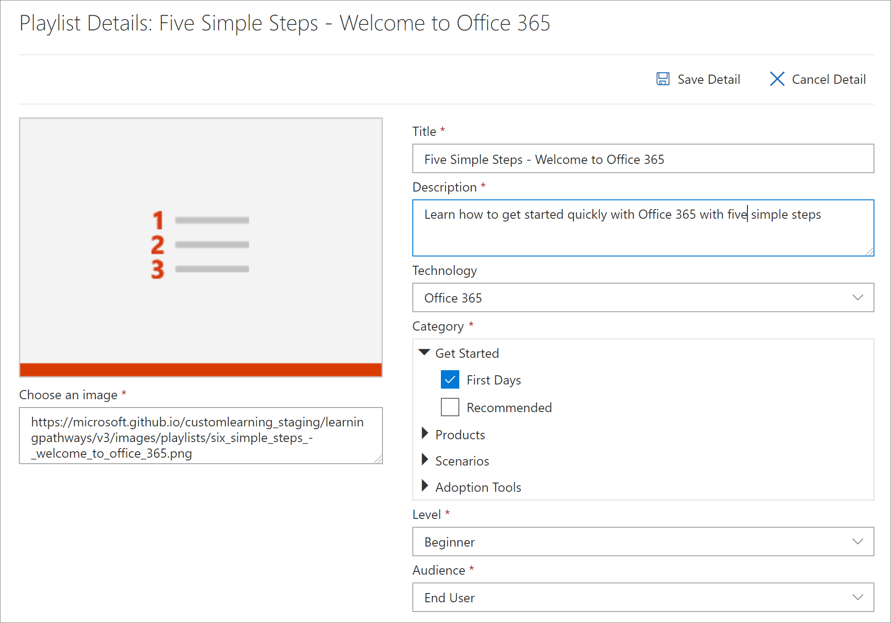

# Copiar uma Lista de ReproduçãoCopy a Playlist
Muitas vezes, as organizações precisam modificar uma playlist fornecida pela Microsoft removendo ou substituindo um ativo por um ativo criado pela organização.Quite often, organizations need to modify a Microsoft-supplied playlist by removing or replacing an asset with an asset created by the organization. Por exemplo, talvez você queira remover uma etapa da lista de reprodução Iniciar com Seis Etapas Simples.For example, you might want to remove a step from the Start with Six Simple Steps playlist. Agora você pode usar o recurso Copiar Playlist de caminhos de aprendizagem para copiar facilmente a lista de reprodução Seis Etapas Simples e simplesmente remover um ativo, substituir um ativo ou adicionar novos ativos.Now you can use the learning pathways Copy Playlist feature to easily copy the Six Simple Steps playlist and simply remove an asset, replace an asset, or add new assets. 

## Para copiar uma playlistTo copy a playlist

1. Na página Inicial dos caminhos  de aprendizado do Microsoft 365, clique em Treinamento do **Office 365.**From the Microsoft 365 learning pathways **Home** page, click **Office 365 training**.
2. Clique no **ícone Administração.**Click the **Administration** icon.
3. Em **Primeiros Dias**, clique na lista de reprodução Seis Etapas Simples - Bem-vindo ao Office **365** e clique em Copiar **Playlist**.Under **First Days**, click the **Six Simple Steps - Welcome to Office 365** playlist, and then click **Copy Playlist**. 
4. Clique **em Editar Detalhes** e preencha os campos **Título** e **Descrição,** conforme mostrado no exemplo a seguir, em seguida, clique em **Salvar Detalhes.**Click **Edit Detail**, and then fill in the **Title** and **Description** fields as shown in the following example, then click **Save Detail**.  
 

## Adicionar ou remover ativos de uma playlistAdd or remove assets from a playlist
Com playlists personalizadas, você pode:With custom playlists, you can:
- adicionar e remover ativos da Microsoft, mas não editar os ativos da Microsoftadd and remove Microsoft assets, but not edit the assets from Microsoft
- adicionar, remover e editar ativos personalizados existentes do SharePoint da sua organização ou dos ativos do SharePoint que você cria.add, remove, and edit custom existing SharePoint assets from your organization or SharePoint assets that you create. 

### Remover um ativo de uma playlistRemove an asset from a playlist
- Role para baixo a **página Administração** e, em Ativos de **Playlist,** clique no ícone de exclusão da **Etapa 5. Configurar aplicativos móveis**.Scroll down the **Administration** page, and then under **Playlist Assets** click the delete icon for **Step 5. Set up mobile apps**. 

## Verifique se o ativo foi removido da lista de reproduçãoVerify the asset is removed from the playlist
1. Volte para a guia com a página de treinamento **do Microsoft 365.**Return to the tab with the **Microsoft 365 training** page.
2. Clique **em Primeiros Dias,** em seguida, clique na **playlist Cinco Etapas Simples - Bem-vindo ao Office 365.**Click **First Days**, then click the **Five Simple Steps - Welcome to Office 365** playlist. 
3. Clique na playlist para verificar se o ativo foi removido.Click through the playlist to verify that the asset has been removed.

