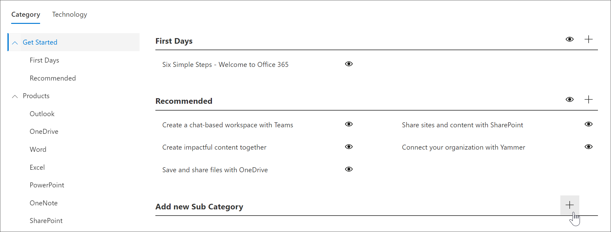

# Criar uma subcategoria 
Em alguns casos, convém criar uma nova subcategoria. Por exemplo, se a subcategoria dias a primeira não funcionar para sua organização, você pode criar uma nova subcategoria e adicionar playlists a ela para atender às necessidades da sua organização. 

1. Na **Home** Page de cursos de aprendizado da Microsoft 365, clique em **treinamento do Microsoft 365**, clique no menu **sistema** da Web Part e, em seguida, clique em **administrar playlist**. 
2. Selecione uma **categoria**. Neste exemplo, selecione **introdução**.  
3. Role para baixo na página 
3. Clique no ícone **Adicionar nova subcategoria +** .  

> [!TIP]
> As subcategorias fornecidas pela Microsoft podem ser ocultas, mas não editadas ou excluídas. 

## Editar uma subcategoria
- Selecione o ícone **Editar** para subcategoria, faça edições no título da subcategoria e clique em **salvar**.

## Ocultar uma subcategoria
- Selecione o Eyeball de subcategoria para ocultá-lo. 

## Excluir uma subcategoria
- Selecione o ícone **Editar** para a subcategoria e, em seguida, selecione **excluir.** 
