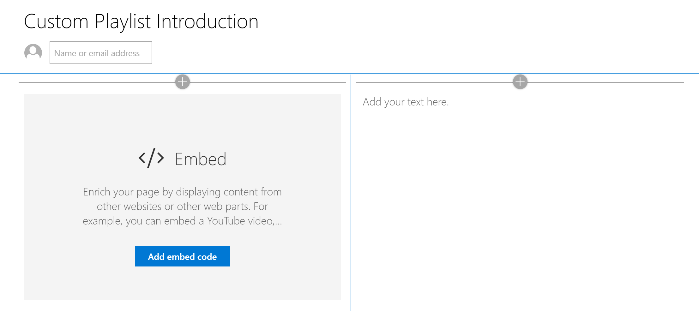
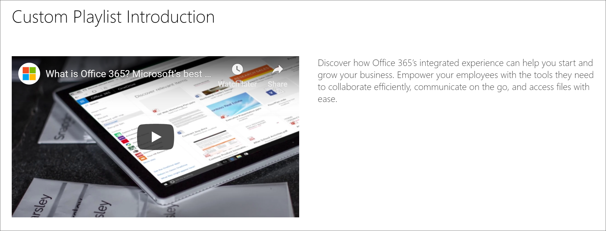

# Criar páginas do SharePoint para listas de reprodução personalizadasCreate SharePoint pages for Custom Playlists

Um dos recursos exclusivos dos caminhos de aprendizado é a capacidade de criar listas de reprodução remontadas de ativos da Microsoft e de ativos do SharePoint que você cria.One of the unique features of learning pathways is the ability to create playlists that are assembled from assets from Microsoft and from SharePoint assets that you create. Neste exemplo, criaremos uma página do SharePoint com antecedência da criação de uma lista de reprodução.In this example, we’ll create a SharePoint page in advance of creating a playlist. A capacidade de criar listas de reprodução a partir de páginas do SharePoint oferece uma variedade de oportunidades para criar páginas usando as Web Parts disponíveis na Microsoft ou em sua organização.The ability to build playlists from SharePoint pages offers a variety of opportunities to build pages using the Web parts available from Microsoft or your organization. Por exemplo, uma lista de reprodução pode incluir uma página do SharePoint com vídeos incorporados do YouTube ou um formulário criado a partir de formulários do Office 365 ou um relatório incorporado do Power BI.For example, a playlist can include a SharePoint page with embedded videos from YouTube, or a form built from Office 365 Forms, or an embedded Power BI report. Neste exemplo, mostraremos como criar uma página com a Web Part de inserção e a Web Part de texto.In this example, we’ll show you how to build a page with the Embed web part and the Text web part.  

## Criar uma página do SharePoint para uma lista de reprodução personalizadaCreate a SharePoint page for a custom playlist

1. Clique no ícone de **engrenagem** do SharePoint e, em seguida, clique em **Adicionar uma página**.Click the SharePoint **Gear** icon, and then click **Add a page**.
2. Clique em **Adicionar uma nova seção (+)** no lado esquerdo da página e, em seguida, clique **duas colunas** para o layout da seção.Click **Add a new section (+)** on the left-hand side of the page, and then click **Two Columns** for the section layout.
3. Na coluna à esquerda, clique em + e, em seguida \*\*\*\* , clique na Web Part de incorporação.In the left column, click + , and then click the **Embed** web part. 
4. Na coluna à direita, clique em + e, em seguida, clique na Web Part de **texto** .In the right column, click +, and then click the **Text** web part. A página deve ter a seguinte aparência.Your page should look like this.

### Adicionar um vídeo e um texto do YouTubeAdd a video and text from YouTube

1. No navegador, vá para YouTube.In your browser, go to YouTube. Para este exemplo, pesquise por "What is Office 365 – Best Productivity aplicativos da Microsoft".For this example, search for “What is Office 365 – Microsoft’s best productivity apps”.
2. Clique no vídeo para reproduzi-lo, depois Pause-o e, em seguida, clique com o botão direito do mouse nele.Click the video to play it, then pause it, then right-click on it. 
3. Clique em **copiar código de inserção**e retorne para a página do SharePoint.Click **Copy embed code**, then return to the SharePoint page. 
4. Clique em **Adicionar código** de incorporação na Web Part de **incorporação** e, em seguida, adicione o código do vídeo do YouTube.Click **Add embed code** in the **Embed** web part, and then add the code from the YouTube video.
5. Retorne à página YouTube e copie o texto da **Descrição** do vídeo.Return to the YouTube page and copy the **Description** text for the video. 
6. Retorne à página do SharePoint, selecione a Web Part de **texto** e copie o texto do vídeo do YouTube.Return to the SharePoint page, select the **Text** web part, then copy the text from the YouTube video.
7. Selecione o ícone **Editar Web Part** na área título da página do SharePoint e, em seguida, nomeie a página "introdução à playlist personalizada".Select the **Edit web part** icon  in the Title area of the SharePoint page, and then name the page “Custom Playlist Introduction”. 
8. Em **layout**, selecione **simples**e, em seguida, fechar painel de propriedades da **região de título** .For **Layout**, select **Plain**, then close **Title Region** properties pane. A página agora deve ter a seguinte aparência.The page should now look something like the following. 

### Publicar a páginaPublish the page

- Selecione o botão **publicar** .Select the **Publish** button. Agora você está pronto para adicionar esta página do SharePoint à sua lista de reprodução personalizada.Now you're ready to add this SharePoint page to your custom playlist. 