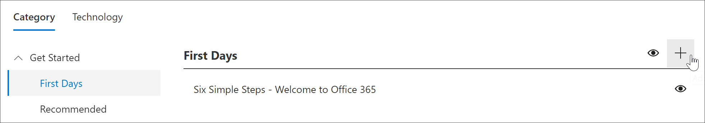
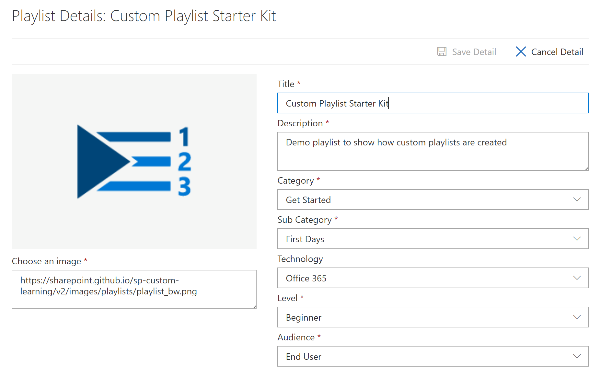
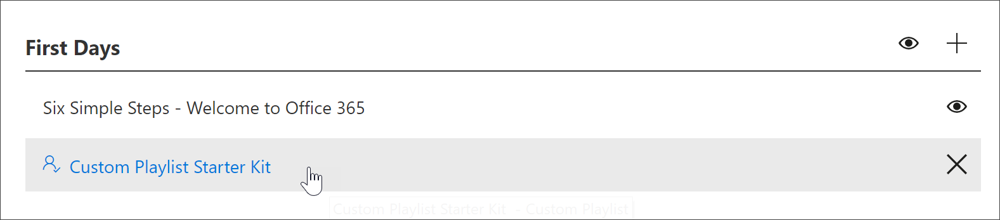
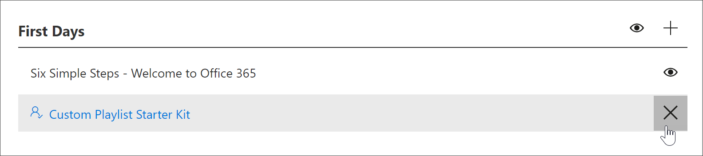

# Criar uma lista de reprodução personalizada

Ao criar uma lista de reprodução, você primeiro cria a lista de reprodução com os detalhes da playlist e, em seguida, adiciona ativos à lista de reprodução. Você pode adicionar uma lista de reprodução a qualquer subcategoria. Por exemplo, você pode adicionar uma lista de reprodução à primeira subcategoria **dias** ou uma subcategoria de **produto** como o **Excel**. Nesta seção, abordaremos como criar uma lista de reprodução e, em seguida, abordaremos a adição de ativos a uma lista de reprodução na seção a seguir, [Adicionar ativos a uma lista de reprodução personalizada](custom_addassets.md).

## Criar uma lista de reprodução 

1. Na **Home** Page de aprendizagem personalizada, clique em **treinamento do Office 365**, selecione o menu do sistema na Web Part e, em seguida, selecione **administrar playlist**. 
2. Selecione uma subcategoria. Neste exemplo, selecione **primeiro dias**.  
3. Clique no ícone +.  

4.  Preencha os campos na lista de reprodução, conforme mostrado no exemplo a seguir. Você pode deixar o ícone padrão para este exemplo. 

5.  Quando terminar, selecione **salvar detalhes**. 

## Editar uma lista de reprodução

- Na página **Administração de aprendizado personalizada** , clique na lista de reprodução e, em seguida, clique em **Editar detalhes**.  

### Excluir uma lista de reprodução

- Na página Administração de aprendizado personalizada, clique no ícone **excluir** da lista de reprodução.  

