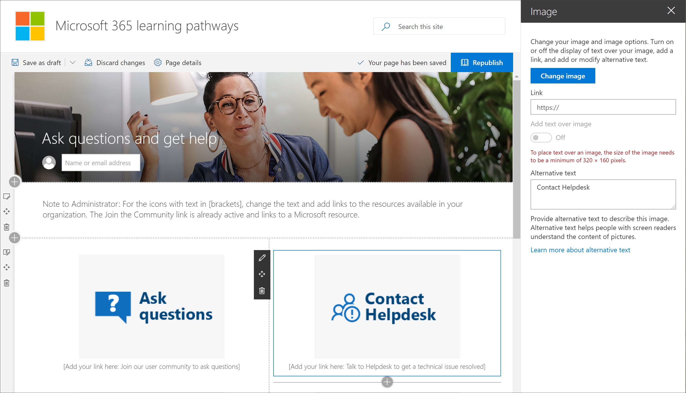

# Personalizar o site

O site de aprendizado personalizado é baseado em um modelo de comunicação do SharePoint, portanto, é fácil modificar o site para atender às necessidades da sua organização. Você pode alterar o nome, o logotipo, os itens de menu e o conteúdo das páginas do site. 

> [!TIP]
> Reúna comentários de seus funcionários e atualize periodicamente o site. Por exemplo, você pode atualizar o calendário de eventos de treinamento à medida que novos eventos são disponibilizados. Ao iniciar novos serviços, você pode Reexibir conteúdo e criar listas de reprodução de treinamento direcionadas para o lançamento dos novos serviços. 

## Personalizar o site e páginas da Web

O site de aprendizado personalizado é totalmente personalizável. Se você não estiver familiarizado com como personalizar seu site ou página da Web do SharePoint, sugerimos que você leia o artigo [personalizar seu site do SharePoint](https://support.office.com/en-us/article/customize-your-sharepoint-site-320b43e5-b047-4fda-8381-f61e8ac7f59b) no support.Office.com. 

### Personalizar perguntas de pergunta e obter ajuda

Como administrador do site de aprendizado personalizado, uma das coisas que você deve fazer é alterar os links na página **obter ajuda e suporte** para apontar para recursos em sua organização. 

1.  Na home page de aprendizado personalizado, clique no item de menu **fazer perguntas e obter ajuda** .
2.  Clique no botão **Editar**.
3.  Passe o mouse sobre uma imagem de opção de ajuda e, em seguida, clique em **Editar Web Part**.

4.  Na caixa **link** , digite a URL do recurso interno. 
5.  Repita as etapas 3 e 4 para as outras duas imagens que não estão vinculadas.

### Alterar o texto na página

1. Passe o mouse sobre a área de texto e edite o texto da página. 
2. Clique no botão **publicar** quando tiver concluído

## Outras opções de personalização
Outras páginas que você pode querer considerar edição são:

- Eventos de treinamento Calendar. aspx
- A Web Part herói no Home. aspx

