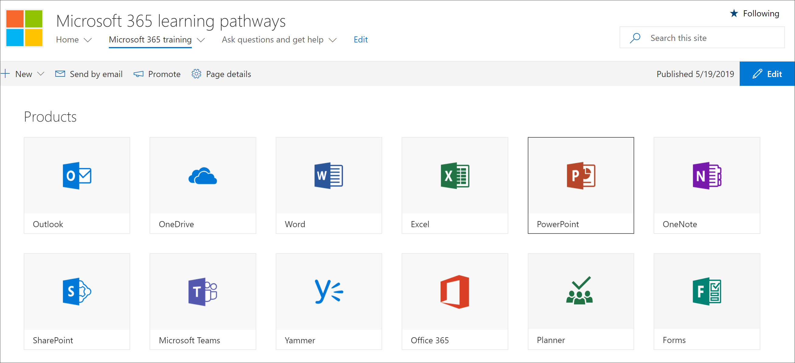

# Explorar o site de cursores de aprendizado

> Observação: para explorar o site de cursores de aprendizado e seus recursos administrativos, você precisará de permissões de administrador do conjunto de sites, proprietário ou membro para o site. Se você não tiver as permissões do neccesary, entre em contato com o administrador do site. O site de cursores de aprendizado está hospedado em seu locatário do Office 365, portanto, você precisará entrar no Office 365 para acessar o site. Se você ainda não tiver entrado no Office 365, entre agora. 

## . 

1.  Abra o navegador da Web e navegue até office.com ou o local de entrada da sua organização. 
2.  Entre com seu nome de usuário e senha.
3.  Navegue até o local do site usando a URL fornecida pelo administrador de locatários ou selecione SharePoint na home page do Office 365 e, em seguida, selecione o site. 

## Explorar o site de cursores de aprendizado

O site de cursores de aprendizado é baseado em um modelo de comunicação do SharePoint, portanto, é fácil modificar o site para atender às necessidades da sua organização. Você pode alterar o nome, o logotipo, os itens de menu e o conteúdo das páginas do site. Uma das páginas que você deseja modificar para sua organização é a página fazer perguntas e obter ajuda. Vamos dar uma olhada.

### Exibir a página fazer perguntas e obter ajuda

O site de cursores de aprendizado fornece conteúdo padrão para ajudá-lo a começar a criar seu portal de treinamento e suporte. Como um admininstrator ou proprietário do site, uma das coisas que você deve fazer é alterar os links na **página Ask question e Get Help** aponte para os recursos em sua organização. 

1.  Na home page de cursores de aprendizado da Microsoft 365, clique no item de menu **fazer perguntas e obter ajuda** .
2.  Clique no botão **Editar**.
3.  Passe o mouse sobre uma imagem de opção de ajuda e, em seguida, clique em **Editar Web Part**.

Para obter instruções sobre como personalizar páginas de site, consulte [Customize The site](custom_edithelp.md).

### Exibir o conteúdo dos caminhos de aprendizado na Web Part
A página de treinamento do Microsoft 365 hospeda a Web Part de cursores de aprendizado configurada para mostrar todos os treinamentos disponíveis para os caminhos de aprendizado. 

1. Role para baixo na página para exibir todas as categorias e subcategorias.
2. Faça um pouquinho dos pneus. Clique em algumas subcategorias e, em seguida, clique em algumas listas de reprodução para saber como o conteúdo dos caminhos de aprendizado é organizado. 

Para obter instruções sobre como personalizar a Web Part de cursores de aprendizado, consulte [Customize The Learning Experience](custom_overview.md).

### Obter um tour de site completo e orientação de personalização
Para obter uma visão detalhada dos caminhos de aprendizado, incuding o site, a Web Part, recursos administrativos e orientações sobre como criar experiências de aprendizado exclusivas para seu ambiente, consulte [Customize The Learning Experience](custom_overview.md)

## Próximas etapas
- [Personalizar a experiência de aprendizagem](custom_overview.md)
- [Adoção de drive](driveadoption.md) 
