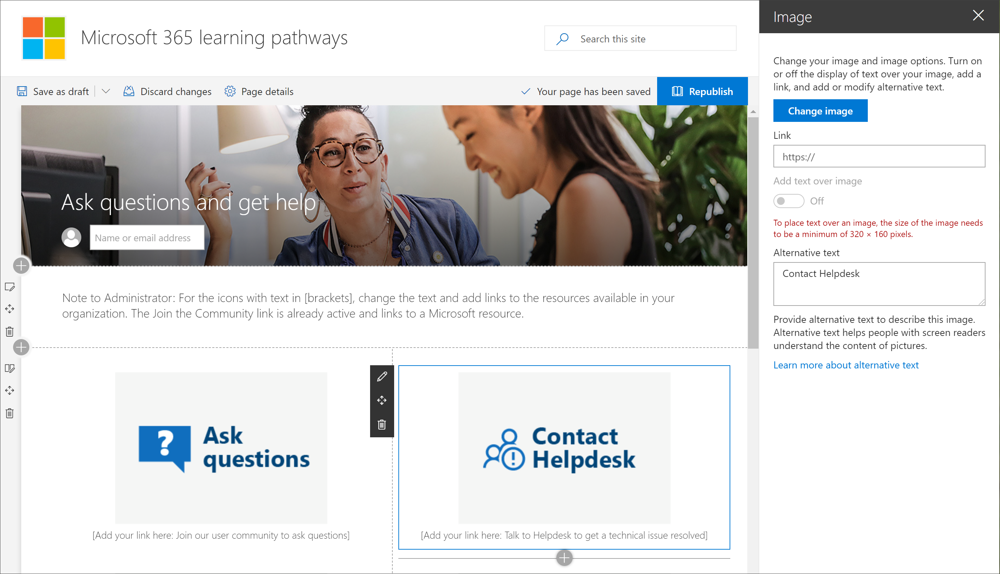

# Explorar o site de cursores de aprendizadoExplore the learning pathways site

> Observação: para explorar o site de cursores de aprendizado e seus recursos administrativos, você precisará de permissões de administrador do conjunto de sites, proprietário ou membro para o site.Note: To explore the learning pathways site and it's administrative features, you'll need Site Collection Admin, Owner, or Member permissions to the site. Se você não tiver as permissões do neccesary, entre em contato com o administrador do site.If you don't have the neccesary permissions, contact the Site Administrator for the site. O site de cursores de aprendizado está hospedado em seu locatário do Office 365, portanto, você precisará entrar no Office 365 para acessar o site.The learning pathways site is hosted in your Office 365 tenant, so you'll need to sign in to Office 365 to get to the site. Se você ainda não tiver entrado no Office 365, entre agora.If you haven’t already signed into Office 365, sign in now. 

## .Sign in to Office 365 

1.  Abra seu navegador da Web e navegue até o office.com ou o local de Logon da sua organização.Open your Web browser and navigate to office.com or your organization’s sign-in location. 
2.  Entre com seu nome de usuário e senha.Sign in with your user name and password.
3.  Navegue até o local do site usando a URL fornecida pelo administrador de locatários ou selecione SharePoint na home page do Office 365 e, em seguida, selecione o site.Navigate to the location of the site using the URL supplied by your tenant administrator or select SharePoint from the Office 365 Home page, and then select the site. 

## Explorar o site de cursores de aprendizadoExplore the learning pathways site

O site de cursores de aprendizado é baseado em um modelo de comunicação do SharePoint, portanto, é fácil modificar o site para atender às necessidades da sua organização.The learning pathways site is based on a SharePoint communication template, so it's easy to modify the site to meet the needs of your organization. Você pode alterar o nome, o logotipo, os itens de menu e o conteúdo das páginas do site.You can change the site name, logo, menu items, and the content on the pages. Uma das páginas que você deseja modificar para sua organização é a página fazer perguntas e obter ajuda.One of the pages you'll want to modify for your organization is the Ask questions and get help page. Vamos dar uma olhada.Let's take a look.

### Exibir a página fazer perguntas e obter ajudaView the Ask questions and get help page

O site de cursores de aprendizado fornece conteúdo padrão para ajudá-lo a começar a criar seu portal de treinamento e suporte.The learning pathways site provides default content to help you get starting building your training and support portal. Como um admininstrator ou proprietário do site, uma das coisas que você deve fazer é alterar os links na **página Ask question e Get Help** aponte para os recursos em sua organização.As an admininstrator or owner of the site, one of the things you’ll want to do is change the links on the **Ask question and get help page** point to resources in your organization. 

1.  Na home page de cursores de aprendizado da Microsoft 365, clique no item de menu **fazer perguntas e obter ajuda** .From the Microsoft 365 learning pathways Home page, click the **Ask questions and get help** menu item.
2.  Clique no botão **Editar**.Click the **Edit** button.
3.  Passe o mouse sobre uma imagem de opção de ajuda e, em seguida, clique em **Editar Web Part**.Hover over a Help option image, then click **Edit web part**.

Para obter instruções sobre como personalizar páginas de site, consulte [Customize The site](custom_edithelp.md).For instructions on customizing site pages, see [Customize the site](custom_edithelp.md).

### Exibir o conteúdo dos caminhos de aprendizado na Web PartView the learning pathways content in the web part
A página de treinamento do Microsoft 365 hospeda a Web Part de cursores de aprendizado configurada para mostrar todos os treinamentos disponíveis para os caminhos de aprendizado.The Microsoft 365 training page hosts the learning pathways Web part configured to show all the training available for learning pathways. 

1. Role para baixo na página para exibir todas as categorias e subcategorias.Scroll down the page to view all the categories and subcategories.
2. Faça um pouquinho dos pneus.Kick the tires a bit. Clique em algumas subcategorias e, em seguida, clique em algumas listas de reprodução para saber como o conteúdo dos caminhos de aprendizado é organizado.Click a few subcategories, and then click a few playlists to get a feel for how learning pathways content is organized. 

Para obter instruções sobre como personalizar a Web Part de cursores de aprendizado, consulte [Customize The Learning Experience](custom_overview.md).For instructions on customizing the learning pathways web part, see [Customize the Learning Experience](custom_overview.md).

### Obter um tour de site completo e orientação de personalizaçãoGet a complete site tour and customization guidance
Para obter uma visão detalhada dos caminhos de aprendizado, incuding o site, a Web Part, recursos administrativos e orientações sobre como criar experiências de aprendizado exclusivas para seu ambiente, consulte [Customize The Learning Experience](custom_overview.md)For a detailed look at learning pathways, incuding the site, the web part, administrative features, and guidance on how to build unique learning experiences for your environment, see [Customize the Learning Experience](custom_overview.md)

## Próximas etapasNext Steps
- [Personalizar a experiência de aprendizagemCustomize the Learning Experience](custom_overview.md)
- [Adoção de driveDrive adoption](driveadoption.md) 
