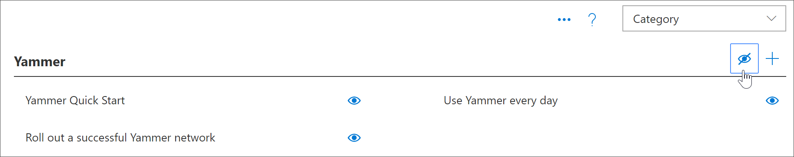

# Novembro de 2019 versão 3,0 recursos atualizações
Com base nos comentários dos clientes, os novos recursos a seguir foram adicionados aos caminhos de aprendizado versão 3,0.

## Atualizações de conteúdo e calendário editorial
Uma das promessas de cursores de aprendizado é o conteúdo atualizado. Para esse fim, fornecemos nossa primeira atualização trimestral de conteúdo. A atualização de conteúdo reflete nosso artigo de atualização de conteúdo que será atualizado trimestralmente. Para atualizações de conteúdo, consulte [cursores de aprendizado atualizações de conteúdo](custom_contentupdates.md)

## Centro de sucesso da Microsoft 365
Adicionamos um centro de sucesso de cursores de aprendizado da Microsoft 365 para ajudar os administradores e os proprietários do conjunto de sites a obter o máximo dos caminhos de aprendizado. O centro de sucesso fornece links para recursos de planejamento e adoção e oferece orientação sobre planejamento, personalização, geração de adoção e medição do impacto dos caminhos de aprendizado. Para obter mais informações, consulte [cursores de aprendizado administração do centro de sucesso](custom_successcenter.md)

## Navegação de playlist
Com base nos comentários dos clientes, fizemos a navegação mais óbvia com os botões próximo e anterior. Também adicionamos um Sumário dentro da área de navegação para permitir que os usuários vejam facilmente a lista completa de itens em uma lista de reprodução e naveguem diretamente para um ativo em uma lista de reprodução. 

## Copiar uma lista de reprodução
Muitos clientes expressou a necessidade de modificar apenas algumas coisas simples em uma lista de reprodução fornecida pela Microsoft, sem a necessidade de criar uma lista de reprodução totalmente nova. Por exemplo, uma solicitação comum é remover uma etapa da lista de reprodução de etapas de início com seis etapas simples. Agora você pode copiar uma lista de reprodução de uma lista de reprodução existente, incluindo uma lista de reprodução do catálogo da Microsoft e, em seguida, modificar essa lista de reprodução. Por exemplo, agora você pode copiar seis etapas simples, excluir 3 etapas e transformar a lista de reprodução em três etapas simples. Para obter mais informações, consulte [Copy a playlist](custom_copyplaylist.md)

## Recursos aprimorados de pesquisa 
Os recursos de pesquisa ao criar uma lista de reprodução na página de administração foram aprimorados. Os resultados da pesquisa fornecem detalhes adicionais para distinguir nomes duplicados em Devoluções de pesquisa. Você também pode clicar em um item de resultados de pesquisa para visualizar o ativo. Para obter mais informações, consulte [criar uma lista de reprodução personalizada](custom_copyplaylist.md)

