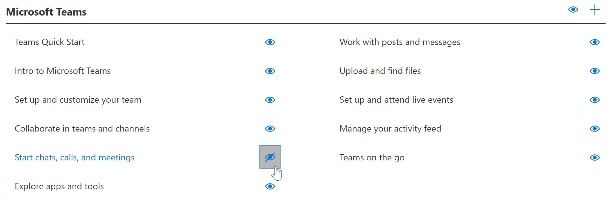
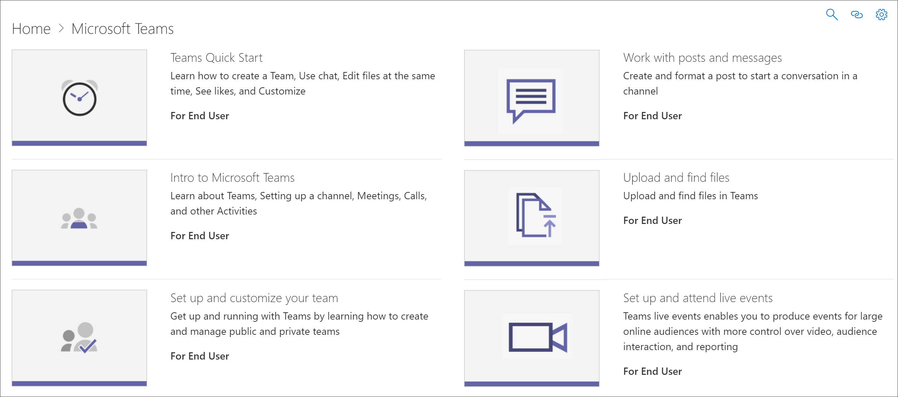

# Mostrar e ocultar Listas de ReproduçãoHide and show Playlists

Para adaptar os caminhos de aprendizado para seu ambiente, você pode ocultar listas de reprodução fornecidas pela Microsoft.To tailor learning pathways for your environment, you can hide playlists provided by Microsoft. 

- Você pode ocultar uma playlist como Iniciar com Seis Etapas Simples e substituí-la por uma playlist personalizada que você cria para sua organização.You can hide a playlist like Start with Six Simple Steps and replace it with a custom playlist that your create for your organization.
- Você pode ocultar uma playlist para um produto se a playlist abranger a funcionalidade não suportada em sua organização.You can hide a playlist for a product if the playlist covers functionality not supported in your organization. Por exemplo, se o Microsoft Teams não estiver configurado para chamadas ou reuniões, você poderá ocultar a playlist Iniciar **chats,** chamadas e reuniões.For example, if Microsoft Teams is not configured for calls or meetings, you can hide the **Start chats, calls, and meetings** playlist. 

## Ocultar uma playlistHide a playlist

1. Na home **page** de caminhos de aprendizado, clique no pacote de treinamento do Office **365.**From the learning pathways **Home** page, click the **Office 365 training** tile.
2. Na Web Part caminhos de aprendizado, selecione o **ícone Administrar.**From the learning pathways web part, select the **Administer** icon. 
3. No painel esquerdo da página **Administração,** selecione uma subcategoria e selecione o globo ocular de uma playlist para o ocultar.From left pane in the **Administration** page, select a subcategory, and then select the eyeball for a playlist to hide it. Para este exemplo, clique na subcategoria do **Microsoft Teams** e, em seguida, hide the \*\*\*\*Start chats, calls, and meetings\*\* playlist.For this example, click the **Microsoft Teams** subcategory, and then hide the \*\*\*\*Start chats, calls, and meetings\*\* playlist.  

### Verificar se a playlist está ocultaVerify the playlist is hidden
- Para verificar se a playlist está oculta, selecione a guia do navegador com a página Iniciar com o **Office 365** carregada e atualize a página.To verify the playlist is hidden, select the browser tab with the **Get Started with Office 365** page loaded, and then refresh the page. Selecione Microsoft Teams.Select Microsoft Teams. Agora você deve ver que a **subcategoria Iniciar chats, chamadas** e reuniões está oculta.You should now see the **Start chats, calls, and meetings** subcategory is hidden. 

## Desarmá-se de uma playlistUnhide a playlist

- Na página **CAdministration,** selecione uma subcategoria, selecione uma playlist e selecione o globo ocular da playlist oculta para desacondicioná-la.From the **CAdministration** page, select a subcategory, select a playlist, and then select the eyeball for the hidden playlist to unhide it. Para este exemplo, desarmem a lista de reprodução de *_chats,_* chamadas e reuniões do Microsoft Teams \* Iniciar.For this example, unhide the Microsoft Teams \**_Start chats, calls, and meetings_* playlist.   

