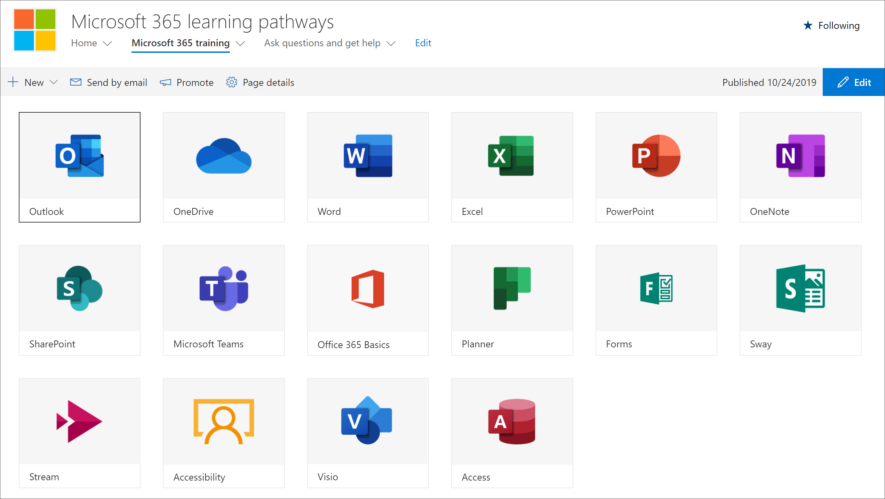

# Ocultar e mostrar subcategoriasHide and show Subcategories

Com a página Administração de cursores de aprendizado, você pode ocultar e mostrar subcategorias de conteúdo.With the learning pathways administration page, you can hide and show subcategories of content. Por exemplo, as empresas que não distribuem o Yammer podem ocultar a subcategoria do Yammer, para que o conteúdo do Yammer não fique visível para os usuários.For example, companies that don’t roll out Yammer can hide the Yammer subcategory, so Yammer content won't be visible to users. Isso impede chamadas de suporte indesejadas de usuários que podem ver informações relacionadas aos serviços que não estão disponíveis na sua organização.This prevents unwanted support calls from users who might otherwise see information related to services that aren't available in your organization.

## Ocultar uma subcategoriaHide a subcategory 

1. Na home page de cursos de aprendizado da Microsoft 365, clique no bloco treinamento do Microsoft 365.From the Microsoft 365 learning pathways Home page, click the Microsoft 365 training tile.
2. Na Web Part de cursores de aprendizado da Microsoft 365, clique no ícone de administração.From the Microsoft 365 learning pathways Web part, click the Administration icon. 
3. No painel esquerdo da página, selecione uma subcategoria e, em seguida, selecione Eyeball para a subcategoria para ocultá-la.In the left pane of the page, select a subcategory, and then select the eyeball for the subcategory to hide it. Para este exemplo, oculte a subcategoria do **Yammer** .For this example, hide the **Yammer** subcategory.  

### Verifique se a subcategoria está ocultaVerify the subcategory is hidden
- Para verificar se a subcategoria está oculta, selecione a guia navegador com a página Introdução **ao Microsoft 365** carregada e, em seguida, atualize a página.To verify the subcategory is hidden, select the browser tab with the **Get Started with Microsoft 365** page loaded, and then refresh the page. Agora você deve ver a subcategoria Yammer oculta na categoria produtos.You should now see the Yammer subcategory hidden in the Products category. 

## Reexibir uma subcategoriaUnhide a subcategory 

- Na página **Administração** , selecione uma subcategoria e, em seguida, selecione Eyeball para a subcategoria oculta para reocultá-la.From the **Administration** page, select a subcategory, and then select the eyeball for the hidden subcategory to unhide it. Para este exemplo, reexiba a subcategoria Yammer.For this example, unhide the Yammer subcategory.