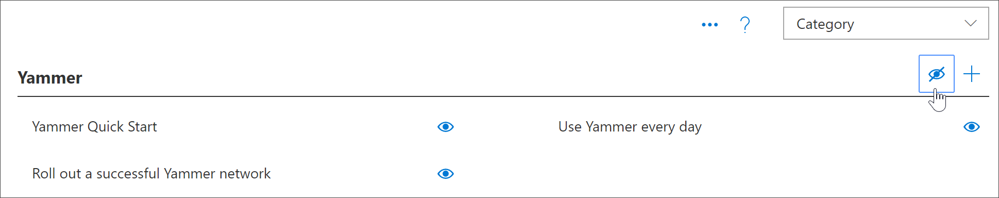

# Ocultar e mostrar subcategoriasHide and show Subcategories

Com a administração de aprendizado personalizada, você pode ocultar e mostrar subcategorias. Por exemplo, as empresas que não distribuem o Yammer podem ocultar a subcategoria do Yammer, para que o conteúdo do Yammer não fique disponível para os usuários. Isso impede chamadas de suporte indesejadas de usuários que podem ver informações relacionadas aos serviços que não estão disponíveis na sua organização.With Custom Learning Administration, you can hide and show subcategories. For example, companies that don’t roll out Yammer can hide the Yammer subcategory, so Yammer content won't be available to users. This prevents unwanted support calls from users who might otherwise see information related to services that aren't available in your organization.

## Ocultar uma subcategoriaHide a subcategory 

1. Na home page de aprendizado personalizado, clique no bloco **treinamento do Office 365** .From the Custom Learning Home page, click the **Office 365 training** tile.
2. Na Web Part de aprendizado personalizado, selecione o menu sistema e, em seguida, selecione **administrar playlist**. Agora você deve ter duas guias abertas: uma com a página de **Administração de aprendizado personalizada** e outra com a página de **treinamento do Office 365** .From the Custom Learning Web part, select the System menu, then select **Administer Playlist**. You should now have two tabs open: One with the **Custom Learning Administration** page, and one with the **Office 365 training** page. 
3. Na página **Administração de aprendizagem personalizada** , em **categoria**, selecione uma subcategoria e, em seguida, selecione Eyeball para a subcategoria para ocultá-la. Para este exemplo, oculte a subcategoria do **Yammer** .From the **Custom Learning Administration** page, under **Category**, select a subcategory, and then select the eyeball for the subcategory to hide it. For this example, hide the **Yammer** subcategory.  

### Verifique se a subcategoria está ocultaVerify the subcategory is hidden
- Para verificar se a subcategoria está oculta, selecione a guia navegador com a página Introdução **ao Office 365** carregada e atualize a página. Agora você deve ver a subcategoria Yammer oculta na categoria produtos.To verify the subcategory is hidden, select the browser tab with the **Get Started with Office 365** page loaded, and then refresh the page. You should now see the Yammer subcategory hidden in the Products category. 

## Reexibir uma subcategoriaUnhide a subcategory 

- Na página **Administração de aprendizagem personalizada** , em **categoria**, selecione uma subcategoria e, em seguida, selecione Eyeball para a subcategoria oculta para reocultá-la. Para este exemplo, reexiba a subcategoria Yammer.From the **Custom Learning Administration** page, under **Category**, select a subcategory, and then select the eyeball for the hidden subcategory to unhide it. For this example, unhide the Yammer subcategory.