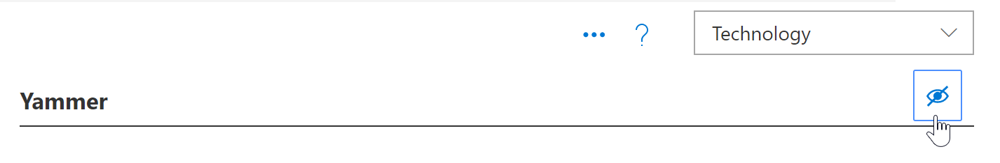
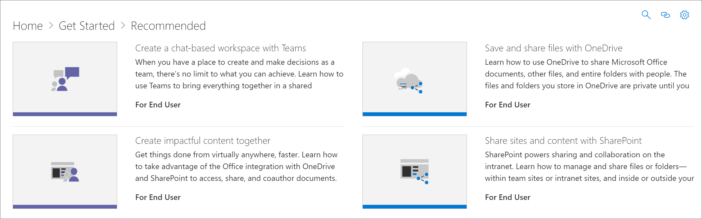

# Ocultar e mostrar tecnologia

Em alguns casos, convém ocultar o conteúdo de uma tecnologia que não é suportada em sua organização. O recurso ocultar tecnologia foi projetado para impedir que a tecnologia apareça em toda a Web Part. Ele oferece uma maneira mais abrangente de ocultar e mostrar o conteúdo do que ocultá-lo por subcategoria ou lista de reprodução. Por exemplo, você pode ocultar uma subcategoria do Yammer, mas o Yammer ainda pode aparecer em determinadas listas de reprodução de cenários, como "conectar sua organização com o Yammer". Para garantir que uma tecnologia específica não seja exposta a usuários finais, é possível ocultá-la por tecnologia. 

## Ocultar uma tecnologia

1. Na **Home** Page de aprendizado personalizado, clique no bloco **treinamento do Office 365** .
2. Na Web Part de aprendizado personalizado, selecione o menu **sistema** e, em seguida, selecione **administrar playlist**. Agora você deve ter duas guias abertas. Um com a página **Administração de aprendizado personalizada** e um com a página de **treinamento do Office 365** . 
3. Na página **Administração de aprendizado personalizada** , clique em uma **tecnologia**e, em seguida, selecione o Eyeball para a tecnologia para ocultá-lo. Para este exemplo, clique na tecnologia **Yammer** e, em seguida, oculte-a.  

### Verifique se a playlist está oculta
1. Para verificar se a tecnologia **Yammer** está oculta, selecione a guia navegador com a página de **treinamento do Office 365** carregada e atualize a página. Agora você deve ver que a subcategoria Yammer está oculta. 
2. Clique na subcategoria **recomendada** . Você notará que a lista conectar sua organização com o Yammer está oculta. 

## Reexibir uma tecnologia

- Na página **Administração de aprendizagem personalizada** , em **tecnologia**, selecione uma tecnologia e, em seguida, selecione o Eyeball para a tecnologia oculta para reocultá-la. Para este exemplo, reexiba a tecnologia **Yammer** . 