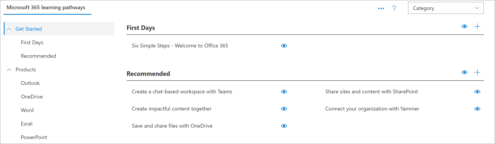

# Configuração manual de caminhos de aprendizado

Os caminhos de aprendizado do Microsoft 365 oferecem uma configuração manual para organizações que precisam de suporte para um dos seguintes cenários: 

- Sua organização tem um site de comunicação moderna do SharePoint Online dedicado ao treinamento e você deseja adicionar caminhos de aprendizado a esse site. Neste cenário, a Web Part de cursores de aprendizado não foi configurada no site.

- Você deseja instalar os caminhos de aprendizado para suporte multilíngue em um dos sites de comunicação do SharePoint da sua organização. O site tem, ou terá, um idioma padrão que não é o inglês e é um dos idiomas com suporte dos caminhos de aprendizado. Estes são os idiomas suportados pelos caminhos de aprendizado:

- Inglês
- Chinês (simplificado)
- Francês
- Alemão
- Italiano (Itália)
- Japonês (Japão)
- Português (Brasil)
- Russo (russo)
- Espanhol

A configuração manual dos caminhos de aprendizado requer experiência que funcione com o Windows PowerShell e o Shell de gerenciamento do SharePoint Online. Veja a seguir uma visão geral das etapas para a configuração manual dos caminhos de aprendizado: 

- Valide se você atendeu a todos os pré-requisitos.
- Verifique as configurações de idioma padrão do seu site. Se estiver OK, continue com a instalação manual. Se você precisar de uma configuração de idioma padrão diferente, será necessário criar um novo site. 
- Instale o arquivo customlearning. sppkg em seu catálogo de aplicativos de locatário do SharePoint.
- Provisione/identifique um site de comunicação moderna para atuar como seu site inicial de cursores de aprendizado da Microsoft 365.
- Execute um script do PowerShell que configurará seu locatário com os artefatos dos quais os caminhos de aprendizado dependem.
- Navegue até a página do site CustomLearningAdmin. aspx para carregar a Web Part de administração para inicializar a configuração de conteúdo personalizado.

## Pré-requisitos
Para garantir uma configuração manual bem-sucedida da Web Part de cursores de aprendizado, os pré-requisitos a seguir devem ser atendidos. 

- Você deve ter configurado e configurado o catálogo de aplicativos de todo o locatário. Confira [Configurar o locatário do Office 365](https://docs.microsoft.com/sharepoint/dev/spfx/set-up-your-developer-tenant#create-app-catalog-site) e siga a seção do site "criar catálogo de aplicativos". 
- Se o catálogo de aplicativos de todo o locatário já tiver sido provisionado, você precisará ter acesso a uma conta que tenha direitos para carregar um pacote nele. Geralmente, essa conta tem uma função de administrador do SharePoint. 
- Se uma conta com essa função não funcionar, vá para o centro de administração do SharePoint e encontre os administradores do conjunto de sites para o conjunto de sites do catálogo de aplicativos e faça o logon como um dos administradores de conjunto de sites ou adicione a conta de administrador do SharePoint que falhou aos administradores do conjunto de sites. 
- Você também precisará de acesso a uma conta que seja um administrador de locatários do SharePoint.

## Etapa 1: verificar suas configurações de idioma
Como a primeira etapa do processo de instalação manual, verifique as configurações de idioma do site. Estas são as opções possíveis:

### Opção 1-você não deseja suporte multilíngue
Se você não quiser suporte multilíngue para seu site, verifique se ele está desativado.
1.  No site de comunicação do SharePoint, selecione **configurações**  >  **informações do site**  >  **Exibir todas**as configurações de idioma das configurações do site  >  **Language settings**. 
2.  Defina a opção **habilitar a conversão de páginas e notícias em vários idiomas** . **Off**
3.  Clique em **Salvar**. 
4.  Vá para a etapa 2.

## Opção 2-você deseja suporte multilíngue e está OK com o idioma padrão
Um site de comunicação do SharePoint tem um idioma padrão. O idioma padrão determina o idioma no qual você visualiza os caminhos de aprendizado, incluindo a página Administração de caminhos de aprendizado. A configuração de idioma padrão é definida quando o site é criado pela primeira vez e não pode ser alterado posteriormente. Antes de continuar com a configuração manual, verifique se você está usando o idioma padrão do site de destino.

1.  No site de comunicação do SharePoint, selecione **configurações**  >  **informações do site**  >  **Exibir todas**as configurações de idioma das configurações do site  >  **Language settings**. 
2.  Defina a opção **habilitar páginas e notícias a serem traduzidas em vários idiomas** para **ligar**.
    - Se você estiver usando o idioma que aparece na parte superior da lista, em **idioma**, você pode adicionar outros idiomas e clique em **salvar**. Vá para a etapa 2.
    - Se quiser um idioma padrão diferente do que foi selecionado para o site, você precisará criar um novo site de comunicação do SharePoint com o idioma desejado. Vá para a opção 3. 

## Opção #3-você deseja suporte multilíngue, mas deseja um idioma padrão diferente para o site
Com esta opção, você cria um novo site de comunicação do SharePoint Online com o idioma padrão desejado e, em seguida, define as configurações de idioma para o site. 
1.  Para criar um novo site de comunicação do SharePoint, confira [criar um site de comunicação no SharePoint Online](https://support.microsoft.com/office/create-a-communication-site-in-sharepoint-online-7fb44b20-a72f-4d2c-9173-fc8f59ba50eb). Ao criar o site, certifique-se de definir o idioma para o idioma padrão que você deseja para os caminhos de aprendizado. 
2. No site criado, selecione **configurações**  >  **informações do site**  >  **Exibir todas**as configurações de idioma das configurações do site  >  **Language settings**. 
2.  Defina a opção **habilitar páginas e notícias a serem traduzidas em vários idiomas** para **ligar**.
3. Adicione outros idiomas, se necessário, e clique em **salvar**. 
4. Vá para a etapa 2. 

>! Observação Se você precisar migrar o conteúdo personalizado de um site para um site recém-criado, consulte a seção "migrar conteúdo personalizado" mais adiante neste documento. 

## Etapa 2: obter o pacote de Web Part e o script de instalação do GitHub
Como parte do processo de instalação, você precisará do pacote de Web Part de cursores de aprendizado da Microsoft 365 e do script de instalação do PowerShell.

- Vá para o [repositório do GitHub de cursores de aprendizado](https://github.com/pnp/custom-learning-office-365).
- Clique em **baixar** para salvar o pacote de Web Parts e o script em uma unidade local. Você usará o script e o pacote de Web Parts em etapas posteriores desse processo.

## Etapa 2-carregar a Web Part no catálogo de aplicativos do locatário
Para configurar os caminhos de aprendizado do Microsoft 365, você carrega o arquivo customlearning. sppkg no catálogo de aplicativos de todo o locatário e o implanta. Consulte [usar o catálogo de aplicativos para disponibilizar aplicativos de negócios personalizados para seu ambiente do SharePoint Online](https://docs.microsoft.com/sharepoint/use-app-catalog) para obter instruções detalhadas sobre como adicionar um aplicativo ao catálogo de aplicativos.

## Etapa 3-provisionar/identificar um site de comunicação moderna
Identifique um site de comunicação existente do SharePoint ou provisione um novo em seu locatário do SharePoint Online. Para obter mais informações sobre como provisionar um site de comunicação, consulte [criar um site de comunicação no SharePoint Online](https://support.office.com/article/create-a-communication-site-in-sharepoint-online-7fb44b20-a72f-4d2c-9173-fc8f59ba50eb) e siga as etapas para criar um site de comunicação.

## Etapa 4: Adicionar o aplicativo de cursores de aprendizado Microsoft 365 ao site

1. No site do SharePoint, clique no menu sistema e, em seguida, clique em **Adicionar um aplicativo**. 
2. Em **seus aplicativos**, clique em **da sua organização**e, em seguida, clique em **caminhos de aprendizado para o Office 365**. 

## Etapa 5-definir permissões para o site
Verifique se as seguintes permissões estão definidas para o site:
- **Administrador do conjunto de sites ou parte do grupo proprietários** -permissões necessárias para inicializar o item de lista CustomConfig que configura os caminhos de aprendizado para seu primeiro uso. 
- **Grupo Membros** -permissões necessárias para administrar os caminhos de aprendizado, incluindo ocultar e Mostrar conteúdo e administrar listas de reprodução personalizadas
- **Grupo de visitantes** -permissões necessárias para exibir o conteúdo do site. 

## Etapa 6: executar o script de configuração do PowerShell
Um script do PowerShell `CustomLearningConfiguration.ps1` é incluído, que você precisará executar para criar três [Propriedades de locatário](https://docs.microsoft.com/sharepoint/dev/spfx/tenant-properties) que a solução usa. Além disso, o script cria duas [páginas de aplicativo de parte única](https://docs.microsoft.com/sharepoint/dev/spfx/web-parts/single-part-app-pages) na biblioteca de páginas do site para hospedar as Web Parts de administrador e usuário em um local conhecido.

1. Se você ainda não baixou o Shell de gerenciamento do SharePoint Online, baixe-o agora. Confira [download do Shell de gerenciamento do SharePoint Online](https://go.microsoft.com/fwlink/p/?LinkId=255251).
2. Talvez seja necessário definir uma política de execução do PowerShell para executar o script. Para obter mais informações, consulte [sobre políticas de execução](https://docs.microsoft.com/powershell/module/microsoft.powershell.core/about/about_execution_policies?view=powershell-6).
3. Executar o `CustomLearningConfiguration.ps1` script. Além de suas credenciais de administrador de locatário, o script solicitará o nome do seu locatário e o nome do site. Considerar o seguinte exemplo para a URL do seu site, `https://contoso.sharepoint.com/sites/O365CL` , `contoso` é o nome do locatário e `O365CL` é o nome do site. 

### Desabilitando a coleção de telemetria
Parte dessa solução inclui consentimento de controle de telemetria anônimo, que por padrão é definido como ativado. Se você estiver fazendo uma instalação manual e quiser desativar o controle de telemetria, altere o `CustomlearningConfiguration.ps1` script para definir a variável $optInTelemetry como $false e execute o script.

## Validar o êxito do provisionamento e inicializar a lista CustomConfig

Depois que o script do PowerShell for executado com êxito, navegue até o site, inicialize o item de lista **CustomConfig** que configura os caminhos de aprendizado para seu primeiro uso e validar o site está funcionando.

- Vá para `<YOUR-SITE-COLLECTION-URL>/SitePages/CustomLearningAdmin.aspx`. Abrir o **CustomLearningAdmin.aspx** inicializa o item de lista **CustomConfig** que configura os caminhos de aprendizado para o primeiro uso. Você verá uma página parecida com esta:

## Adicionar proprietários ao site
Como administrador de locatários, é improvável que você seja a pessoa que personaliza o site, portanto, você precisará atribuir alguns proprietários ao site. Os proprietários têm privilégios administrativos no site para que eles possam modificar as páginas do site e remarcar o site. Eles também podem ocultar e mostrar o conteúdo fornecido por meio da Web Part de caminhos de aprendizado. Além disso, eles terão a capacidade de criar uma lista de reprodução personalizada e atribuí-las às subcategorias personalizadas.  

1. No menu **configurações** do SharePoint, clique em **permissões do site**.
2. Clique em **configurações de permissão avançadas**.
3. Clique em **cursores de aprendizado para os proprietários do Office 365**.
4. Clique em **novo**  >  **Adicionar usuários a este grupo**e adicione as pessoas que você deseja que sejam proprietários. 
5. Adicione um link para [explorar o site](https://docs.microsoft.com/Office365/CustomLearning/custom_explore) na mensagem de compartilhamento e clique em **compartilhar**.

## Migrar conteúdo personalizado
Após restabelecer o site de cursores de aprendizado seguindo as etapas acima, você precisará mover o conteúdo de sua lista do **CustomPlaylists** e sua lista do **CustomAssets** . Você também pode, opcionalmente, mover as páginas personalizadas reais que compõem seus ativos personalizados se residirem no site de cursores de aprendizado existentes e sua intenção é excluí-lo. A tarefa pode ser difícil porque para todos os itens na lista **CustomPlaylists** , a ID do item de lista na lista **CustomAssets** é incluída no campo JSONData de cada item de lista de playlist. Portanto, simplesmente mover o conteúdo da lista **CustomPlaylists** de um site para outro não será suficiente. Além disso, a lista **CustomAssets** contém a URL absoluta para a página do ativo personalizado no campo JSONData do item de lista. Se os ativos não forem movidos e o site não for renomeado (alterando, assim, a URL absoluta para a página do ativo), o **CustomAssets** poderá permanecer. Mas será necessário corrigir manualmente as entradas. Dada a complexidade desse tipo de migração sugerimos que você considere a lista de um dos nossos cursores de aprendizado para ajudá-lo a fazer essa transição. 

### Próximas etapas
- Consulte [Personalizar os caminhos de aprendizado](custom_overview.md). 
- Confira [traduzir páginas de sites](custom_translate_page_ml.md).

