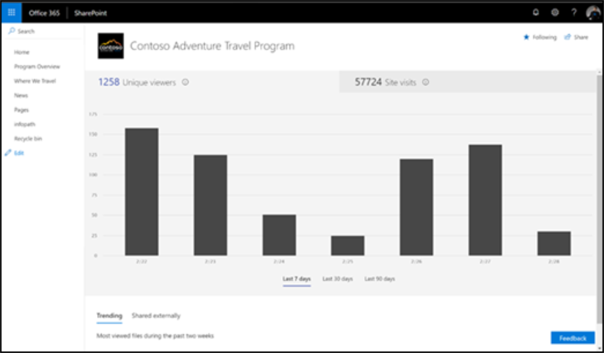

# Medir o impacto dos caminhos de aprendizado do Microsoft 365Measuring impact of Microsoft 365 learning pathways

Os administradores devem aproveitar os recursos de relatório de uso de site integrados do SharePoint para medir o impacto organizacional dos caminhos de aprendizado do Microsoft 365.Administrators should leverage SharePoint’s built-in site usage reporting capabilities to measure organizational impact of the Microsoft 365 learning pathways. Há dois cenários principais para medir o impacto:There are two primary scenarios for measuring impact: 
- Impacto no nível do site – exibir dados de uso para o site específico do Custom Learning para o Office 365Site level impact – view usage data for the Custom Learning for Office 365 specific site 
- Impacto no nível da organização – entenda o uso do Customer Learning para o Office 365 em relação a todos os outros sites em sua organizaçãoOrganization level impact – understand Customer Learning for Office 365 usage with respect to all other sites within your organization

## Impacto no nível do siteSite-level impact

Como proprietário de site do SharePoint Online, você pode exibir informações que mostram como os usuários estão interagindo com seu site.As a SharePoint Online site owner, you can view information that shows you how users are interacting with your site. Por exemplo, você pode ver o número de pessoas que visitaram o site, quantas vezes as pessoas visitaram o site e uma lista de arquivos que receberam mais exibição.For example, you can see the number of people who have visited the site, how many times people have visited the site, and a list of files that have received the most views. Consulte [Detalhes do Relatório](https://support.office.com/article/view-usage-data-for-your-sharepoint-site-2fa8ddc2-c4b3-4268-8d26-a772dc55779e).See [Report Details](https://support.office.com/article/view-usage-data-for-your-sharepoint-site-2fa8ddc2-c4b3-4268-8d26-a772dc55779e). 

## Impacto no nível da organizaçãoOrganization-level impact
O relatório de uso do site do Centro de Administração do Office 365 do SharePoint permite que os administradores recebam uma exibição de alto nível do valor que você está recebendo do site Aprendizagem Personalizada do Office 365 em relação a todos os outros sites do SharePoint.The Office 365 Admin Center SharePoint site usage report enables Administrators to get a high level view of the value you are getting from the Custom Learning for Office 365 site relative to all other SharePoint sites. Consulte [Detalhes do Relatório](/office365/admin/activity-reports/sharepoint-site-usage?view=o365-worldwide).See [Report Details](/office365/admin/activity-reports/sharepoint-site-usage?view=o365-worldwide).
 
Siga o artigo referenciado para:Follow the referenced article to: 
1. Saiba como chegar ao relatório de uso do site do SharePointLearn how to get to the SharePoint site usage report 
2. Interpretando os detalhes do relatório de uso do site do SharePoint.Interpreting the SharePoint site usage report details. Classificar no campo URL do Site para identificar mais facilmente seu site de caminhos de aprendizagem do Microsoft 365.Sort on the Site URL field to more easily identify your Microsoft 365 learning pathways site. 
3. Aproveite a funcionalidade de exportação de relatório para análise de dados mais avançada ou se sua organização tiver mais de 2.000 sites.Leverage the report Export functionality for more advanced data analysis or if your organization has greater than 2,000 sites. 

## RelatóriosReporting

A partir de hoje, o relatório está limitado ao nível do site do SharePoint.As of today, reporting is limited to the SharePoint site level. Empresse seu voto em [nosso fórum do User Voice](https://go.microsoft.com/fwlink/?linkid=2109552) para ajudar a priorizar solicitações de funcionalidade de relatório aprimoradas.Lend your vote to our [User Voice](https://go.microsoft.com/fwlink/?linkid=2109552) forum to help prioritize enhanced reporting functionality requests.