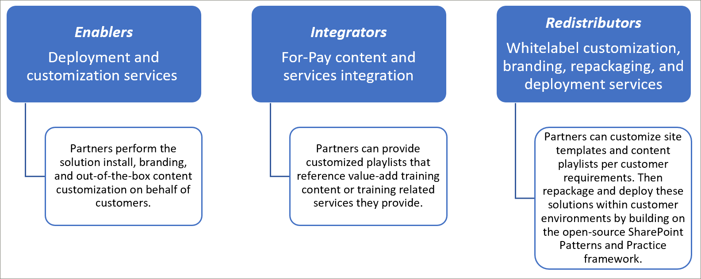
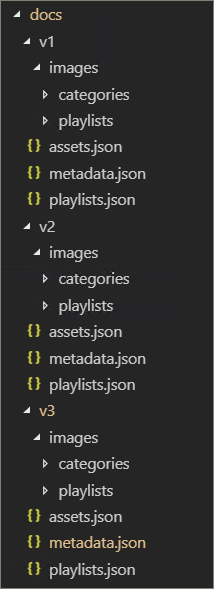
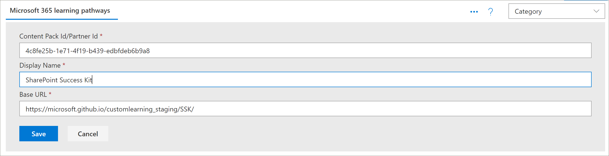
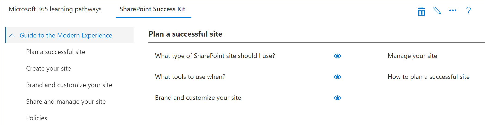
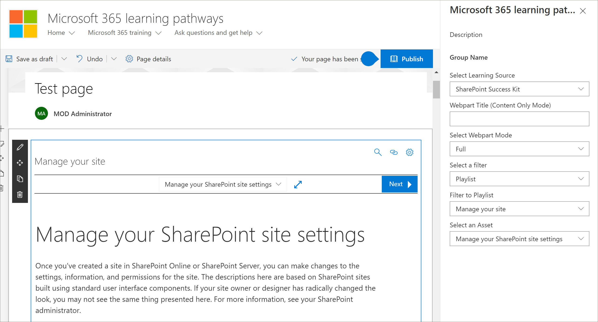

# Modelos de integração de parceirosPartner integration models
Embora não seja possível complementar o conteúdo de cursores de aprendizado da Microsoft 365 diretamente do serviço de provisionamento do SharePoint Online, há vários modelos de integração que os parceiros podem aproveitar para criar um serviço de agregação de valor alinhado ofertas.While it’s not possible to supplement the Microsoft 365 learning pathways content directly ‘out of the box’ from the SharePoint Online Provisioning service, there are several integration models that partners can leverage to create aligned value-add service offerings. Os modelos de integração de parceiros acima são apresentados em ordem de complexidade crescente e níveis de investimento.The partner integration models above are presented in order of ascending complexity and levels of investment. Portanto, nossa orientação é criar sua especialização e graduação para níveis mais avançados com base em seus modelos de negócios.Hence our guidance is to build your expertise and graduate to more advanced levels based on your business models.

 

## Como devo começar?How should I get started? 
Para começar, veja algumas práticas recomendadas a seguir.To get started, here are some best practices to follow.     

### 1. comece com a criação de expertise como um viabilizador.1. Begin with building expertise as an Enabler. 
Você pode ajudar uma porcentagem da sua base de clientes imediatamente, habilitando o portal de treinamento de cursores de aprendizado e realizando a ajuda do conteúdo da Microsoft direcionada.You can help a percentage of your customer base right away by enabling their learning pathways training portal and performing targeted Microsoft content curation. Para obter instruções sobre como provisionar os caminhos de https://docs.microsoft.com/en-us/office365/customlearning/custom_provisionaprendizado, consulte.For instructions on provisioning learning pathways, see https://docs.microsoft.com/en-us/office365/customlearning/custom_provision.  

### 2. em seguida, estenda seus serviços como um integrador2. Then extend your services as an Integrator
Execute uma análise de retorno de automação sobre o investimento, dependendo da quantidade de suas necessidades de integração de conteúdo e/ou serviços.Perform an automation return on investment analysis - depending on the quantity of your content and/or services integration needs. Por exemplo, talvez não seja necessário realizar os custos de desenvolvimento e operacional com relação às diretrizes de integração de conteúdo se você puder criar rapidamente uma lista de reprodução personalizada direcionada que aponte para seu conteúdo para pagamento ou faça referência a seus serviços.For example, it may not make sense to take on the development and operational costs with respect to our content integration guidelines if you can quickly manually create a targeted custom playlist(s) pointing to your for-pay content or reference your services.

### 3. quando o retorno sobre o investimento faz sentido – considere redistribuição3. When the return on investment makes sense – consider Redistribution 
Quando o retorno sobre o investimento faz sentido – considere redistribuição (ou trabalhar com os parceiros de cursores de aprendizado relacionados) para criar soluções reempacotadas.When the return on investment makes sense – consider Redistribution (or working with related learning pathways partners) to build repackaged solutions. Eles são baseados na estrutura de práticas e padrões do SharePoint, que oferece soluções para extrair sites personalizados e implantar em ambientes do clienteThese are based on the SharePoint Patterns and Practice framework which provides solutions to extract customized sites and then deploy into customer environments 

## Diretrizes de integração de conteúdo fornecidas pelo parceiroPartner-provided content integration guidelines
O conteúdo para os caminhos de aprendizado do Microsoft 365 é orientado por um conjunto de arquivos JSON que atuam como manifestos de conteúdo para seu pacote de aprendizado.Content for Microsoft 365 learning pathways is driven by a set of JSON files that act as content manifests for your learning package. Há três arquivos: Metadata. JSON, playlists. JSON e assets. JSON.There are three files: metadata.json, playlists.json, and assets.json. Esses arquivos precisam ser estruturados para corresponder aos modelos que a Web Part reconhece e, em seguida, hospedado de uma CDN (rede de distribuição de conteúdo) para permitir que a Web Part seja carregada.These files need to be structured to match the models the web part recognizes and then hosted from a content delivery network (CDN) to allow the web part to load them. A Microsoft fornecerá modelos de início desses arquivos para começar.Microsoft will provide starter templates of these files to get you started.  

**Isenção de responsabilidade:** a estrutura de arquivos JSON está sujeita a alterações com base no trabalho da solução futura.**Disclaimer:** the JSON file structure is subject to change based on upcoming solution work. O programa de adoção antecipada (EAP) do Microsoft 365 Learning Precursors será informado sobre qualquer alteração iminente dessa natureza.The Microsoft 365 learning pathways partner Early Adopter Program (EAP) will be informed of any impending changes of this nature. Junto com qualquer compatibilidade com versões anteriores do cliente e/ou diretrizes de transição.Along with any customer backwards compatibility and/or transition guidance. 

### Baixar a solução de cursores de aprendizagem da Microsoft 365Download the Microsoft 365 learning pathways solution
Você pode baixar a solução de cursores de aprendizado da Microsoft 365, junto com os arquivos JSON, do repositório https://github.com/pnp/custom-learning-office-365do github:.You can download the Microsoft 365 learning pathways solution, along with the JSON files, from the GitHub repository: https://github.com/pnp/custom-learning-office-365. Observe que, no momento, a Microsoft não está executando a solicitação pull do GitHub na solução.Note that at this time, Microsoft is not taking GitHub pull request on the solution. Mas você pode usar os arquivos do GitHub como um ponto de partida para a criação de seu próprio pacote de conteúdo personalizado.But you can use the GitHub files as a starting point for creating your own custom content pack. 

### Estrutura Metadata. JSONMetadata.json Structure
Você pode pensar nesse arquivo como o cérebro dos menus e da estrutura.You can think of this file as the brains of the menus and structure. Ele contém toda a estrutura de navegação, além de selecionar listas para dados nos outros dois arquivos.It contains all the navigation structure as well as pick lists for data in the other two files. 

|              NomeName        |                     DescriçãoDescription                                                               | 
|:-----------------------------|-------------------------------------------------------------------------------------------|
|**Tecnologias****Technologies**              |O conteúdo é marcado e pode ser ocultado com base na tecnologia que é atribuída.Content is tagged and can be hidden based on the Technology it’s assigned.                 |  
|&nbsp;&nbsp;ID&nbsp;&nbsp;Id                |GUID que representa a tecnologiaGUID representing the technology                                                           |  
|&nbsp;&nbsp;Tdomínio&nbsp;&nbsp;Name              |Nome para exibição da tecnologiaDisplay name of the technology                                                             |
|&nbsp;&nbsp;*Subjects []*&nbsp;&nbsp;*Subjects[ ]*     |Uma matriz de assuntos que são um subconjunto da tecnologiaAn array of subjects that are a subset of the technology                                   | 
|&nbsp;&nbsp;&nbsp;&nbsp;ID&nbsp;&nbsp;&nbsp;&nbsp;Id    |GUID que representa o assuntoGUID representing the subject                                                              |
|&nbsp;&nbsp;&nbsp;&nbsp;Tdomínio&nbsp;&nbsp;&nbsp;&nbsp;Name  |Nome para exibição do assuntoDisplay name of the subject                                                                |
|**Categories []****Categories [ ]**             |As categorias informam a navegação da Web Part.Categories inform the navigation of the webpart. Cada categoria representa um nível superior da navegaçãoEach category represents a top level of the navigation                                                                                                                 |
|&nbsp;&nbsp;ID&nbsp;&nbsp;Id                |GUID que representa a categoria/subcategoriaGUID representing the category/subcategory                                                 |
|&nbsp;&nbsp;Tdomínio&nbsp;&nbsp;Name              |Nome para exibição da categoria/subcategoriaDisplay name for the category/subcategory                                                  |
|&nbsp;&nbsp;Ampliá&nbsp;&nbsp;Image             |URL para a imagem que deve ser exibida no UX (relativa à base de CDN)URL for the image that should be displayed in the UX (relative to the CDN base)            |
|&nbsp;&nbsp;Technologyid&nbsp;&nbsp;TechnologyId      |O GUID da tecnologia à qual este conteúdo está relacionado (opcional – cadeia de caracteres vazia)The GUID of the Technology this content is related to (optional – empty string)            |
|&nbsp;&nbsp;SubjectID&nbsp;&nbsp;SubjectId         |O GUID do sujeito ao qual este conteúdo está relacionado (opcional – cadeia de caracteres vazia)The GUID of the Subject this content is related to (optional – empty string)               |
|&nbsp;&nbsp;Originais&nbsp;&nbsp;Source            |Da matriz de origem, não usada especificamente em experiência de usuário diferente de os dados personalizados adicionados pelo usuário é marcado como "locatário", e a área de administração de UX não permite a edição de nada que não esteja marcado como "locatário".From Source array, not specifically used in UX other than custom data added by the user is marked as “Tenant” and the UX admin area does not allow editing of anything not marked “Tenant”.                           |
|&nbsp;&nbsp;*Subcategorias []*&nbsp;&nbsp;*Subcategories[ ]*|As subcategorias são basicamente o nível de navegação do nível 2 para baixo.Sub-Categories are basically the nav level from level 2 down. A estrutura é o mesmo que uma categoria apenas aninhada.The structure is the same as a Category just nested.          |
|**Audiências []****Audiences [ ]**             |Quando as listas de reprodução associadas a uma categoria/subcategoria são várias audiências marcadas, um seletor estará disponível para mostrar as audiências disponíveis.When playlists associated with a category/subcategory are various audiences tagged, a selector will be available to show the available audiences. |         
|&nbsp;&nbsp;ID&nbsp;&nbsp;Id                |GUID da audiênciaGUID of the audience                                                                       |  
|&nbsp;&nbsp;Tdomínio&nbsp;&nbsp;Name              |Nome para exibição da audiênciaDisplay name of the audience                                                               |       
|**Fontes []****Sources [ ]**               |A matriz de cadeias de caracteres que marca o conteúdo com sua fonte, não usada especificamente em experiência de usuário diferente de dados personalizados adicionados pelo usuário é marcada como "locatário", e a área de administração de UX não permite a edição de nada que não esteja marcado como "locatário".Array of strings that tag content with its source, not specifically used in UX other than custom data added by the user is marked as “Tenant” and the UX admin area does not allow editing of anything not marked “Tenant”.                                                   |  
|**Níveis []****Levels  [ ]**               |Quando as listas de reprodução associadas a uma categoria/subcategoria são vários níveis marcados, um seletor estará disponível para mostrar os níveis disponíveis.When playlists associated with a category/subcategory are various levels tagged, a selector will be available to show the available levels.             |  
|&nbsp;&nbsp;ID&nbsp;&nbsp;Id                |GUID do nívelGUID of the Level                                                                          |  
|&nbsp;&nbsp;Tdomínio&nbsp;&nbsp;Name              |Nome para exibição do nívelDisplay name of the Level                                                                  | 
|**StatusTag [ ]****StatusTag  [ ]**           |A marca de status é para identificar o conteúdo com vários status que serão expostos no UX.Status tag is to identify content with various status that will be exposed in the UX. Alguns desses sinalizadores serão mostrados para o consumidor e alguns apenas para o administrador.Some of these flags will be show to the consumer and some only to the admin.                                                   |  
|&nbsp;&nbsp;ID&nbsp;&nbsp;Id                |GUID do StatugTagGUID of the StatugTag                                                                      |  
|&nbsp;&nbsp;Tdomínio&nbsp;&nbsp;Name              |Nome para exibição do StatusTagDisplay name of the StatusTag                                                              | 
|**Telemetria []****Telemetry  [ ]**            |                                                                                           |  
|&nbsp;&nbsp;AppInsightsKey&nbsp;&nbsp;AppInsightsKey    |GUID da chave do App insights que você configurou para controlar o carregamento da Web Part do visualizador.GUID of the app insights key that you have set up to track the loading of the viewer web part. O controle pode ser desativado por um administrador para o locatário inteiro, mas as informações enviadas são usuário anônimo com a ID do locatário. Confira esta seção para obter mais informaçõeshttps://github.com/pnp/custom-learning-office-365#disabling-telemetry-collectionTracking can be turned off by an administrator for the entire tenant, but the information sent is anonymized user with the tenant id. Please see this section for more information https://github.com/pnp/custom-learning-office-365#disabling-telemetry-collection               |  
|**Versão****Version**                   |As informações de versão são usadas pela solução para indicar aos administradores que a Web Part atualizou e também permite que a Web Part seja AutoAtualizar conteúdo personalizado para a versão mais recente do manifesto, caso sejam feitas alterações significativas.Version information is used by the solution to indicate to administrators that the webpart has updated and also allow the webpart to self-update custom content to the latest version of the manifest if significant changes have been made.         | 
|&nbsp;&nbsp;Manifesto&nbsp;&nbsp;Manifest          |A versão do manifestoThe version of the manifest                                               |
|&nbsp;&nbsp;ManifestMinWebPart&nbsp;&nbsp;ManifestMinWebPart|A versão mínima da WebPart que funciona com a versão do manifestoThe minimum version of the webpart that works with the version of the manifest             |
|&nbsp;&nbsp;CurrentWebPart&nbsp;&nbsp;CurrentWebPart    |URL para a imagem que deve ser exibida no UX (relativa à base de CDN)URL for the image that should be displayed in the UX (relative to the CDN base)            |
|&nbsp;&nbsp;Rederramado&nbsp;&nbsp;RepoURL           |A URL do repositório onde estão as instruções de atualização da Web Part.The url of the repository where the updating web part instructions are.                    |
|**Pacotes de conteúdo****Content Packs**             |No momento, não há suporte para pacotes de conteúdo para CDN adicionais.At this time content packs for additional CDN’s is not supported. Os pacotes de conteúdo permitem que a Microsoft sugira outras soluções criadas pela Microsoft que podem ser provisionadas por meio do serviço de provisionamento que aproveita o M365LP para fornecer conteúdo e que se encontram no CDNs personalizado.Content packs allow Microsoft to suggest other Microsoft created solutions that can be provisioned via the Provisioning service that leverage M365LP to deliver content and are in and of themselves custom CDNs.       | 
|&nbsp;&nbsp;ID&nbsp;&nbsp;Id                |GUID do pacote de conteúdo/CDNGUID of the content pack/CDN                                                              |
|&nbsp;&nbsp;Tdomínio&nbsp;&nbsp;Name              |Nome para exibição da CDNDisplay name of the CDN                                                                   |
|&nbsp;&nbsp;Descrição&nbsp;&nbsp;Description       |Descrição a ser exibida na interface do usuário para adicionar um pacote de conteúdoDescription to be displayed in UI for adding a content pack                               |
|&nbsp;&nbsp;Ampliá&nbsp;&nbsp;Image             |Imagem a ser exibida na interface do usuário para adicionar um pacote de conteúdoImage to be displayed in UI for adding a content pack                                     |
|&nbsp;&nbsp;ProvisionURL&nbsp;&nbsp;ProvisionURL      |A URL do pacote de serviço de provisionamento para criar o conjunto de sites do pacote de conteúdoThe URL to the provisioning service package to create the content pack’s site collection  |
|&nbsp;&nbsp;CDNbase&nbsp;&nbsp;CDNbase           |A URL base para os manifestos do pacote de conteúdoThe Base URL for the manifests for the content pack                                       |
|AssetOriginsAssetOrigins                  |Uma matriz de origem da URL utilizada no arquivo assets. JSON descrito mais tarde.An array of URL origin’s utilized in the assets.json file described later. Se a URL de origem oferecer suporte, uma mensagem de postagem será enviada para help_getClientHeight.If the origin URL supports it, a post message will be sent to help_getClientHeight. Uma resposta na propriedade data de: "help_getClientHeight = {altura de conteúdo}" (por exemplo, "help_getClientHeight = 5769") permitirá que o iFrame seja redimensionado para a altura apropriada do conteúdo enquadrado.A response in the data property of: "help_getClientHeight={height of content}" (for example "help_getClientHeight=5769") will allow the iFrame to be resized to the appropriate height of the framed content.         |

### Estrutura de listas de reprodução. JSONPlaylists.json Structure
playlists. JSON – o manifesto de playlists é uma matriz de objetos que descrevem os metadados sobre uma lista de reprodução e os ativos incluídos na lista de reprodução.playlists.json – The playlists manifest is an array of objects that describe the metadata about a playlist and the assets that are included in the playlist.

|              NomeName        |                     DescriçãoDescription                                                               | 
|:-----------------------------|-------------------------------------------------------------------------------------------|
|IdId                            |GUID que representa a lista de reproduçãoGUID representing the playlist                                                             |  
|TítuloTitle                         |Nome de exibição da lista de reproduçãoDisplay name of the playlist                                                               |
|ImageImage                         |URL relativa (de CDN) para uma imagem para visualizar a lista de reproduçãoRelative URL (from CDN) to an image to visualize the playlist                              |                      
|LevelidLevelId                       |Nível associadoAssociated level                                                                           |
|AudienceIDAudienceId                   |Público associadoAssociated audience                                                                        |
|TechnologyidTechnologyId                 |Tecnologia associadaAssociated technology                                                                      |
|SubjectIDSubjectId                    |Nome para exibição da categoria/subcategoriaDisplay name for the category/subcategory                                                  |
|OrigemSource                        |A partir da matriz de origem, não usada especificamente no UX diferente dos dados personalizados adicionados pelo usuário está marcado como "locatário", e a área de administração de UX não permite a edição de nada que não esteja marcado como "locatário".From the source array, not specifically used in UX other than custom data added by the user is marked as “Tenant” and the UX admin area does not allow editing of anything not marked “Tenant”.                                              |
|CatIdCatId                         |A ID de categoria ou de subcategoria que representa o contêiner em que a playlist deve ser mostrada.The Category or SubCategory ID that represents the container the playlist should be shown in. No momento, o manifesto não oferece suporte à seleção de uma categoria ou subcategoria como o contêiner, caso também tenha filhos de subcategorias.Currently the manifest does not support selecting a Category or SubCategory as the container if it also has SubCategory children.        |
|DescriçãoDescription                   |Uma descrição mostrada para cada lista de reprodução no UXA description showed for each playlist in the UX                                           |
|StatusTagIdStatusTagId                   |Marca de status associadaAssociated status tag                                                                      |
|StatusNoteStatusNote                    |Observações sobre o conteúdo exibido para administradoresNotes about content displayed to administrators                                            |
|*Ativos []**Assets[]*                        |Uma matriz de GUIDs para os ativos que fazem parte desta playlist, em ordem de exibição.An array of GUID’s for the assets that are part of this playlist, in display order.        |         

### Estrutura de ativos. JSONAsset.json Structure
playlists. JSON – o manifesto de playlists é uma matriz de objetos que descrevem os metadados sobre uma lista de reprodução e os ativos incluídos na lista de reprodução.playlists.json – The playlists manifest is an array of objects that describe the metadata about a playlist and the assets that are included in the playlist.

|              NomeName        |                     DescriçãoDescription                                                               | 
|:-----------------------------|-------------------------------------------------------------------------------------------|
|IdId                            |GUID que representa a lista de reproduçãoGUID representing the playlist                                                             |  
|TítuloTitle                         |Nome de exibição da lista de reproduçãoDisplay name of the playlist                                                               |
|DescriçãoDescription                   |---                                                                                           |                      
|URLURL                           |A URL de origem do ativo a ser aplicada ao iFrameThe source url for the asset, to be applied to the iFrame                                  |
|TechnologyidTechnologyId                  |Tecnologia associadaAssociated technology                                                                      |
|SubjectIDSubjectId                     |Assunto associadoAssociated subject                                                                         |
|OrigemSource                        |Nome para exibição da categoria/subcategoriaDisplay name for the category/subcategory                                                  |
|StatusTagIdStatusTagId                   |Marca de status associadaAssociated status tag                                                                      |
|StatusNoteStatusNote                    |Observações sobre o conteúdo exibido para administradores.Notes about content displayed to administrators.                                           |

### PMKCaching
A versão atual da Web Part do visualizador utiliza uma versão em cache dos arquivos de manifesto por 24 horas.The current version of the viewer web part utilizes a cached version of the manifest files for 24 hours. Após 24 horas, o primeiro usuário que acertar a Web Part leva o impacto de desempenho para atualizar o cache baixando os manifestos da CDN de origem e mesclar essas informações com tecnologias e listas de reprodução ocultas, bem como mesclar em subcategorias personalizadas, listas de reprodução e ativos.After 24 hours, the first user that hit’s the webpart takes the performance hit to refresh the cache by downloading the manifests from the source CDN and merge that information with hidden technologies and playlists as well as merging in custom sub-categories, playlists, and assets. Como alternativa, a Web Part de administração sempre baixa o conteúdo dos manifestos e o mescla e atualiza o cache.Alternately the admin web part always downloads the content from the manifests and merges them in and updates the cache.  Portanto, em outras palavras, o administrador pode forçar uma atualização de cache a qualquer momento carregando a Web Part de administração, não se referindo à página de administração.So, in other words, the administrator can force a cache update at any time by loading the admin web part, aka going to the Administration page.

## Diretrizes de pacote de conteúdoContent Pack Guidelines
O recurso de pacote de conteúdo desbloqueia os seguintes cenários:The Content Pack feature unlocks the following scenarios:
- A capacidade de os parceiros redistribuirem o conteúdo de aprendizado personalizado de valor agregado personalizado sob medida para o ambiente do clienteThe ability for partners to redistribute value-added custom learning content custom tailored to customers’ environment
- A capacidade para organizações com uma equipe de treinamento forte e suporte de ti para criar conteúdo de aprendizado personalizado direcionado a seus próprios sistemas internos e governançaThe ability for organizations with a strong training team and IT support to build custom learning content directed at their own internal systems and governance
- A capacidade para a Microsoft de fornecer outros caminhos de aprendizado no futuro que os clientes podem optar porThe ability for Microsoft to deliver additional learning pathways in the future that customers can opt into

Este conjunto de documentação atual é direcionado intencionalmente para parceiros devido à complexidade do recurso.This current documentation set is intentionally targeted for Partners due to the feature’s complexity. A equipe de serviço está trabalhando ativamente para melhorar o suporte e permitir o #2 de cenário no futuro.The service team is actively working to better support and enable scenario #2, in the future. 

### Como os pacotes de conteúdo funcionamHow Content Packs work
A Microsoft utiliza páginas do GitHub como uma fonte de rede de distribuição de conteúdo (CDN) para seus arquivos de manifesto e imagens.Microsoft utilizes GitHub pages as a Content Delivery Network (CDN) source for its manifest files and images. Temos uma pasta docs na raiz do nosso repositório do GitHub que inclui subpastas para cada versão dos arquivos de manifesto.We have a docs folder at the root of our GitHub repository that includes sub folders for each version of the manifest files. Dentro de cada pasta há três arquivos de manifesto, mais uma pasta de imagens para armazenar todas as imagens de categoria, subcategoria e lista de reprodução.Inside each folder there are three manifest files, plus an images folder to store all the category, subcategory, and playlist images. 

É importante que você mantenha a mesma estrutura de controle de versão que a Microsoft deve optar por estender a solução de cursores de aprendizado com seu próprio pacote de conteúdo.It is important that you maintain the same versioning structure that Microsoft does should you choose to extend the learning pathways solution with your own content pack. O ponto de extremidade da CDN não deve incluir a pasta da versão, pois a versão do manifesto à qual a Web Part oferece suporte é Baked nela e é automaticamente acrescentada à URL da CDN.Your CDN endpoint should not include the version folder, as the manifest version the web part supports is baked into it and is automatically appended to the CDN url. Obviamente, forneceremos tempo para criar novas instâncias de seus arquivos de manifesto sempre que o revisarmos.We will obviously give you time to create new instances of your manifest files any time we revision it.

 

Para obter mais informações sobre como usar páginas do GitHub como sua fonte de CDN, confira a [https://help.github.com/en/articles/configuring-a-publishing-source-for-github-pages](https://help.github.com/en/articles/configuring-a-publishing-source-for-github-pages)seguinte documentação da ajuda:.For more information about utilizing GitHub pages as your CDN source please see the following help documentation: [https://help.github.com/en/articles/configuring-a-publishing-source-for-github-pages](https://help.github.com/en/articles/configuring-a-publishing-source-for-github-pages).

A solução da Microsoft faz com que as informações sobre os ativos sejam abertas para o público, já que não há nenhuma segurança sobre quem tem acesso a esses arquivos.Microsoft’s solution makes the information about the assets open to the public as there is no security around who has access to these files. Acreditamos que deve haver uma camada de conteúdo livre para um consumidor, que diz que se você precisa de pagamento de parede para alguns ou todos os seus conteúdos, precisará implementar isso de forma diferente nas limitações técnicas da solução e usar as páginas do GitHub é de nenhuma média s um requisito.We believe that there should be a free layer of content for a consumer, that said if you have a need for pay wall for some or all of your content you will need to implement this differently within the technical limitations of the solution and using GitHub pages is by no means a requirement. Qualquer provedor de CDN que você gostaria de usar é bom se você mantiver a estrutura de numeração de versão que descrevemos.Any CDN provider you would like to use is fine if you maintain the version numbering structure we’ve outlined. Conforme mencionado anteriormente, a versão da estrutura do manifesto à qual a Web Part oferece suporte é Baked no código e é automaticamente acrescentada à URL da CDN.As stated previously, the version of the manifest structure the web part supports is baked into the code and is automatically appended to the CDN URL. 

### Orientação de integração do pacote de conteúdoContent Pack Integration Guidance 
As Web Parts do administrador e do visualizador foram estendidas para permitir que o consumidor configure pontos de extremidade adicionais da CDN em seu locatário, que permitirá que a Web Part do visualizador selecione qual CDN eles devem originar os dados que eles exibem.The admin and viewer web parts have been extended to allow the consumer to configure additional CDN endpoints in their tenant which will then allow the viewer web part to select which CDN they should source the data they display. 

Principais enquadramento para ter em mente este recurso:Key framing to keep in mind for this feature: 
- Isso é o principal aplicável para cenários de redistribuição de parceiros – onde a configuração manual de playlist é muito complicadaThis is primary applicable for partner redistribution scenarios – where manual playlist configuration is too cumbersome 
- Pacotes de conteúdo personalizados são um recurso avançado e devem ser usados apenas por parceiros com experiência de administração de conteúdo da Web.Custom Content Packs are an advanced feature and should only be used by Partners with experience administrating web content. Fontes de conteúdo não confiáveis podem apresentar conteúdo não seguro em seu site.Untrustworthy content sources may introduce unsafe content into your site. Você só deve adicionar fontes confiáveis.You should only add sources that you trust.

> **Importante** Antes de adicionar um pacote de conteúdo personalizado, você deve ter provisionado os caminhos de aprendizado do Microsoft 365 3,0 ou posterior.**IMPORTANT** Before adding a Custom Content Pack, you must have provisioned Microsoft 365 learning pathways 3.0 or later. Para o informataion sobre o provisionamento de caminhos de aprendizado do Microsoft 365, confira [provisionar os caminhos de aprendizado da microsoft 365](https://docs.microsoft.com/en-us/office365/customlearning/custom_provision).For informataion about provisioning Microsoft 365 learning pathways, see [Provision Microsoft 365 learning pathways](https://docs.microsoft.com/en-us/office365/customlearning/custom_provision).

### Lista de conteúdoContent Whitelisting
Como um parceiro, você é responsável por ajudar seus clientes a garantir que seu conteúdo seja whitelist em seu ambiente.As a partner it’s your responsibility to assist your consumers in making sure your content is whitelisted in their environment. Sugerimos que você crie um cenário de teste em seu ambiente para validar que seu conteúdo pode ser iFrame em uma página do SharePoint dentro do firewall.We suggest you create a test scenario in their environment to validate that your content can be iFrame’d into a SharePoint page inside of their firewall. Siga as instruções para [criar páginas do SharePoint de listas de reprodução personalizadas](https://docs.microsoft.com/en-us/office365/customlearning/custom_createnewpage) para confirmar se esse é o caso.Follow the [Create SharePoint pages for Custom Playlists](https://docs.microsoft.com/en-us/office365/customlearning/custom_createnewpage) instructions to confirm this is the case.

### Adicionar um pacote de conteúdo aos caminhos de aprendizadoAdd a Content Pack to Learning Pathways
Depois que você tiver criado modificado o JSON e definido sua CDN, poderá adicionar o pacote de contato aos caminhos de aprendizado.Once you've created modified the JSON and defined your CDN, you can add the Contact Pack to learning pathways. 

1. Na **Home** Page do site de cursores de aprendizado, aponte para **página inicial** e clique em **Administração de caminhos de aprendizado**.From the learning pathways site **Home** page, point to **Home** and then click **Learning pathways administration**. 
2. Na página **Administração** , clique em **... Adicione o pacote de conteúdo** no canto superior direito da página.From the **Administration** page, click the **... Add Content Pack** in the upper-right corner of the page.
3. Clique em pacote de conteúdo personalizado e insira um nome para o pacote de conteúdo e, em seguida, especifique a CDN onde os arquivos JSON estão localizados.Click Custom Content Pack, and then enter a name of the Content Pack and then specify the CDN where the JSON files are located.

4. Clique em **Salvar**.Click **Save**. O conteúdo do seu pacote de conteúdo personalizado agora deve aparecer na página de administração.The content from your Custom Content Pack should now appear in the Administration page. Veja um exemplo.Here is an example. 

### Filtrar para o pacote de conteúdo na Web PartFilter to the Content Pack in the web part
Com os caminhos de aprendizado, você pode adicionar a Web Part de cursores de aprendizado à página, filtrar a Web Part para apontar para a fonte do pacote de conteúdo personalizado e, em seguida, filtrar a Web Part para a categoria, a subcategoria, a lista de reprodução e o ativo que você deseja.With learning pathways, you can add the learning pathways web part to a page, filter the web part to point to the Custom Content Pack source, and then filter the web part to the category, subcategory, playlist, and asset that you want. 

1. No site de cursores de aprendizado, clique em **novo**e em **página**.From the learning pathways site, click **New**, and then **Page**.
2. Clique em **em branco**e, em seguida, **crie página**.Click **Blank**, and then **Create Page**.
3. Dê um nome à página.Give the page a name. 
4. Clique em **+ Adicionar uma nova seção** no lado esquerdo da página.Click **+ Add a new section** on the left side of the page.
5. Clique **+** na parte superior central da nova seção e, em seguida, adicione a Web Part **caminhos de aprendizado da Microsoft 365** .Click **+** in the top-middle of the new section, and then add the **Microsoft 365 learning pathways** web part.
6. Clique na Web Part e, em seguida, clique no ícone **Editar** .Click the Web part, and then click the **Edit** icon.
7. Na caixa **selecionar a fonte de aprendizado** , selecione seu pacote de conteúdo personalizado e, em seguida, filtre a Web Part para o conteúdo desejado.In the **Select the Learning Source** box, select your Custom Content Pack, and and then filter the web part to the content you want. Veja a seguir um exemplo da Web Part filtrada para uma lista de reprodução de um pacote de conteúdo personalizado.The following provides an example of the Web part filtered to a playlist from a Custom Content Pack.

  

