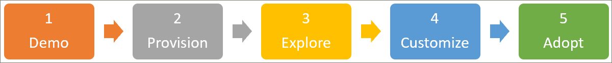

# Guia de Integração do Parceiro
Comece com os caminhos de aprendizado seguindo as três etapas descritas abaixo. Com as três etapas, você pode criar uma demonstração atraente que você pode usar para envolver apresentações com clientes. 

## 1. criar um ambiente de demonstração do Microsoft 365
Você pode usar o demos.microsoft.com para criar um ambiente de demonstração onde você pode provisionar o serviço, validá-lo e usá-lo para apresentar os cursores de aprendizado aos clientes. Todos os parceiros têm acesso a https://demos.microsoft.com essa finalidade. Você pode usar o **Guia de introdução** do demos.Microsoft.com se você for novo no ambiente de demonstração.

## 2. provisionar os caminhos de aprendizado do Microsoft 365
Você pode provisionar os caminhos de aprendizado com o serviço de provisionamento do SharePoint Online.
- Para provisionar os caminhos de aprendizado, vá para a página de solução de [cursores de aprendizado da Microsoft 365](https://provisioning.sharepointpnp.com/details/3df8bd55-b872-4c9d-88e3-6b2f05344239) . Revise as [Opções de configuração dos caminhos de aprendizado](https://docs.microsoft.com/office365/customlearning/custom_setupoptions). 
- Examine os [pré-requisitos da solução](https://docs.microsoft.com/office365/customlearning/custom_provision) , pois esses são impedimentos comuns para o cliente novo no SharePoint, que pode não ter todas as permissões corretas ou a configuração de ambiente necessária, como um catálogo de aplicativos de locatários.
- Tente implantar a solução por meio de uma função que não seja de administrador – para se familiarizar com o serviço de provisionamento e tratamento de erros do serviço de gerenciamento de mensagens.

## 3. Explore seu site de caminhos de aprendizado provisionados recentemente para se familiarizar com seus recursos
[Explore seu site de caminhos de aprendizado provisionados recentemente](https://docs.microsoft.com/office365/customlearning/custom_exploresite) para se familiarizar com seus recursos. Revise o [centro de sucesso do administrador](https://docs.microsoft.com/office365/customlearning/custom_successcenter) para obter informações sobre atualizações de conteúdo e recursos, além de diretrizes de planejamento, personalização, adoção e medição de impacto.

## 4. personalizar a experiência de aprendizagem
[Personalize a experiência dos caminhos de aprendizado](https://docs.microsoft.com/office365/customlearning/custom_overview) trabalhando nas seguintes áreas funcionais:
- [Ocultar e mostrar subcategorias](https://docs.microsoft.com/office365/customlearning/custom_hideshowsub), [listas de reprodução](https://docs.microsoft.com/office365/customlearning/custom_hideshowplaylists)e [tecnologias](https://docs.microsoft.com/office365/customlearning/custom_hideshowtech).
- [Copiar uma lista de reprodução](https://docs.microsoft.com/office365/customlearning/custom_copyplaylist)
- [Criar uma playlist personalizada](https://docs.microsoft.com/office365/customlearning/custom_createnewplaylist) – começando com [páginas do SharePoint](https://docs.microsoft.com/office365/customlearning/custom_createnewpage), [criação de playlist](https://docs.microsoft.com/office365/customlearning/custom_createnewplaylist), [adição de ativos](https://docs.microsoft.com/office365/customlearning/custom_addassets)e [criação de subcategorias](https://docs.microsoft.com/office365/customlearning/custom_createnewcat).

## 5. criar uma campanha de comunicação de caminhos de aprendizado de amostra
Crie uma campanha de comunicação de cursores de aprendizado de exemplo com base no [Kit de adoção baixável](https://teamworktools.azurewebsites.net/m365lp/m365lpadoptionkit.zip) e destaque o conteúdo personalizado que você criou na etapa 4. Você pode aproveitar isso ao demonstrar a experiência completa do cliente. 

