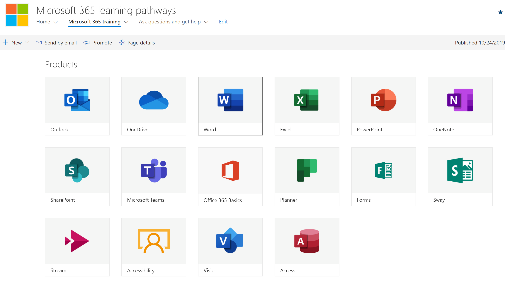
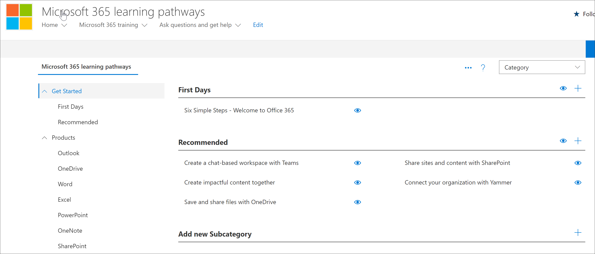

# Planejar o conteúdo dos caminhos de aprendizadoPlan your learning pathways content
Antes de se aprofundar na distribuição dos caminhos de aprendizado da Microsoft 365, é uma boa ideia levar algum tempo para pesquisar o conteúdo de aprendizado, as ferramentas e os recursos disponíveis para você.Before you dive into rolling out Microsoft 365 learning pathways, it’s a good idea to take some time to survey the learning content, tools, and capabilities available to you. Nosso objetivo é ajudá-lo a fazer com que os usuários da sua organização se conectem e sejam produtivos da maneira mais rápida e eficiente possível.Our goal is to help you get your organization's users up to speed, and productive, as quickly and efficiently as possible. Quando se trata de planejamento de caminhos de aprendizado, recomendamos um processo de três etapas:When it comes to planning for learning pathways, we recommend a three-step process:

1. **Revise os recursos disponíveis** – os recursos fornecidos por meio de caminhos de aprendizado e os recursos disponíveis em sua organização.**Review the available resources** – both the resources provided through learning pathways and the resources available in your organization. Os melhores planos de aprendizado combinam recursos da Microsoft e recursos da sua organização.The best learning plans combine both Microsoft resources and resources from your organization.
2. **Saiba mais sobre os recursos da ferramenta de cursores de aprendizado** – daremos um tour rápido.**Get to know the capabilities of the Learning Pathways tool** - we'll give you a quick tour. 
3. **Criar um plano de conteúdo** – revise os guias de adoção disponíveis para ajudá-lo a criar um plano geral.**Create a content plan** – review the available Adoption Guides to help you with building an overall plan.

## Revisar os recursos disponíveisReview the available resources
Antes de criar um plano de conteúdo para os caminhos de aprendizado do Microsoft 365, Reserve algum tempo para descobrir todos os recursos que estão disponíveis para você.Before you create a content plan for Microsoft 365 learning pathways, take some time to discover all the resources that are available to you.  

### Revisar o site do SharePoint dos caminhos de aprendizadoReview the learning pathways SharePoint site
A solução de caminhos de aprendizado do Microsoft 365 fornece um site de comunicação do SharePoint com uma Web Part que está conectada a um catálogo online.The Microsoft 365 learning pathways solution provides a SharePoint communication site with a web part that's connected to an online catalog. O site do SharePoint é totalmente personalizável, incluindo o nome do site, logotipo, páginas, itens de menu, temas e blocos.The SharePoint site is fully customizable, including the site name, logo, pages, menu items, themes, and tiles. Reserve algum tempo para clicar nos blocos e itens de menu para descobrir o que está disponível no site de cursores de aprendizado.Take some time to click the tiles and menu items to discover what's available with the learning pathways site.

### Revise o conteúdo do catálogo online com a Web PartReview the content from the Online catalog with the Web part
A Web Part, por padrão, é adicionada a uma série de páginas no site de comunicação do SharePoint.The Web part, by default, is added to a series of pages in the SharePoint Communication site. O conjunto completo de conteúdo é fornecido na página de treinamento do Microsoft 365.The complete set of content is provided on the Microsoft 365 training page. A página de treinamento do Microsoft 365 hospeda a Web Part de cursores de aprendizado configurada para mostrar todos os treinamentos disponíveis para os caminhos de aprendizado.The Microsoft 365 training page hosts the learning pathways Web part configured to show all the training available for learning pathways. 

**Para exibir a página de treinamento do Microsoft 365****To view the Microsoft 365 Training page**
1. Clique no item de menu treinamento do Microsoft 365.Click the Microsoft 365 training menu item. 
1. Role para baixo na página para exibir todas as categorias e subcategorias.Scroll down the page to view all the categories and subcategories.
2. Faça um pouquinho dos pneus.Kick the tires a bit. Clique em algumas subcategorias e, em seguida, clique em algumas listas de reprodução para saber como o conteúdo dos caminhos de aprendizado é organizado.Click a few subcategories, and then click a few playlists to get a feel for how learning pathways content is organized. 

### Exibir a página de administraçãoView the Administration Page
A página de administração fornece uma lista do conteúdo disponível para você.The Administration page provides a listing of the content available to you. É aqui que você pode ocultar o conteúdo, criar novas listas de reprodução e adicionar, editar e remover a playlist.This is where you can hide content, create new playlists, and add, edit, and remove playlist. Clique nas várias categorias e listas de reprodução para ver a esspire completa do conteúdo disponível.Click through the various categories and playlists to see the full breath of the content available. 

**Para exibir a página de administração.****To view the Administration page.**
1. No site de cursores de aprendizado, aponte para a seta suspensa menu página inicial e clique em administração de caminhos de aprendizado.From the learning pathways site, point to the Home menu dropdown arrow, then click Learning pathways Administration.  
2. Em seguida, clique nas várias categorias, subcategorias e listas de reprodução para obter uma respire do conteúdo disponível.Then click through the various categories, subcategories, and playlists to get a feel for the breath of content available to you. 

### Conheça os recursos dos caminhos de aprendizado do Microsoft 365Get to know the capabilities of Microsoft 365 Learning Pathways
Com os caminhos de aprendizado da Microsoft 365, você pode ter conteúdo fornecido pela Microsoft misto com o conteúdo que você cria para direcionar políticas e procedimentos específicos que sejam exclusivos para sua organização.With Microsoft 365 Learning Pathways, you can have content provided by Microsoft mixed with content you create to target specific policies and procedures that are unique to your organization. Como prática recomendada, tente aproveitar o conteúdo fornecido pela Microsoft o máximo possível.As a best practice, try to leverage Microsoft-provided content as much as possible. A Microsoft atualiza ativos individuais regularmente e atualiza o inventário completo do conteúdo trimestralmente.Microsoft updates individual assets on a regular basis and updates the full inventory of content on a quarterly basis. Normalmente, uma organização criará 10-20% de conteúdo exclusivo e deixará o restante de 80% para a Microsoft para manter-se atualizado.Typically an organization will create 10-20% unique content, then leave the remaining 80% to Microsoft to keep up-to-date. As listas a seguir descrevem como o conteúdo de caminhos de aprendizado é organizado, juntamente com as diretrizes para o conteúdo que pode ser modificado ou criado.The following lists describes how learning pathways content is organized, along with guidelines for the content that can be modified or created. A orientação para personalizar o conteúdo é fornecida na seção Personalizando os caminhos de aprendizado do centro de sucesso do administrador.Guidance for customizing content is provided in the Customizing learning pathways section of the Admin Success Center.

- **Categorias** : são contêineres para subcategorias.**Categories** - are containers for subcategories. As categorias são fornecidas pela Microsoft e não podem ser criadas ou modificadas.Categories are provided by Microsoft and cannot be created or modified.
- **Subcategorias** -são contêineres para listas de reprodução.**Subcategories** - are containers for playlists. A Microsoft fornece subcategorias que você não pode modificar, mas pode criar suas próprias subcategorias.Microsoft provides subcategories which you cannot modify, but you can create your own subcategories. 
- **Playlist** -são contêineres de ativos.**Playlist** - are containers for assets. A Microsoft fornece listas de reprodução que você não pode modificar, mas você pode criar suas próprias listas de reprodução.Microsoft provides playlists which you cannot modify, but you can create your own playlists.  
- **Ativos** – as páginas de aprendizado dentro da lista de reprodução.**Assets** - are the learning pages within playlist. A Microsoft fornece ativos em listas de reprodução que não podem ser modificadas, mas você pode criar seus próprios ativos e adicioná-los a listas de reprodução. estMicrosoft provides assets in playlists which you cannot modify, but you can create your own assets and add them to playlists.est

### Examinar recursos adicionais da MicrosoftReview additional resources from Microsoft
A Microsoft fornece ajuda e recursos de treinamento que você pode aproveitar ao planejar o conteúdo para caminhos de aprendizado.Microsoft provides help and training resources that you can leverage when planning for content for learning pathways.  

-  [Ajuda e treinamento do OfficeOffice Help and Training](https://support.office.com)
-  [Centro de Treinamento do Office 365Office 365 Training Center](https://support.office.com/office-training-center)

### Analisar os recursos de aprendizado em sua organizaçãoReview the learning resources in your organization
Coloque em estoque o conteúdo de aprendizado já disponível para você em sua organização.Take stock of the learning content already available to you in your organization.
Por exemplo, sua organização já pode ter guias personalizados de início rápido, folhas de dicas ou páginas do SharePoint dedicadas à preparação para a Microsoft 365, assistência técnica, integração ou treinamento.For example, your organization have may already have custom Quick Start Guides, Cheat Sheets, or SharePoint pages dedicated to Microsoft 365 readiness, HelpDesk, onboarding or training. Os ativos existentes do SharePoint podem ser incorporados no Microsoft 365 portal playlists e ou combinados com o conteúdo da Microsoft em uma lista de reprodução para criar uma lista de reprodução direcionada para sua organização.Existing SharePoint assets can be incorporated into the Microsoft 365 Portal playlists and or mixed with Microsoft content in a playlist to build a targeted playlist for your organization. Para obter mais informações sobre como misturar o conteúdo da sua organização com o conteúdo da Microsoft, consulte a [personalização dos caminhos de aprendizado](custom_overview.md). Personalização da seção de cursores de aprendizado do centro de sucesso do administrador.For more information about mixing your organization's content with Microsoft's content, see the [Customizing learning pathways](custom_overview.md).Customizing learning pathways section of the Admin Success Center.

### Aproveite os recursos de adoçãoLeverage the Adoption Resources
Observe que você pode começar a usar os caminhos de aprendizado dentro de dias, mas é melhor fazer um planejamento antecipado antes de executar uma estratégia de campanha de aprendizado para integrar uma nova tecnologia ou conjunto de serviços.Note that you can get started using learning pathways within days, but it’s best to do some up-front planning before executing a learning campaign strategy to onboard a new technology or set of services. O desenvolvimento de um plano de conteúdo e o uso de caminhos de aprendizado realmente fazem parte de um esforço mais abrangente no planejamento de uma estratégia geral de gerenciamento de alterações, portanto, fornecemos materiais de adoção que você pode aproveitar para planejar sua estratégia geral.Developing a content plan and using learning pathways is really part of a more extensive effort in planning an overall Change Management strategy, so we provide adoption materials that you can leverage for planning your overall strategy. Como parte do seu esforço de planejamento, confira [recursos de adoção](https://resources.techcommunity.microsoft.com/adoption/).As part of your planning effort, check out [Adoption Resources](https://resources.techcommunity.microsoft.com/adoption/).

### Criar um plano de aprendizado e iterarBuild a Learning Plan and Iterate 
Muitas empresas que foram implantadas com êxito os caminhos de aprendizado adotaram campanhas de aprendizado voltadas para cenários ou tecnologias específicas.Many companies who’ve successfully rolled out Learning Pathways have adopted Learning campaigns focusing on specific scenarios or technologies. Por exemplo, "seja mais colaborativo – usando equipes" ou "seja mais móvel com o Outlook Mobile".For example, "Be more collaborative - using Teams" or “Be more mobile with Outlook mobile.” Você pode ver exemplos de campanhas de aprendizado potenciais usando o [Kit de adoção baixável](https://teamworktools.azurewebsites.net/m365lp/m365lpadoptionkit.zip).You can see examples of potential learning campaigns using the [downloadable Adoption Kit](https://teamworktools.azurewebsites.net/m365lp/m365lpadoptionkit.zip).

 
