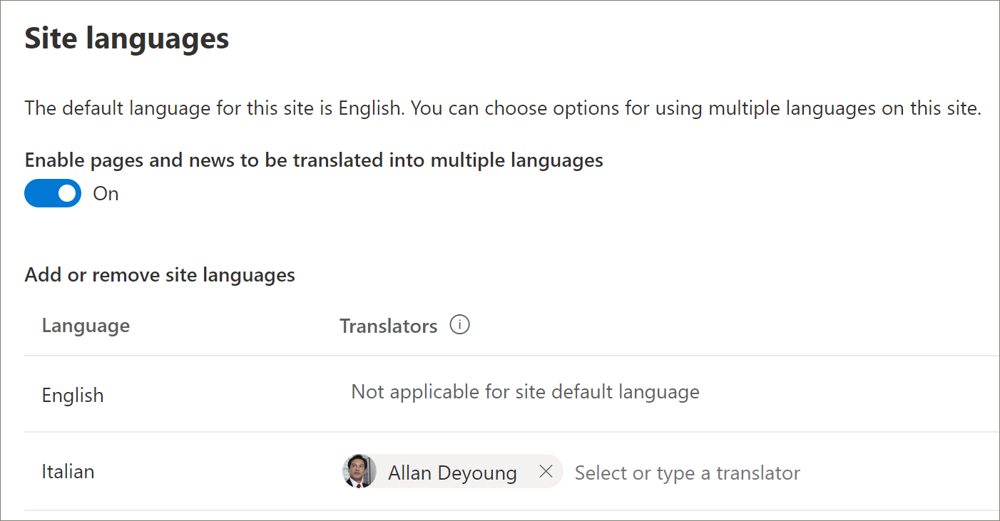

# Provisione uma nova solução de caminhos de aprendizado 
Organizações que não têm caminhos de aprendizado provisionados em seu locatário podem usar o serviço de livro de aparência do SharePoint para adicionar a solução de caminhos de aprendizagem multilíngues. Com essa opção, o modelo de caminhos de aprendizado do SharePoint é convertido em nove idiomas e pode ser usado com um mínimo de modificação. 

> [!IMPORTANT]
> Se você já tiver os caminhos de aprendizado provisionados em seu locatário, é recomendável atualizar [os](custom_update.md) caminhos de aprendizado. Se você instalar uma nova instância de caminhos de aprendizado, será necessário transferir manualmente quaisquer personalizações do site existente para o novo site. 

## Pré-requisitos para suporte multilíngue
 
Para configurar com êxito os caminhos de aprendizado do Microsoft 365 com o serviço de look book, a pessoa que está fazendo o provisionamento deve atender aos seguintes pré-requisitos:   
 
- A pessoa que provisiona os caminhos de aprendizado deve ser um Administrador de Locatários do locatário onde os caminhos de aprendizagem serão provisionados.  
- Um Catálogo de Aplicativos de locatário deve estar disponível na opção Aplicativos do Centro de Administração do SharePoint. Se sua organização não tiver um Catálogo de Aplicativos do Locatário do SharePoint, consulte a documentação do [SharePoint Online](/sharepoint/use-app-catalog) para criar um. Você deve aguardar pelo menos duas horas após a criação do Catálogo de Aplicativos antes de provisionar os caminhos de aprendizado.  
- A pessoa que provisiona os caminhos de aprendizado deve ser um Proprietário do Conjunto de Sites do Catálogo de Aplicativos de Locatário. Se a pessoa que provisiona os caminhos de aprendizado não for um Proprietário do Conjunto de Sites do Catálogo de Aplicativos, [conclua essas instruções](addappadmin.md) e continue. 

## Verifique se a conta de Administrador de Locatários não tem um idioma selecionado
Antes de provisioná-los, verifique se a Conta de Administrador do locatário não tem um idioma selecionado. Veja como verificar se a conta admin não tem um idioma selecionado. 
1.  Com seu perfil de Administrador de Borda, vá para office.com.
2.  Insira as credenciais do usuário (se necessário).
3.  No Microsoft 365, clique em **Todos os Aplicativos** > Delve. 
4.  Clique **em Me** Atualizar  >  **Perfil**.
5.  Role para baixo a página e clique **em Como posso alterar o idioma e as configurações regionais**.
6.  Clique **aqui** e clique nas releições... . 
7.  Em **Meus Idiomas de Exibição,** você deve ver Nenhum idioma **selecionado**. Se um idioma estiver selecionado, desmarque-o.

### Para provisionar caminhos de aprendizado

1. Vá para a página de solução de caminhos de aprendizado do [Microsoft 365.](https://lookbook.microsoft.com/details/3df8bd55-b872-4c9d-88e3-6b2f05344239)
2. Clique **em Adicionar ao seu locatário.** Se você não estiver entrando no seu locatário, o Serviço de Provisionamento solicitará suas credenciais de Administrador de Locatários. 
3. Na caixa de diálogo Permissões solicitadas, selecione **Consentimento em nome** da sua organização e selecione **Aceitar**.

O serviço de catálogo de aparência requer essas permissões para criar o Catálogo de Aplicativos do locatário, instalar o aplicativo no Catálogo de Aplicativos do locatário e provisionar o modelo de site. Não há impacto geral em seu locatário. Essas permissões são usadas explicitamente para fins de instalação da solução. Você deve aceitar essas permissões para continuar com a instalação.

4. Preencha os campos na página de informações de provisionamento, conforme apropriado à sua instalação. No mínimo, insira o endereço de email no qual você deseja receber notificações sobre o processo de provisionamento e a URL de destino para o site a ser provisionado.  
   > [!NOTE]
   > Torne a URL de destino do seu site em algo amigável para seus funcionários, como "/sites/MeuTreinamento" ou "/teams/AprendaMicrosoft365".

   

6. Clique **em Provisionar** quando estiver pronto para instalar os caminhos de aprendizado em seu ambiente de locatário.  O processo de provisionamento poderá levar até 15 minutos. Você será notificado por email quando o site estiver pronto. 

> [!IMPORTANT]
> O Administrador de Locatários que provisiona o site de caminhos de aprendizagem deve acessar o site e, em seguida, abrir **CustomLearningAdmin.aspx** para inicializar as propriedades de administrador de caminhos de aprendizagem. Neste momento, o Administrador de Locatários também deve atribuir Proprietários ao site. 

## Validar o sucesso do provisionamento e inicializar a lista CustomConfig

Quando o provisionamento é concluído, o Administrador de Locatários que provisionou o site recebe um email do serviço de guia de aparência. O email contém um link para o site. Neste ponto, o Administrador de Locatários deve acessar o site usando o link fornecido no email e configurar o site para primeiro uso:

- Vá para `<YOUR-SITE-COLLECTION-URL>sites/<YOUR-SITE-NAME>/SitePages/CustomLearningAdmin.aspx`. Abrir o **CustomLearningAdmin.aspx** inicializa o item de lista **CustomConfig** que configura os caminhos de aprendizado para o primeiro uso. Você deve ver uma página com esta aparência:

   

## Adicionar proprietários ao site
Como Administrador de Locatários, é improvável que você seja a pessoa que personalização do site, portanto, você precisará atribuir alguns proprietários ao site. Os proprietários têm privilégios administrativos no site para que possam modificar páginas do site e renomear o site. Eles também têm a capacidade de ocultar e mostrar conteúdo e criar listas de reprodução e subcategorias personalizadas.  

1. No menu Configurações **do** SharePoint, clique em **Permissões do Site.**
2. Clique **em Configurações avançadas de Permissão**.
3. Clique em Proprietários dos caminhos de **aprendizado do Microsoft 365.**
4. Clique **em Novo** Adicionar Usuários a esse grupo e adicione as pessoas que você deseja que sejam  >  Proprietários. 
5. Adicione um link para [Explorar o Site](custom_exploresite.md) na mensagem Compartilhar e clique em **Compartilhar**.

## Adicionar tradutores ao site
Se você estiver usando tradutores para o site, poderá atribuir permissões a eles. Os tradutores exigem permissões de membro ou superiores. 

## Escolha opções para usar vários idiomas no site
O serviço de livro de aparência do SharePoint cria o site Caminhos de Aprendizagem em nove idiomas. As seguintes recomendações se aplicam:
- Desativar os idiomas que você não deseja suportar
- Se você não estiver dando suporte a um site multilíngue, desligue o recurso multilíngue. Consulte a seção "Desativar suporte multilíngue" mais adiante neste tópico.

### Remover idiomas que você não deseja suportar
Para organizações que optam por dar suporte a apenas um idioma, além do idioma inglês padrão, recomendamos remover idiomas que não têm suporte. 
1. No site Caminhos de Aprendizagem, selecione **Configurações** no canto superior direito da página e selecione **Informações do site.**
2. Na parte inferior do painel de informações do site, selecione **Exibir todas as configurações do site.**
3. Em **Administração do Site,** selecione **Configurações de idioma.**
4. Em **Habilitar páginas e notícias a serem traduzidas em vários idiomas,** deslize a alternância para **Ativado.** Ele deve ser On por padrão.
5. Em Adicionar ou remover idiomas de site, clique em **Remover** para remover os idiomas que você não precisa para o site. A seguir, mostra um exemplo da página Configurações de Idioma para mostrar o italiano com suporte para o site, além do idioma padrão em inglês.

   

> [!NOTE]
> Ao remover idiomas, você não pode remover o idioma inglês padrão. 

### Atribuir tradutores
Se você for traduzir páginas, atribua opcionalmente um ou mais tradutores para cada idioma (exceto o idioma padrão do site). 
- Na coluna **Tradutor,** comece a digitar o nome de uma pessoa que você deseja ser tradutor e selecione o nome na lista. 

> [!NOTE]
> Qualquer pessoa no Active Directory da sua organização pode ser atribuída como tradutor. As pessoas atribuídas como tradutores não receberão permissões apropriadas automaticamente. Quando alguém sem permissões de edição para um site tentar acessar o site, ele será direcionado para uma página da Web onde poderá solicitar acesso.

## Desativar o suporte multilíngue
Se você não quiser um site multilíngue, por exemplo, deseja um site somente em inglês, é recomendável desativar o recurso multilíngue. 

1. No site Caminhos de Aprendizagem, selecione **Configurações** no canto superior direito da página e selecione **Informações do site.**
2. Na parte inferior do painel de informações do site, selecione **Exibir todas as configurações do site.**
3. Em **Administração do Site,** selecione **Configurações de idioma.**
4. Em **Habilitar páginas e notícias a serem traduzidas em vários idiomas,** deslize a alternância para **Ativado.** Ele deve ser On por padrão.
- Em **Habilitar páginas e notícias a serem traduzidas,** selecione **Desligar**. 

### Adicionar idiomas
Os caminhos de aprendizado suportam 9 idiomas, mas é recomendável adicionar apenas os idiomas necessários para o site de caminhos de aprendizado. Você pode adicionar langauges a qualquer momento. 
- Em **Adicionar ou remover idiomas de site,** comece a digitar um nome de idioma em **Selecionar** ou digite um idioma ou escolha um idioma no menu suspenso. Você pode repetir esta etapa para adicionar vários idiomas. Você pode adicionar ou remover idiomas do seu site a qualquer momento, voltando para esta página.