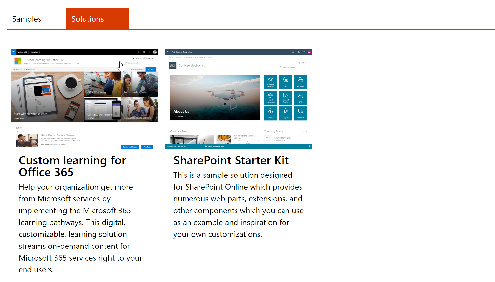
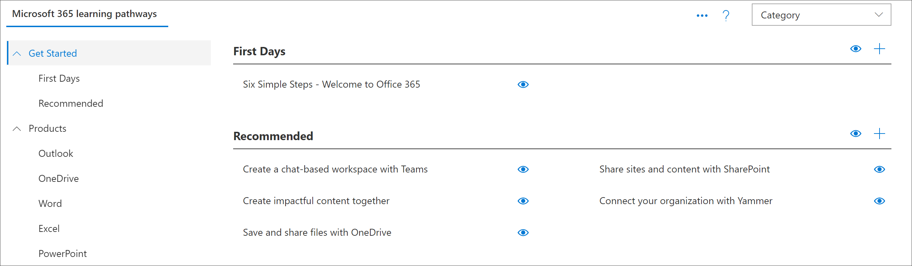

# ProVisionar aprendizado personalizadoProvision Custom Learning 

Com o serviço de provisionamento do SharePoint Online, um administrador de locatários do Office 365 pode iniciar o processo de provisionamento com alguns cliques simples.With the SharePoint Online Provisioning Service, an Office 365 Tenant Administrator can start the provisioning process with a few simple clicks. O serviço de provisionamento é a maneira recomendada de provisionar o aprendizado personalizado.The Provisioning Service is the recommended way to provision Custom Learning. É rápido, fácil e leva apenas alguns minutos para iniciar o processo.It's fast, easy, and takes only a few minutes to start the process. Antes de começar a usar o serviço de provisionamento, no entanto, verifique se você atendeu aos pré-requisitos de provisionamento.Before getting started with the Provisioning Service, however, make sure you've met the prerequisites for provisioning.

## Pré-requisitosPrerequisites
 
Para configurar com êxito a aprendizagem personalizada com o serviço de provisionamento, a pessoa que está fazendo o provisionamento deve atender aos seguintes pré-requisitos:To successfully set up Custom Learning with the Provisioning Service, the person doing the provisioning must meet the following pre-requisites: 
 
- O aprendizado personalizado de provisionamento de pessoa deve ser um administrador de locatários do locatário onde o aprendizado personalizado será provisionado.The person provisioning Custom Learning must be a Tenant Administrator of the tenant where Custom Learning will be provisioned.  
- Um catálogo de aplicativos do locatário deve estar disponível na opção aplicativos do centro de administração do SharePoint.A tenant App Catalog must be available within the Apps option of the SharePoint Admin Center. Se sua organização não tiver um catálogo de aplicativos de locatário do SharePoint, consulte a [documentação do SharePoint Online](https://docs.microsoft.com/en-us/sharepoint/use-app-catalog) para criar um.If your organization does not have an SharePoint tenant App catalog, refer to the [SharePoint Online documentation](https://docs.microsoft.com/en-us/sharepoint/use-app-catalog) to create one.  
- O aprendizado personalizado de provisionamento de pessoa deve ser um proprietário de conjunto de sites do catálogo de aplicativos do locatário.The person provisioning Custom Learning must be a Site Collection Owner of the Tenant App Catalog. Se a pessoa que estiver Provisionando o aprendizado personalizado não for um proprietário do conjunto de sites do catálogo de aplicativos, [Complete estas instruções](addappadmin.md) e continue.If the person provisioning Custom Learning is not a Site Collection Owner of the App Catalog [complete these instructions](addappadmin.md) and continue. 

### Para provisionar o aprendizado personalizadoTo provision Custom Learning

1. Vá para http://provisioning.sharepointpnp.com e **entre** no canto superior direito da Home Page.Go to http://provisioning.sharepointpnp.com and **sign in** from the upper right hand corner of the home page.  Entre com as credenciais do locatário de destino no qual você planeja instalar o modelo de site.Sign in with the  credentials for the targeted tenant where you plan to install the site template.

2. DesMarque o **consentimento em nome da sua organização** e selecione **aceitar**.Clear the **Consent on behalf of your organization** and select **Accept**.

3. Role para baixo na página, selecione a guia **soluções** e, em seguida, selecione **aprendizado personalizado para o Office 365**.Scroll down the page, select the **Solutions** tab, and then select **Custom learning for Office 365**. 

4. Selecione **Adicionar ao seu locatário**Select **Add to your tenant**

5. Preencha os campos da página informações de provisionamento, conforme apropriado para sua instalação.Complete the fields on the provisioning information page as appropriate for your installation. No mínimo, insira o endereço de email para o qual você deseja obter notificações sobre o processo de provisionamento e a URL de destino do seu site a ser provisionado.At a minimum enter the email address where you wish to get notifications about the provisioning process and the destination URL for your site to be provisioned to.  
> [!NOTE]
> Torne a URL de destino do seu site um tanto amigável para seus funcionários, como "/sites/MyTraining" ou "/teams/LearnOffice365".Make the destination URL for your site something friendly to your employees such as "/sites/MyTraining" or "/teams/LearnOffice365".

6. Selecione \*\*\*\* provisionar quando estiver pronto para instalar o aprendizado personalizado no seu ambiente de locatário.Select **Provision** when ready to install Custom Learning into your tenant environment.  O processo de provisionamento levará até 15 minutos.The provisioning process will take up to 15 minutes. Você será notificado por email (para o endereço de email de notificação que você inseriu na página de provisionamento) quando o site estiver pronto para o Access.You will be notified via email (to the notification email address you entered on the Provisioning page) when the site is ready for access. 

> [!IMPORTANT]
> O administrador de locatários que provisiona o site de aprendizado personalizado deve ir para o site e, em seguida, abrir **CustomLearningAdmin. aspx** para inicializar as propriedades personalizadas de administração de aprendizado.The Tenant Admin who provisions the Custom Learning site must go to the site, and then open **CustomLearningAdmin.aspx** to initialize Custom Learning Admin properties. No momento, o administrador de locatários também deve atribuir proprietários ao site.At this time, the Tenant Admin should also assign Owners to the site. 

## Validar o êxito do provisionamento e inicializar a lista CustomConfigValidate Provisioning Success and Initialize the CustomConfig List

Quando o provisionamento é concluído, o administrador de locatários que provisionou o site recebe um email do serviço de provisionamento PnP.When provisioning is complete, the Tenant Admin who provisioned the site,receives an email from the PnP Provisioning Service. O email contém um link para o site.The email contains a link to the site. Neste ponto, o administrador de locatário deve ir para o site usando o link fornecido no email e configurar o site para o primeiro uso:At this point, the Tenant Admin should go to the site using the link provided in the email and set up the site for first use:

1. Acesse `<YOUR-SITE-COLLECTION-URL>/SitePages/CustomLearningAdmin.aspx`.Go to `<YOUR-SITE-COLLECTION-URL>/SitePages/CustomLearningAdmin.aspx`. Abrir **CustomLearningAdmin. aspx** Inicializa o item de lista **CustomConfig** que configura o aprendizado personalizado para o primeiro uso.Opening **CustomLearningAdmin.aspx** initializes the **CustomConfig** list item that sets up Custom Learning for first use. Você verá uma página parecida com esta:You should see a page that looks like this:

## Adicionar proprietários ao siteAdd Owners to Site
Como administrador de locatários, é improvável que você seja a pessoa que personaliza o site, portanto, você precisará atribuir alguns proprietários ao site.As the Tenant Admin, it's unlikely you'll be the person customizing the site, so you'll need to assign a few owners to the site. Os proprietários têm privilégios administrativos no site para que eles possam modificar as páginas do site e remarcar o site.Owners have administrative privileges on the site so they can modify site pages and rebrand the site. Eles também podem ocultar e mostrar o conteúdo fornecido por meio da Web Part de aprendizado personalizado.They also have the ability to hide and show content delivered through the Custom Learning Web part. Além disso, eles terão a capacidade de criar uma lista de reprodução personalizada e atribuí-las às subcategorias personalizadas.In addition, they'll have the ability to build custom playlist and assign them to custom subcategories.  

1. No menu **configurações** do SharePoint, clique em **permissões do site**.From the SharePoint **Settings** menu, click **Site Permissions**.
2. Clique em **configurações de permissão avançadas**.Click **Advanced Permission Settings**.
3. Clique em **aprendizagem personalizada para proprietários do Office 365**.Click **Custom learning for Office 365 Owners**.
4. Clique em **novo** > **Adicionar usuários a este grupo**e adicione as pessoas que você deseja que sejam proprietários.Click **New** > **Add Users to this group**, and then add the people you want to be Owners. 
5. Adicione um link para [explorar o site](https://docs.microsoft.com/en-us/Office365/CustomLearning/custom_explore) na mensagem de compartilhamento e clique em **compartilhar**.Add a link to [Explore the Site](https://docs.microsoft.com/en-us/Office365/CustomLearning/custom_explore) in the Share message, and then click **Share**.

### Próximos passosNext Steps
- Explore o [conteúdo padrão](custom_exploresite.md) fornecido no site e na Web Part.Explore the [default content](custom_exploresite.md) provided in the site and web part.
