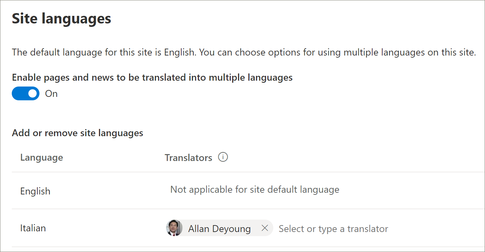

# Provisionar uma nova solução multilíngue de caminhos de aprendizagemProvision a new learning pathways multilingual solution
Organizações que não têm caminhos de aprendizado provisionados em seu locatário podem usar o Serviço de Provisionamento do SharePoint para adicionar a solução de caminhos de aprendizagem multilíngues.Organizations that that don’t have learning pathways provisioned in their tenant can use the SharePoint Provisioning Service to add the multilingual learning pathways solution. Com essa opção, o modelo de caminhos de aprendizado do SharePoint é convertido em nove idiomas e pode ser usado com um mínimo de modificação.With this option, the learning pathways SharePoint template is translated into nine languages and can be used with a minimum of modification. 

> [!IMPORTANT]
> Se você já tiver os caminhos de aprendizado provisionados em  seu locatário, é recomendável seguir o caminho de atualização para caminhos de aprendizado.If you already have learning pathways provisioned in your tenant, it's recommended that you follow the [update path](custom_update_ml.md) for learning pathways. Se você instalar caminhos de aprendizado em uma instância existente em seu locatário, quaisquer alterações feitas no modelo de site ou playlists dos caminhos de aprendizado poderão ser perdidas.If you install learning pathways over an existing instance in your tenant, any changes made to the the learning pathways site template or playlists may be lost.

## Pré-requisitos para suporte multilínguePrerequisites for multilingual support
 
Para configurar com êxito os caminhos de aprendizado do Microsoft 365 com o Serviço de Provisionamento, a pessoa que está fazendo o provisionamento deve atender aos seguintes pré-requisitos:To successfully set up Microsoft 365 learning pathways with the Provisioning Service, the person doing the provisioning must meet the following pre-requisites: 
 
- A pessoa que provisiona os caminhos de aprendizado deve ser um Administrador de Locatários do locatário onde os caminhos de aprendizagem serão provisionados.The person provisioning learning pathways must be a Tenant Administrator of the tenant where learning pathways will be provisioned.  
- Um Catálogo de Aplicativos de locatário deve estar disponível na opção Aplicativos do Centro de Administração do SharePoint.A tenant App Catalog must be available within the Apps option of the SharePoint Admin Center. Se sua organização não tiver um Catálogo de Aplicativos do Locatário do SharePoint, consulte a documentação do [SharePoint Online](/sharepoint/use-app-catalog) para criar um.If your organization doesn't have an SharePoint tenant App Catalog, refer to the [SharePoint Online documentation](/sharepoint/use-app-catalog) to create one. Você deve aguardar pelo menos duas horas após a criação do Catálogo de Aplicativos antes de provisionar os caminhos de aprendizado.You must wait at least two hours after creating the App Catalog before provisioning learning pathways.  
- A pessoa que provisiona os caminhos de aprendizado deve ser um Proprietário do Conjunto de Sites do Catálogo de Aplicativos de Locatário.The person provisioning learning pathways must be a Site Collection Owner of the Tenant App Catalog. Se a pessoa que provisiona os caminhos de aprendizado não for um Proprietário do Conjunto de Sites do Catálogo de Aplicativos, [conclua essas instruções](addappadmin.md) e continue.If the person provisioning learning pathways is not a Site Collection Owner of the App Catalog, [complete these instructions](addappadmin.md) and continue. 

## Verifique se a conta de Administrador de Locatários não tem um idioma selecionadoEnsure the Tenant Admin account doesn't have a language selected
Antes de provisioná-los, verifique se a Conta de Administrador do locatário não tem um idioma selecionado.Before you provision learning pathways, ensure that the Admin Account for the tenant doesn't have a language selected. Veja como verificar se a conta admin não tem um idioma selecionado.Here’s how to verify if the Admin account doesn't have a language selected. 
1.  Com seu perfil de Administrador de Borda, vá para office.com.With your Edge Admin profile, go to office.com.
2.  Insira as credenciais do usuário (se necessário).Enter the user credentials (if necessary).
3.  No Microsoft 365, clique em **Todos os Aplicativos** > Delve.In Microsoft 365, click **All Apps** > Delve. 
4.  Clique **em Me** Atualizar  >  **Perfil**.Click **Me** > **Update Profile**.
5.  Role para baixo a página e clique **em Como posso alterar o idioma e as configurações regionais**.Scroll down the page and click **How can I change language and regional settings**.
6.  Clique **aqui** e clique nas releições... . Click **here**, and then click the ellipses **...**.
7.  Em **Meus Idiomas de Exibição,** você deve ver Nenhum idioma **selecionado**.Under **My Display Languages**, you should see **No languages selected**. Se um idioma estiver selecionado, desmarque-o.If a language is selected, unselect it.

### Para provisionar caminhos de aprendizadoTo provision learning pathways

1. Vá para a página de solução de caminhos de aprendizado do [Microsoft 365.](https://provisioning.sharepointpnp.com/details/3df8bd55-b872-4c9d-88e3-6b2f05344239)Go to the [Microsoft 365 learning pathways solution page](https://provisioning.sharepointpnp.com/details/3df8bd55-b872-4c9d-88e3-6b2f05344239).
2. Clique **em Adicionar ao seu locatário.**Click **Add to your tenant**. Se você não estiver entrando no seu locatário, o Serviço de Provisionamento solicitará suas credenciais de Administrador de Locatários.If you aren't signed into to your tenant, the Provisioning Service will ask for your Tenant Admin credentials. 
3. Na caixa de diálogo Permissões solicitadas, selecione **Consentimento em nome** da sua organização e selecione **Aceitar**.From the Permissions requested dialog box, select **Consent on behalf of your organization** and then select **Accept**.

O serviço de provisionamento exige essas permissões para criar o Catálogo de Aplicativos do locatário, instalar o aplicativo no Catálogo de Aplicativos do locatário e provisionar o modelo de site.The provisioning service requires these permissions to create the tenant App Catalog, install the application into the tenant App Catalog and provision the site template. Não há impacto geral em seu locatário.There's no overall impact on your tenant. Essas permissões são usadas explicitamente para fins de instalação da solução.These permissions are explicitly used for the purpose of the solution installation. Você deve aceitar essas permissões para continuar com a instalação.You must accept these permissions to continue with the installation.

4. Preencha os campos na página de informações de provisionamento, conforme apropriado à sua instalação.Complete the fields on the provisioning information page as appropriate for your installation. No mínimo, insira o endereço de email no qual você deseja receber notificações sobre o processo de provisionamento e a URL de destino para o site a ser provisionado.At a minimum, enter the email address where you wish to get notifications about the provisioning process and the destination URL for your site to be provisioned to.  
> [!NOTE]
> Torne a URL de destino do seu site em algo amigável para seus funcionários, como "/sites/MeuTreinamento" ou "/teams/AprendaMicrosoft365".Make the destination URL for your site something friendly to your employees such as "/sites/MyTraining" or "/teams/LearnMicrosoft365".

6. Clique **em Provisionar** quando estiver pronto para instalar os caminhos de aprendizado em seu ambiente de locatário.Click **Provision** when ready to install learning pathways into your tenant environment.  O processo de provisionamento poderá levar até 15 minutos.The provisioning process can take up to 15 minutes. Você será notificado por email quando o site estiver pronto.You will be notified via email when the site is ready. 

> [!IMPORTANT]
> O Administrador de Locatários que provisiona o site de caminhos de aprendizagem deve acessar o site e, em seguida, abrir **CustomLearningAdmin.aspx** para inicializar as propriedades de administrador de caminhos de aprendizagem.The Tenant Admin who provisions the learning pathways site must go to the site, and then open **CustomLearningAdmin.aspx** to initialize learning pathways Admin properties. Neste momento, o Administrador de Locatários também deve atribuir Proprietários ao site.At this time, the Tenant Admin should also assign Owners to the site. 

## Validar o sucesso do provisionamento e inicializar a lista CustomConfigValidate Provisioning Success and Initialize the CustomConfig List

Quando o provisionamento é concluído, o Administrador de Locatários que provisionou o site recebe um email do Serviço de Provisionamento PnP.When provisioning is complete, the Tenant Admin who provisioned the site receives an email from the PnP Provisioning Service. O email contém um link para o site.The email contains a link to the site. Neste ponto, o Administrador de Locatários deve acessar o site usando o link fornecido no email e configurar o site para primeiro uso:At this point, the Tenant Admin should go to the site using the link provided in the email and set up the site for first use:

- Vá para `<YOUR-SITE-COLLECTION-URL>sites/<YOUR-SITE-NAME>/SitePages/CustomLearningAdmin.aspx`.Go to `<YOUR-SITE-COLLECTION-URL>sites/<YOUR-SITE-NAME>/SitePages/CustomLearningAdmin.aspx`. Abrir o **CustomLearningAdmin.aspx** inicializa o item de lista **CustomConfig** que configura os caminhos de aprendizado para o primeiro uso.Opening **CustomLearningAdmin.aspx** initializes the **CustomConfig** list item that sets up learning pathways for first use. Você deve ver uma página com esta aparência:You should see a page that looks like this:

## Adicionar proprietários ao siteAdd Owners to Site
Como Administrador de Locatários, é improvável que você seja a pessoa que personalização do site, portanto, você precisará atribuir alguns proprietários ao site.As the Tenant Admin, it's unlikely you'll be the person customizing the site, so you'll need to assign a few owners to the site. Os proprietários têm privilégios administrativos no site para que possam modificar páginas do site e renomear o site.Owners have administrative privileges on the site so they can modify site pages and rebrand the site. Eles também têm a capacidade de ocultar e mostrar conteúdo e criar listas de reprodução e subcategorias personalizadas.They also have the ability to hide and show content and build custom playlist and subcategories.  

1. No menu Configurações **do** SharePoint, clique em **Permissões do Site.**From the SharePoint **Settings** menu, click **Site Permissions**.
2. Clique **em Configurações avançadas de Permissão**.Click **Advanced Permission Settings**.
3. Clique em Proprietários dos caminhos de **aprendizado do Microsoft 365.**Click **Microsoft 365 learning pathways Owners**.
4. Clique **em Novo** Adicionar Usuários a esse grupo e adicione as pessoas que você deseja que sejam  >  Proprietários.Click **New** > **Add Users to this group**, and then add the people you want to be Owners. 
5. Adicione um link para [Explorar o Site](custom_exploresite.md) na mensagem Compartilhar e clique em **Compartilhar**.Add a link to [Explore the Site](custom_exploresite.md) in the Share message, and then click **Share**.

## Adicionar tradutores ao siteAdd translators to the site
Se você estiver usando tradutores para o site, poderá atribuir permissões a eles.If you will be using translators for the site, you can assign them permissions. Os tradutores exigem permissões de membro ou superiores.Translators require Member permissions or higher. 

## Escolha opções para usar vários idiomas no siteChoose options for using multiple languages on the site
O Serviço de Provisionamento do SharePoint cria o site Caminhos de Aprendizagem em nove idiomas.The SharePoint Provisioning Service creates the Learning Pathways site in nine languages. As seguintes recomendações se aplicam:The following recommendations apply:
- Desativar os idiomas que você não deseja suportarTurn off the languages you don’t want to support
- Se você não estiver dando suporte a um site multilíngue, desligue o recurso multilíngue.If you are not supporting a multilingual site, turn off the multi-lingual feature. Consulte a seção "Desativar suporte multilíngue" mais adiante neste tópico.See the "Turn off multilingual support" section later in this topic.

### Remover idiomas que você não deseja suportarRemove languages you don’t want to support
Para organizações que optam por dar suporte a apenas um idioma, além do idioma inglês padrão, recomendamos remover idiomas que não têm suporte.For organizations that choose to support only one language, in addition to the default English language, we recommend removing languages that aren’t supported. 
1. No site Caminhos de Aprendizagem, selecione **Configurações** no canto superior direito da página e selecione **Informações do site.**From the Learning Pathways site, select **Settings** from the top-right of the page, and then select **Site information**.
2. Na parte inferior do painel de informações do site, selecione **Exibir todas as configurações do site.**At the bottom of the site information pane, select **View all site settings**.
3. Em **Administração do Site,** selecione **Configurações de idioma.**Under **Site Administration**, select **Language settings**.
4. Em **Habilitar páginas e notícias a serem traduzidas em vários idiomas,** deslize a alternância para **Ativado.**Under **Enable pages and news to be translated into multiple languages**, slide the toggle to **On**. Ele deve ser On por padrão.It should be On by default.
5. Em Adicionar ou remover idiomas de site, clique em **Remover** para remover os idiomas que você não precisa para o site.Under Add or remove site languages, click **Remove** to remove the languages you don't need for the site. A seguir, mostra um exemplo da página Configurações de Idioma para mostrar o italiano com suporte para o site, além do idioma padrão em inglês.The following shows an example of the Language Settings page to show Italian supported for the site, in addition to the default English language.

> [!NOTE]
> Ao remover idiomas, você não pode remover o idioma inglês padrão.When removing languages you cannot remove the default English language. 

### Atribuir tradutoresAssign translators
Se você for traduzir páginas, atribua opcionalmente um ou mais tradutores para cada idioma (exceto o idioma padrão do site).If you're going to translate pages, optionally assign one or more translators for each language (except the site default language). 
- Na coluna **Tradutor,** comece a digitar o nome de uma pessoa que você deseja ser tradutor e selecione o nome na lista.In the **Translator** column, start typing the name of a person you want to be a translator, and then select the name from the list. 

> [!NOTE]
> Qualquer pessoa no Active Directory da sua organização pode ser atribuída como tradutor.Anyone in your organization's Active Directory can be assigned as a translator. As pessoas atribuídas como tradutores não receberão permissões apropriadas automaticamente.People assigned as translators will not automatically be given appropriate permissions. Quando alguém sem permissões de edição para um site tentar acessar o site, ele será direcionado para uma página da Web onde poderá solicitar acesso.When someone without edit permissions to a site tries to access the site, they will be directed to a web page where they can request access.

## Desativar o suporte multilíngueTurn off multilingual support
Se você não quiser um site multilíngue, por exemplo, deseja um site somente em inglês, é recomendável desativar o recurso multilíngue.If you don’t want a multilingual site, for example, you want an English-only site, it’s recommended that you turn off the multilingual feature. 

1. No site Caminhos de Aprendizagem, selecione **Configurações** no canto superior direito da página e selecione **Informações do site.**From the Learning Pathways site, select **Settings** from the top-right of the page, and then select **Site information**.
2. Na parte inferior do painel de informações do site, selecione **Exibir todas as configurações do site.**At the bottom of the site information pane, select **View all site settings**.
3. Em **Administração do Site,** selecione **Configurações de idioma.**Under **Site Administration**, select **Language settings**.
4. Em **Habilitar páginas e notícias a serem traduzidas em vários idiomas,** deslize a alternância para **Ativado.**Under **Enable pages and news to be translated into multiple languages**, slide the toggle to **On**. Ele deve ser On por padrão.It should be On by default.
- Em **Habilitar páginas e notícias a serem traduzidas,** selecione **Desligar**.Under **Enable pages and news to be translated**, select **Off**. 

### Adicionar idiomasAdd languages
Os caminhos de aprendizado suportam 9 idiomas, mas é recomendável adicionar apenas os idiomas necessários para o site de caminhos de aprendizado.Learning pathways supports 9 languages, but it’s recommended that you add only the languages you need to support for the learning pathways site. Você pode adicionar langauges a qualquer momento.You can add langauges at any time. 
- Em **Adicionar ou remover idiomas de site,** comece a digitar um nome de idioma em **Selecionar** ou digite um idioma ou escolha um idioma no menu suspenso.Under **Add or remove site languages**, start typing a language name in **Select or type a language**, or choose a language from the dropdown. Você pode repetir esta etapa para adicionar vários idiomas.You can repeat this step to add multiple languages. Você pode adicionar ou remover idiomas do seu site a qualquer momento, voltando para esta página.You can add or remove languages from your site at any time by going back to this page.