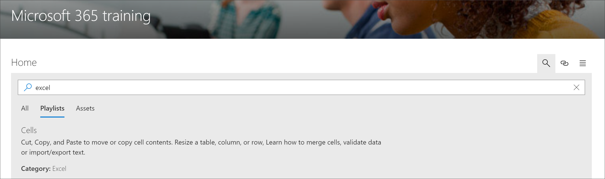

# Pesquisar conteúdo de caminhos de aprendizado do Microsoft 365

Os caminhos de aprendizado do Microsoft 365 oferecem a capacidade de pesquisar conteúdo por subcategoria, lista de reprodução ou ativo. 

> [!TIP]
> Os caminhos de aprendizado da Microsoft 365 pesquisa têm escopo para o conteúdo de caminhos de aprendizado, incluindo o conteúdo fornecido pela Microsoft e qualquer conteúdo adicionado a listas de reprodução ou subcategorias personalizadas. As páginas do SharePoint que não estão em uma playlist de cursores de aprendizado não estão incluídas nos resultados da pesquisa.     

- Clique no ícone de **pesquisa** e digite uma frase de pesquisa. 

