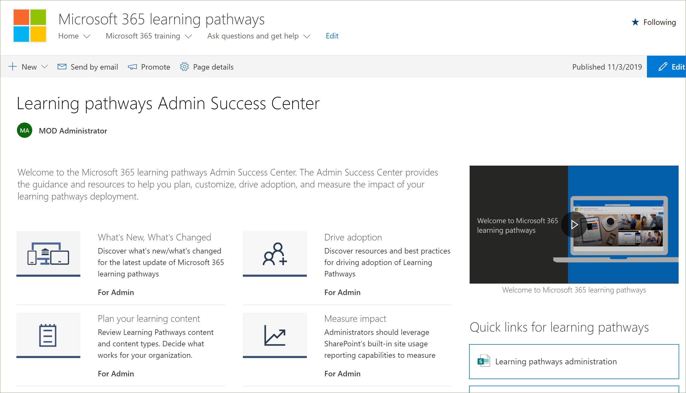

# Centro de Sucesso do Administrador de Caminhos de AprendizagemLearning pathways Admin Success Center

Bem-vindo ao Centro de Sucesso do Administrador dos caminhos de aprendizado do Microsoft 365.Welcome to the Microsoft 365 learning pathways Admin Success Center. O Centro de Sucesso do Administrador fornece as diretrizes e recursos para ajudá-lo a planejar, personalizar, impulsionar a adoção e medir o impacto da implantação de seus caminhos de aprendizado.The Admin Success Center provides the guidance and resources to help you plan, customize, drive adoption, and measure the impact of your learning pathways deployment.

## .Sign in to Office 365 

1.  Abra seu navegador da Web e navegue até o office.com ou o local de Logon da sua organização.Open your Web browser and navigate to office.com or your organization’s sign-in location. 
2.  Entre com seu nome de usuário e senha.Sign in with your user name and password.
3.  Navegue até o local do site usando a URL fornecida pelo administrador do locatário ou selecione SharePoint na home page do Office 365 e selecione o site.Navigate to the location of the site using the URL supplied by your tenant administrator or select SharePoint from the Office 365 Home page, and then select the site. 

### Começar com o Centro de Sucesso do AdministradorGet started with the Admin Success Center

O Centro de Sucesso do Administrador fornece as diretrizes e recursos para ajudá-lo a planejar, personalizar, impulsionar a adoção e medir o impacto da implantação de seus caminhos de aprendizado.The Admin Success Center provides the guidance and resources to help you plan, customize, drive adoption, and measure the impact of your learning pathways deployment. 

- Na página Inicial dos caminhos  de aprendizado do Microsoft 365, clique em **Começar com o Centro de Sucesso do Administrador.**From the Microsoft 365 learning pathways **Home** page, click **Get started with the Admin Success Center**.

Os caminhos de aprendizado fornece orientações no Centro de Sucesso do Administrador na solução.Learning pathways provides guidance within the Admin Success Center in the solution. A documentação do Centro de Sucesso do Administrador também está disponível neste conjunto de documentação:Documentation for the Admin Success Center is also available in this documentation set: 

- [Planejar o conteúdo de aprendizagemPlan your learning content](custom_plancontent.md)
- [Personalizar os caminhos de aprendizagemCustomize learning pathways](custom_overview.md)
- [Impulsionar a adoçãoDrive adoption](driveadoption.md)
- [Medir impactoMeasure impact](custom_measureimpact.md)

