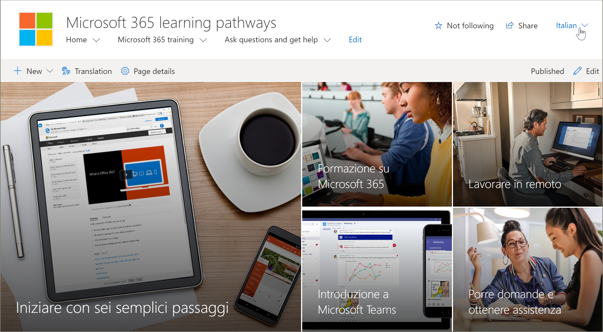
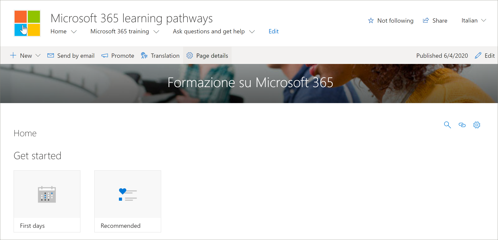

# Traduzir páginas de site
Antes de começar a converter o site de cursores de aprendizado, é importante compreender alguns conceitos fundamentais de como o recurso multilíngue funciona com os caminhos de aprendizado. 
- As informações do site-navegação, logotipo e traduções de nome do site exigem que o site seja exibido e traduzido no perfil de idioma do usuário.  
- A Web Part de caminhos de aprendizado deve ser exibida com o perfil de idioma do usuário para que ela apareça em um idioma diferente do inglês. A Web Part e o conteúdo fornecido pela Microsoft já foram convertidos para você. Para obter mais informações sobre perfis de idiomas, confira [alterar suas configurações regionais e de idioma pessoal](https://support.microsoft.com/en-us/office/change-your-personal-language-and-region-settings-caa1fccc-bcdb-42f3-9e5b-45957647ffd7).
- A maneira como você configura os caminhos de aprendizado determina se você tem páginas traduzidas disponíveis. Novos sites provisionados com o serviço de provisionamento do SharePoint terão páginas traduzidas em nove idiomas disponíveis. Os sites ou sites atualizados que você criar precisarão de tradução manual. Confira [Opções de configuração para caminhos de aprendizado multilíngues](custom_setupoptions_ml.md).
- O suporte multilíngue para caminhos de aprendizado é habilitado por recursos multilíngues do SharePoint Online para sites de comunicação. Para saber mais sobre os recursos multilíngues do SharePoint Online, consulte [criar sites de comunicação multilíngues, páginas e notícias](https://support.office.com/article/2bb7d610-5453-41c6-a0e8-6f40b3ed750c). 

## Trabalhar com um site provisionado recentemente
Se você provisionou um novo site de cursores de aprendizado do serviço de provisionamento do SharePoint, as páginas traduzidas já estarão disponíveis para você. Por padrão, o site fornece as seguintes páginas:

- Home. aspx
- Start-with-Six-Simple-Steps. aspx
- Get-started-with-Microsoft-365. aspx
- Get-started-with-Microsoft-Teams. aspx
- Get-started-with-SharePoint. aspx
- Get-started-with-OneDriive. aspx
- Ask-questions-and-Get-Help. aspx
- Eventos de treinamento Calendar. aspx
- Become-a-Champion. aspx
- Recommended-Playlists. aspx
- Cursores de aprendizado centro de sucesso de administração

## Exibir páginas traduzidas do site provisionado recentemente
Para se familiarizar com o site de cursores de aprendizado traduzido, vamos dar uma olhada em algumas páginas traduzidas.

### Exibir a Home Page traduzida
Na home page de cursores de aprendizado, selecione um idioma no menu suspenso de idiomas, conforme mostrado no exemplo a seguir. No exemplo, você vê italiano selecionado no canto superior direito e todos os elementos da página são traduzidos.

### Exibir a página de treinamento do Microsoft 365 traduzido
Agora, vamos dar uma olhada na página de treinamento do Microsoft 365. 

1. Na **Home** Page do site de cursores de aprendizado, clique em **treinamento do Microsoft 365**.
2. No canto superior direito da página, selecione um idioma. Neste exemplo, italiano é selecionado.

Quais traduções são visíveis quando o idioma é selecionado?
- A página do SharePoint é traduzida conforme mostrado no gráfico acima. Observe que o texto da faixa de página agora está em italiano.

O que as traduções não estão visíveis?
- O nome do site está em inglês
- A navegação do site está em inglês
- A Web Part de cursores de aprendizado está em inglês

## Exibir o site totalmente traduzido 
Para exibir um site totalmente traduzido em um idioma específico, incluindo as páginas do site, a navegação e a Web Part, as configurações regionais e de idioma pessoal do usuário devem ser definidas para esse idioma. Para obter mais informações sobre como definir configurações regionais e de idioma, confira [alterar suas configurações regionais e de idioma pessoal](https://support.microsoft.com/en-us/office/change-your-personal-language-and-region-settings-caa1fccc-bcdb-42f3-9e5b-45957647ffd7). É recomendável usar uma conta separada ou ter outro usuário com as configurações de idioma diferentes exibir as páginas traduzidas.  

## Trabalhar com um site de cursores de aprendizado atualizado ou instalado manualmente
Se você atualizou um site de cursores de aprendizado existente ou instalou manualmente a Web Part em um site existente, você precisará traduzir manualmente as páginas do site. A Web Part de cursores de aprendizado e o conteúdo já foram convertidos e serão exibidos no idioma preferencial do usuário. Para traduzir páginas, consulte as seguintes instruções "criar páginas para os idiomas que você deseja". 

## Criar páginas para os idiomas que você deseja
Depois de habilitar o site para recursos multilíngues e escolher os idiomas que você deseja disponibilizar, você pode criar as páginas de tradução desejadas. 

1. Vá para a página de idioma padrão que você deseja disponibilizar em outro idioma.
2. Na barra superior, selecione **tradução**.
3. Selecione **criar** para os idiomas desejados.

> [!IMPORTANT]
> Após criar as páginas de tradução, você deve publicar (ou republicar) a página de idioma padrão para garantir que:
>- As páginas de tradução são mostradas no site de idioma correspondente.
>- As páginas de tradução são exibidas corretamente na Web Part News e nas Web Parts de conteúdo realçadas.
>- O menu suspenso de idiomas na parte superior do site inclui todos os idiomas habilitados.
>- Os tradutores são notificados sobre a solicitação de tradução.

Depois de criar a (s) página (s), o status da página (rascunho salvo, publicado e assim por diante) é mostrado no painel de conversão ao lado de cada idioma. Além disso, os tradutores que você atribuiu serão notificados em email de que uma tradução é solicitada.

### Exibir o site totalmente traduzido em um idioma específico
Para exibir um site totalmente traduzido em um idioma específico, incluindo as páginas do site, a navegação e a Web Part, as configurações regionais e de idioma pessoal do usuário devem ser definidas para esse idioma. Para obter mais informações sobre como definir configurações regionais e de idioma, confira [alterar suas configurações regionais e de idioma pessoal](https://support.microsoft.com/en-us/office/change-your-personal-language-and-region-settings-caa1fccc-bcdb-42f3-9e5b-45957647ffd7). Observe que é melhor usar uma conta separada ou ter outro usuário com as diferentes configurações de idioma exibir as páginas traduzidas.

## O que faz um tradutor?
 Depois que o site é configurado em inglês, um usuário com espanhol como idioma pessoal preferido, por exemplo, edita e converte manualmente o título, a navegação e o conteúdo do rodapé em espanhol. Um usuário com alemão como idioma pessoal preferido faz o mesmo para alemão. Depois que o conteúdo é traduzido, ele será exibido para todos os usuários desses idiomas preferidos. A Web Part escolhe o idioma preferencial do usuário e mostra o conteúdo traduzido nesse idioma. 

Os tradutores convertem manualmente as cópias da página de idioma padrão nos idiomas especificados. Quando as cópias das páginas são criadas, os tradutores são notificados no email se um tradutor tiver sido especificado. O email inclui um link para a página de idioma padrão e a página de tradução recém-criada. O tradutor irá:
1. Selecione o botão **Iniciar conversão** no email.
2. Selecione **Editar** na parte superior direita da página e traduza o conteúdo.
3. Quando terminar, selecione **salvar como rascunho** (se você não estiver pronto para torná-lo visível aos leitores) ou se a página estiver pronta para ficar visível a todos os usuários que estiverem usando esse idioma no site, selecione **publicar** ou **postar notícias**.

Para obter mais informações sobre o processo de tradução, consulte [criar sites de comunicação multilíngue, páginas e notícias](https://support.office.com/en-us/article/2bb7d610-5453-41c6-a0e8-6f40b3ed750c). 

## Atualizando a página de idioma padrão
Quando a página idioma padrão for atualizada, a página deverá ser republicada. Em seguida, o (s) conversor (es) para as páginas de tradução são notificados no email de que uma atualização foi feita para que as atualizações possam ser feitas nas páginas de tradução individuais.

## Configurar um nome de site multilíngue, navegação e rodapé
Para mostrar o nome, a navegação e o rodapé do site nos diferentes idiomas que você fez disponíveis, cada um deve ser traduzido manualmente.

Por exemplo, digamos que você tenha criado um site de comunicação com uma linguagem padrão em inglês e tenha habilitado o site para idiomas espanhol e alemão. Ao criar um site, você configura o nome e a descrição do site no idioma padrão (neste caso, inglês). Você também pode atualizar o nome e a descrição do site após a criação do site. Em seguida, crie os nós de navegação e o conteúdo de rodapé em inglês.

Depois que o site é configurado em inglês, um usuário com espanhol como idioma pessoal preferido edita manualmente e converte o título, a descrição, a navegação e o conteúdo do rodapé em espanhol. Um usuário com alemão como idioma pessoal preferido faz o mesmo para alemão. Depois que o conteúdo é traduzido, ele será exibido para todos os usuários desses idiomas preferidos. 

> [! Notes
>- Os usuários que convertem o conteúdo do site para seus idiomas de preferência devem ser membros do grupo proprietários do site ou ter permissões de site equivalentes.
>- Se uma alteração for feita no nome do site, na navegação ou no rodapé no idioma padrão, o item traduzido correspondente em outro idioma não será atualizado automaticamente, a menos que você opte por substituir as traduções de site existentes. Se você fizer isso, o item traduzido será substituído pela atualização no idioma padrão e precisará ser convertido manualmente novamente. Para substituir traduções, vá para a página idiomas do site para o idioma padrão e selecione Mostrar configurações avançadas. Em seguida, deslize o botão de alternância para substituir traduções. Essa opção não se aplica a conteúdo de página ou de notícias.

### Para exibir o site totalmente traduzido em um idioma específico
Para exibir um site totalmente traduzido em um idioma específico, incluindo as páginas do site, a navegação e a Web Part, as configurações regionais e de idioma pessoal do usuário devem ser definidas para esse idioma. Para obter mais informações sobre como definir configurações regionais e de idioma, confira [alterar suas configurações regionais e de idioma pessoal](https://support.microsoft.com/en-us/office/change-your-personal-language-and-region-settings-caa1fccc-bcdb-42f3-9e5b-45957647ffd7). É recomendável usar uma conta separada ou ter outro usuário com as configurações de idioma diferentes exibir as páginas traduzidas.

## Para saber mais
- Para obter mais informações sobre a conversão de páginas do site de comunicação do SharePoint, consulte [criar sites de comunicação multilíngues, páginas e notícias](https://support.office.com/en-us/article/2bb7d610-5453-41c6-a0e8-6f40b3ed750c).
- Para obter mais informações sobre como personalizar os caminhos de aprendizado, consulte [Customize cursores de aprendizado](custom_overview.md).  
