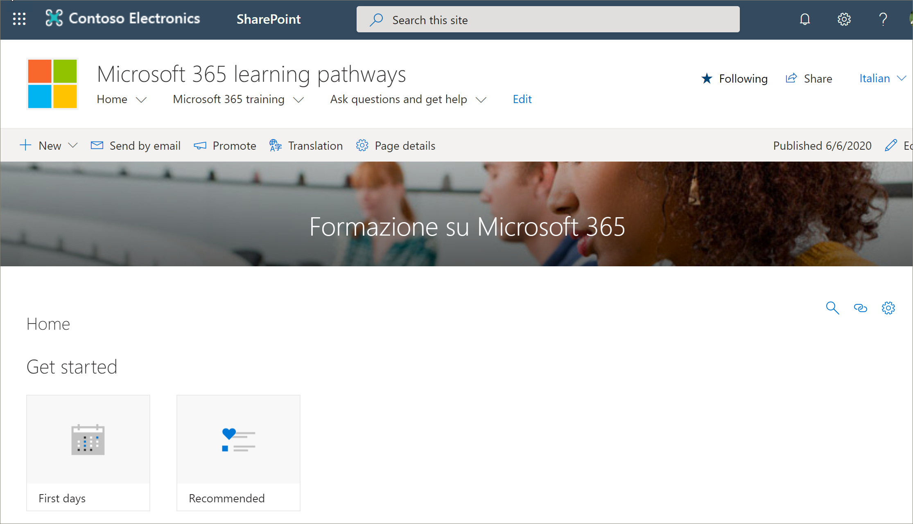

# Traduzir páginas de site
Se você atualizou uma versão existente dos caminhos de aprendizado para a versão 4,0 ou provisionou um novo site, o processo de tradução de páginas de site é o mesmo. No entanto, há algumas coisas que você deve estar ciente. 
- Quando um novo cursores de aprendizado versão 4,0 multilíngue é provisionado, as páginas do site são traduzidas para você em 9 idiomas. 
- Quando a solução de cursores de aprendizado é atualizada para a versão 4,0 multilíngue, as páginas do site do SharePoint dos caminhos de aprendizado permanecem inalteradas. As traduções devem ser feitas manualmente. 

O site de cursores de aprendizado, por padrão, fornece as seguintes páginas:

- Home. aspx
- Start-with-Six-Simple-Steps. aspx
- Get-started-with-Microsoft-365. aspx
- Get-started-with-Microsoft-Teams. aspx
- Get-started-with-SharePoint. aspx
- Get-started-with-OneDriive. aspx
- Ask-questions-and-Get-Help. aspx
- Eventos de treinamento Calendar. aspx
- Become-a-Champion. aspx
- Recommended-Playlists. aspx
- Cursores de aprendizado centro de sucesso de administração

## Criar páginas para os idiomas que você deseja
Depois de habilitar o site para recursos multilíngues e escolher os idiomas que você deseja disponibilizar, você pode criar as páginas de tradução desejadas. Para ajudar a demonstrar alguns conceitos importantes, usaremos a página de treinamento do Microsoft 365 como um exemplo. Para fazer isso:

1.  Na **Home** Page de cursores de aprendizado, clique em **treinamento do Microsoft 365**.  
2.  Na barra superior, selecione **tradução**.

3. Se você deseja criar uma página para tradução em cada um de todos os idiomas disponíveis para seu site, selecione **criar para todos os idiomas**. Caso contrário, selecione **criar** somente para os idiomas desejados. Neste exemplo, selecionaremos italiano.
4.  Clique em **Exibir**. A página agora está pronta para tradução. 

### Um conceito importante para saber
Observe que, no exemplo a seguir, a página foi convertida em italiano. Mas o título do site, a navegação e a Web Part ainda aparecem em inglês. 

 Depois que o site é configurado em inglês, um usuário com espanhol, por exemplo, como idioma pessoal preferido, edita manualmente e converte o título, a navegação e o conteúdo do rodapé em espanhol. Um usuário com alemão como idioma pessoal preferido faz o mesmo para alemão. Depois que o conteúdo é traduzido, ele será exibido para todos os usuários desses idiomas preferidos. A Web Part escolhe o idioma preferencial do usuário e mostra o conteúdo traduzido nesse idioma. 

> [!IMPORTANT]
> Importante: depois de criar as páginas de tradução, você deve publicar (ou republicar) a página de idioma inglês padrão para garantir que:
- As páginas de tradução são mostradas no site de idioma correspondente
- As páginas de tradução são exibidas corretamente na Web Part News e nas Web Parts de conteúdo realçado
- O menu suspenso de idiomas na parte superior do site inclui todos os idiomas que você habilitou
- Os tradutores são notificados sobre a solicitação de tradução.

## O que faz um tradutor?
Os tradutores convertem manualmente as cópias da página de idioma padrão nos idiomas especificados. Quando as cópias das páginas são criadas, os tradutores são notificados por email. O email inclui um link para a página de idioma padrão e a página de tradução recém-criada. O tradutor irá:
1. Selecione o botão **Iniciar conversão** no email.
2. Selecione **Editar** na parte superior direita da página e traduza o conteúdo.
3. Quando terminar, selecione **salvar como rascunho** (se você não estiver pronto para torná-lo visível aos leitores) ou, se a página estiver pronta para ficar visível a todos os usuários que estiverem usando esse idioma no site, selecione **publicar** ou **postar notícias**.

Para obter mais informações sobre o processo de tradução, consulte [criar sites de comunicação multilíngue, páginas e notícias](https://support.office.com/en-us/article/2bb7d610-5453-41c6-a0e8-6f40b3ed750c). 

## Atualizando a página de idioma padrão
Quando a página idioma padrão for atualizada, a página deverá ser republicada. Em seguida, o (s) conversor (es) para as páginas de tradução são notificados no email de que uma atualização foi feita para que as atualizações possam ser feitas nas páginas de tradução individuais.

## Próximas etapas
- [Converter listas de reprodução personalizadas](custom_translate_pl_ml.md)
- [Ocultar e Mostrar conteúdo do multiligual](custom_translate_pl_ml.md)
