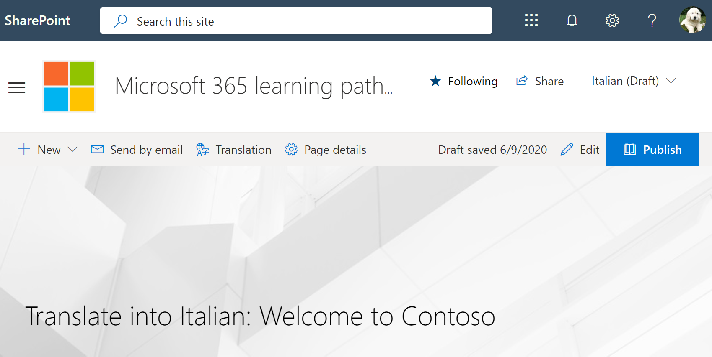
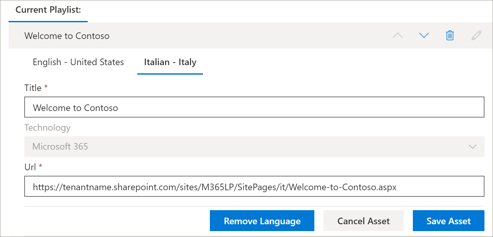

# Converter uma lista de reprodução personalizada de caminhos de aprendizadoTranslate a learning pathways custom playlist
Se você criou as listas de execução de cursores de aprendizado personalizadas para seu site, pode traduzir as listas de reprodução para os idiomas habilitados para este site.If you've created learning pathways custom playlists for your site, you can translate the playlists into the languages enabled for this site.

1.  No menu **principal** de cursores de aprendizado, clique em **Administração de caminhos de aprendizado**.From the learning pathways **Home** menu, click **Learning pathways administration**. 
2.  Clique na lista de reprodução personalizada.Click the custom playlist. Neste exemplo, usaremos **cinco etapas simples – bem-vindo à contoso**.In this example, we'll use **Five Simple Steps - Welcome to Contoso**. 
3.  Clique em **Editar detalhe**e, na caixa **Adicionar idioma** , selecione um idioma.Click **Edit Detail**, then in the **Add language** box, select a language. Neste exemplo, usaremos **italiano – Itália**.In this example, we'll use **Italian – Italy**. 
5.  Clique em **salvar detalhes**.Click **Save Detail**. 

> [!IMPORTANT]
> As notificações do tradutor não são criadas em playlists personalizadas.Translator notifications are not built into custom playlists. Os tradutores deverão ser notificados manualmente.Translators will need to be notified manually. 

## O que faz um tradutor?What does a translator do?
Os tradutores convertem manualmente as cópias da página de idioma padrão nos idiomas especificados.Translators manually translate the copies of the default language page into the language(s) specified. Você precisará notificar o tradutor das traduções necessárias para obter detalhes da playlist.You will need to notify the translator of the translations required for playlist details. É recomendável concluir todas as alterações da playlist, incluindo adicionar, editar ou excluir ativos da playlist e, em seguida, notificar o tradutor das traduções necessárias.It's recommended that you finish all playlist changes,including adding, editing, or deleting playlist assets, then notify the translator of the required translations.

## Converter os ativos na playlist personalizadaTranslate the assets in the custom playlist
Qualquer ativo em uma lista de reprodução que seja fornecido pela Microsoft não é editável e não exige conversão.Any assets in a playlist that are supplied by Microsoft are not editable and do not require translation. Se você tiver adicionado ativos personalizados do site do SharePoint do seu locatário, esses ativos precisarão de tradução.If you’ve added custom assets from your tenant's SharePoint site, those assets will require translation. Vamos dar uma olhada em como traduzir um ativo personalizado em uma lista de reprodução.Let's take a look at how to translate a custom asset in a playlist.

### Adicionar um idioma para um ativo existenteAdd a language for an existing asset
1. Em **ativos**, selecione o ícone **Editar** ao lado do ativo personalizado.Under **Assets**, select the **Edit** icon next to the custom asset. 
2. Selecione um idioma na caixa **Adicionar idioma** e, em seguida, selecione **salvar ativo**.Select a language from the **Add language** box, and then select **Save Asset**.

### Adicionar uma página de idioma para um ativo existenteAdd a language page for an existing asset
1. Na lista ativo, clique no ativo em inglês e, em seguida, clique em **abrir**.In the asset list, click the English asset, and then click **Open**.
2. Na barra superior, selecione **tradução**.On the top bar, select **Translation**.
3. No menu suspenso idioma, selecione o idioma para o ativo, selecione **criar**e **Exibir**.From the language dropdown, select the language for the asset, select **Create**, and then **View**. Agora, a página deve ter a seguinte aparência.Your page should now look something like this. 

4. Clique em **publicar**e copie a URL da página.Click **Publish**, and then copy the URL for the page. Ele deve ter a seguinte aparência, com o código de idioma na URL.It should look something like this, with the language code in the URL.
https://tenantname.sharepoint.com/sites/M365LP/SitePages/it/Welcome-to-Contoso.aspx.https://tenantname.sharepoint.com/sites/M365LP/SitePages/it/Welcome-to-Contoso.aspx.
5. Retorne à página de administração do SharePoint, adicione a URL do idioma do ativo e clique em **salvar**.Return to the SharePoint Administration page, add the URL for the language for the asset, and then click **Save**. 

6.  Role para cima na página e clique em **fechar playlist**.Scroll up the page and click **Close Playlist**.

## O que o tradutor faz?What the translator does?
O tradutor irá:The translator will:
- Traduzir detalhes da playlist.Translate playlist details.
- Traduz detalhes do ativo.Translate asset details.
- Traduza páginas de idiomas adicionadas para o ativo.Translate added language pages for asset.
- Notificar o solicitante das traduções que as traduções estão prontas para revisãoNotify the requestor of the translations that the translations are ready for review

### Detalhes da lista de reproduçãoTranslate playlist details
No menu **principal** de cursores de aprendizado, clique em **Administração de caminhos de aprendizado**.From the Learning Pathways **Home** menu, click **Learning pathways administration**. 
1. Clique na lista de reprodução personalizada que requer Tradução e, em seguida, clique nos idiomas.Click the custom playlist that requires translation, then click the languages. 
2. Clique em **Editar detalhe**, faça as traduções da lista de reprodução e, em seguida, clique emClick **Edit Detail**, make the translations for the playlist, then click 
3. Clique em **salvar detalhes**.Click **Save Detail**. 
4. Notifique o solicitante de conversão que a tradução foi concluída.Notify the translation requestor that the translation is complete. 

### Converter detalhes do ativoTranslate asset details
No menu **principal** de cursores de aprendizado, clique em **Administração de caminhos de aprendizado**.From the Learning Pathways **Home** menu, click **Learning pathways administration**. 
1. Clique na lista de reprodução personalizada que requer tradução.Click the custom playlist that requires translation. 
2. Role para baixo na página e, em ativos, selecione Editar para o ativo que você deseja editar e, em seguida, selecione o idioma.Scroll down the page, then under Assets, select edit for the asset you want to edit, then select the language. 
3. Faça as traduções do ativo e clique em **salvar ativo**.Make the translations for the asset, and then click **Save Asset**.  

## Traduzir a página do idioma adicionado para o ativoTranslate the added language page for the asset
No menu **principal** de cursores de aprendizado, clique em **Administração de caminhos de aprendizado**.From the Learning Pathways **Home** menu, click **Learning pathways administration**. 
1. Clique na lista de reprodução personalizada que requer tradução.Click the custom playlist that requires translation. 
2. Role para baixo na página e, em ativos, selecione o ativo, selecione o idioma e clique em abrir.Scroll down the page, then under Assets, select the asset, select the language, and then click Open. 
3. Faça as traduções para a página e clique em **publicar**.Make the translations for the page, and then click **Publish**.  

## Criar uma nova lista de reprodução do multilangualCreate a new multilangual playlist
Para obter instruções sobre como criar uma nova lista de reprodução para um site, consulte [criar uma lista de reprodução personalizada](custom_createnewplaylist.md).For instructions on how to create a new playlist for a site, see [Create a Custom Playlist](custom_createnewplaylist.md). Depois de criar a lista de reprodução e os ativos, consulte esta documentação para obter instruções sobre como traduzir a lista de reprodução e os ativos.After you've created the playlist and assets, refer back to this documentation for instruction on how to translate the playlist and assets. 