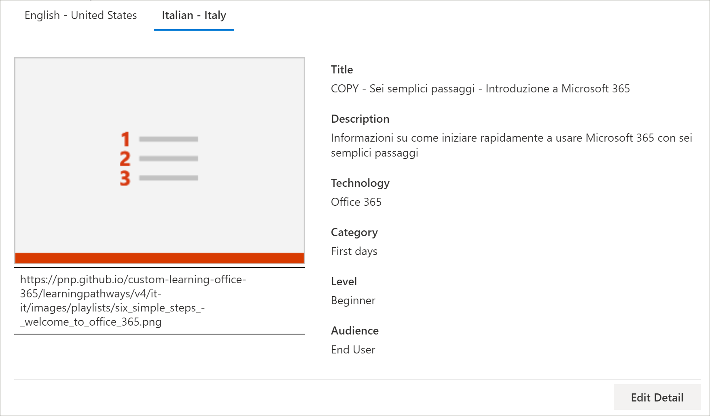
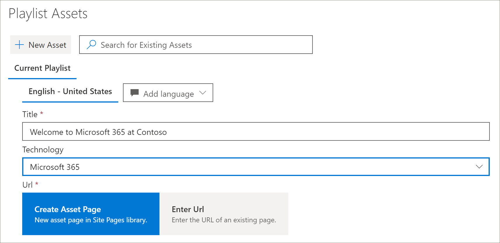
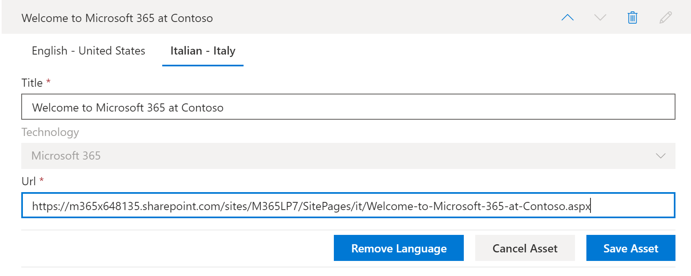
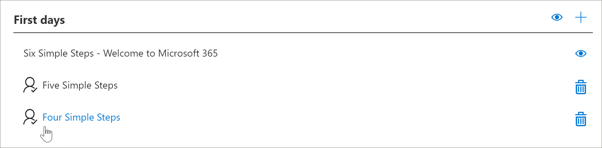
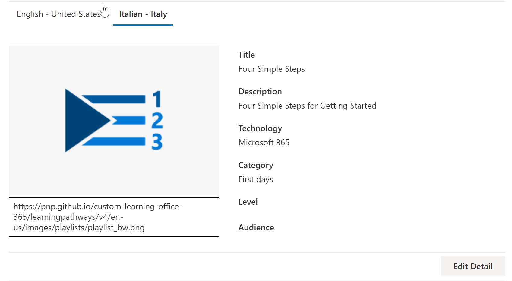

# Converter os caminhos de aprendizado de playlists personalizadas
Com os caminhos de aprendizado, a maneira como você trabalha com as listas de reprodução personalizadas depende de como você configurou os caminhos de aprendizado.  

- Se você provisionou um novo site multilíngue de caminhos de aprendizado, poderá copiar ou criar uma nova lista de reprodução e traduzir a lista de reprodução para os idiomas aos quais o site oferece suporte.
- Se você atualizou um site de cursores de aprendizado existente que tenha listas de reprodução personalizadas preexistentes, poderá traduzir as listas de reprodução existentes nos idiomas aos quais o site oferece suporte. Você também pode copiar e criar novas listas de reprodução. 

> [!IMPORTANT]
> - As playlists fornecidas pela Microsoft já foram convertidas e não podem ser modificadas, a menos que você crie uma cópia da lista de reprodução. 

## Criar ou copiar uma lista de reprodução e fazer com que ela seja convertida
Se você tiver configurado um novo site de cursores de aprendizado ou atualizado o site com a Web Part multilíngue, poderá copiar ou criar uma lista de reprodução personalizada e converter os ativos de playlist e playlist nos idiomas aos quais seu site oferece suporte. 

### Copiar uma lista de reprodução e fazer com que ela seja convertida
Para demonstrar como criar uma nova lista de reprodução personalizada e traduzi-la, usaremos o recurso copiar playlist dos caminhos de aprendizado.

1.  No menu **principal** de cursores de aprendizado, clique em **Administração de caminhos de aprendizado**. 
2.  Em **caminhos de aprendizado da Microsoft 365**, selecione **primeiro dias**e, em seguida, selecione **seis etapas simples – bem-vindo ao Microsoft 365**. 
3. Clique em **copiar playlist**, role para baixo na página e clique em **Editar detalhes**.   
4. Alterar o título da lista de reprodução. Neste exemplo, alteraremos o título da playlist para **cinco etapas simples**. Os idiomas disponíveis dependerão dos idiomas com suporte selecionados para o site. Para adicionar outros idiomas, você precisa adicionar outros idiomas com suporte no site.   
5. Clique em **salvar detalhes**. 
6. Clique em um idioma à direita do idioma padrão (neste caso, em inglês) para exibir os detalhes copiados da playlist. Os detalhes do novo idioma refletem a lista de reprodução original copiada e exigem tradução.
7. Anote para notificar o tradutor dos detalhes da playlist a serem traduzidos.  

> [!IMPORTANT]
> As notificações do tradutor não são criadas em playlists personalizadas. Os tradutores deverão ser notificados manualmente. Os tradutores convertem manualmente as cópias dos detalhes do idioma padrão nos idiomas especificados. Você precisará notificar o tradutor das traduções necessárias para obter detalhes da playlist. É recomendável concluir todas as alterações da playlist, incluindo adicionar, editar ou excluir ativos da playlist e, em seguida, notificar o tradutor das traduções necessárias para obter detalhes e ativos da playlist.

## Criar ativos multilíngues em uma lista de reprodução personalizada
Qualquer ativo em uma lista de reprodução que seja fornecido pela Microsoft não é editável e não exige conversão. Os ativos fornecidos pela Microsoft estarão disponíveis nos idiomas com suporte no site. Para ativos personalizados que você cria ou ativos personalizados existentes, você pode adicionar os idiomas com suporte no site.  Vamos dar uma olhada em como adicionar idiomas para ativos personalizados novos e existentes em uma lista de reprodução. 

### Criar um novo ativo multilíngue para uma lista de reprodução
Estas instruções pressupõem que você esteja usando a lista de reprodução de cinco etapas simples no exemplo neste tópico. 

**Para criar o ativo**
1. Para a lista de cinco etapas simples, em **ativos**, selecione **+ novo ativo** e preencha os detalhes do ativo. 
- Em **título**, insira "bem-vindo ao Microsoft 365 na contoso". 
- Para **tecnologia**, selecione **Microsoft 365**.

2. Selecione **criar ativo**e, em seguida, selecione **salvar ativo**.

**Para abrir o ativo**
1. Selecione o ativo que você criou e clique em **abrir**.  
2. Faça as alterações na página conforme desejado. Por enquanto, você pode alterar o título da página e adicionar texto à página, conforme mostrado no exemplo a seguir, e clique em **publicar**. 
3. Clique em **tradução**.
4. Selecione **criar** para os idiomas desejados. Para este exemplo, selecionaremos italiano.
5. Selecione **Exibir**. Agora você deve ver uma página semelhante ao exemplo a seguir, dependendo dos seus idiomas com suporte.

6. Clique em **Publicar**.
7. Para a página de Tradução criada, copie a URL do navegador e retorne à página de administração de cursores de aprendizado.

**Para adicionar um idioma para o ativo de tradução que você criou** 
1. Retorne à página Administração de caminhos de aprendizado e selecione o ícone Editar (lápis) para o ativo "cinco etapas simples" que você abriu. 
2. Clique em **Adicionar idioma**e selecione um idioma. Neste exemplo, selecionamos italiano. 
3. Insira a URL da página traduzida que você criou. Você verá uma página semelhante ao exemplo a seguir. 

4. Clique em **salvar ativo**.

## Adicionar idiomas para listas de reprodução e ativos personalizados existentes
Se você tiver atualizado os caminhos de aprendizado para suporte multilíngue e tiver recursos e listas de reprodução personalizados existentes, poderá adicionar idiomas com suporte para as listas de reprodução e ativos. Estas instruções pressupõem que você tenha uma lista de reprodução personalizada à qual você pode adicionar idiomas. Se você não tiver uma lista de reprodução personalizada, consulte "criar ou copiar uma lista de reprodução", anteriormente neste tópico. 

> [!IMPORTANT]
> - As playlists fornecidas pela Microsoft já foram convertidas e não podem ser modificadas, a menos que você crie uma cópia da lista de reprodução. Você só pode adicionar idiomas para listas de reprodução personalizadas. 
> - Para adicionar idiomas para listas de reprodução e ativos personalizados, o suporte multilíngue e idiomas devem ser habilitados. Para obter mais informações, consulte [definir configurações de idioma](https://docs.microsoft.com/office365/customlearning/custom_update_ml#set-language-settings). 

### Para adicionar idiomas para uma lista de reprodução existente
1.  No menu **principal** de cursores de aprendizado, clique em **Administração de caminhos de aprendizado**. 
2.  Selecione uma lista de reprodução personalizada. Uma lista de reprodução personalizada é identificada pelo ícone pessoas com a marca de opções, conforme mostrado no exemplo a seguir.
 
3. Selecione **Editar detalhes**. Talvez seja necessário rolar para baixo para localizar o botão **Editar detalhes** .   
4. Selecione **Adicionar idioma** e, em seguida, selecione um idioma.  
5. Selecione **salvar detalhes**.
 Os idiomas disponíveis dependerão dos idiomas com suporte selecionados para o site. Para adicionar outros idiomas, você precisa adicionar outros idiomas com suporte no site.   
5. Clique em um idioma à direita do idioma padrão (neste caso, em inglês) para exibir os detalhes copiados da playlist. Os detalhes do novo idioma refletem a lista de reprodução original copiada e exigem tradução.
 
7. Anote para notificar o tradutor dos detalhes da playlist a serem traduzidos.  

**Para abrir o ativo**
1. Selecione o ativo que você criou e clique em **abrir**.  
2. Faça as alterações na página conforme desejado. Por enquanto, você pode alterar o título da página e adicionar texto à página, conforme mostrado no exemplo a seguir, e clique em **publicar**. 
3. Clique em **tradução**.
4. Selecione **criar** para os idiomas desejados. Para este exemplo, selecionaremos italiano.
5. Selecione **Exibir**. Agora você deve ver uma página semelhante ao exemplo a seguir, dependendo dos seus idiomas com suporte.

6. Clique em **Publicar**.
7. Para a página de Tradução criada, copie a URL do navegador e retorne à página de administração de cursores de aprendizado.

## Notificar o tradutor
Quando você tiver concluído a criação de ativos de tradução, notifique o tradutor das traduções necessárias. O tradutor irá:
- Traduzir detalhes da playlist.
- Traduz detalhes do ativo.
- Traduza páginas de idiomas adicionadas para um ativo.
- Notificar o solicitante das traduções que as traduções estão prontas para revisão

## Adicionar idiomas para uma lista de reprodução personalizada existente
Se você tiver atualizado os caminhos de aprendizado para suporte multilíngue e tiver recursos e listas de reprodução personalizados existentes, poderá adicionar idiomas com suporte para as listas de reprodução e ativos. 

> [!IMPORTANT]
> - As playlists fornecidas pela Microsoft já foram convertidas e não podem ser modificadas, a menos que você crie uma cópia da lista de reprodução. Você só pode adicionar idiomas para listas de reprodução personalizadas. 
> - Para adicionar idiomas para listas de reprodução e ativos personalizados, o suporte multilíngue e idiomas devem ser habilitados. Para obter mais detalhes sobre como habilitar o suporte multilíngue e opções, consulte [definir configurações de idioma](https://docs.microsoft.com/office365/customlearning/custom_update_ml#set-language-settings). 

## Instruções para o tradutor
Ao adicionar idiomas a listas de reprodução, você precisa notificar o tradutor das alterações. Você pode apontar o tradutor para o seguinte 

### Detalhes da lista de reprodução
No menu **principal** de cursores de aprendizado, clique em **Administração de caminhos de aprendizado**. 
1. Clique na lista de reprodução personalizada que requer Tradução e, em seguida, clique nos idiomas. 
2. Clique em **Editar detalhe**, faça as traduções da lista de reprodução e, em seguida, clique em 
3. Clique em **salvar detalhes**. 
4. Notifique o solicitante de conversão que a tradução foi concluída. 

### Converter detalhes do ativo
No menu **principal** de cursores de aprendizado, clique em **Administração de caminhos de aprendizado**. 
1. Clique na lista de reprodução personalizada que requer tradução. 
2. Role para baixo na página e, em ativos, selecione Editar para o ativo que você deseja editar e, em seguida, selecione o idioma. 
3. Faça as traduções do ativo e clique em **salvar ativo**.  

### Traduzir a página do idioma adicionado para o ativo
No menu **principal** de cursores de aprendizado, clique em **Administração de caminhos de aprendizado**. 
1. Clique na lista de reprodução personalizada que requer tradução. 
2. Role para baixo na página e, em ativos, selecione o ativo, selecione o idioma e clique em abrir. 
3. Faça as traduções para a página e clique em **publicar**.   

## Para saber mais
- Para obter mais informações sobre como personalizar os caminhos de aprendizado, consulte [Customize cursores de aprendizado](custom_overview.md).  

