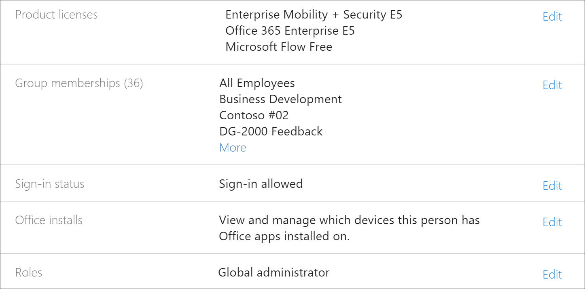
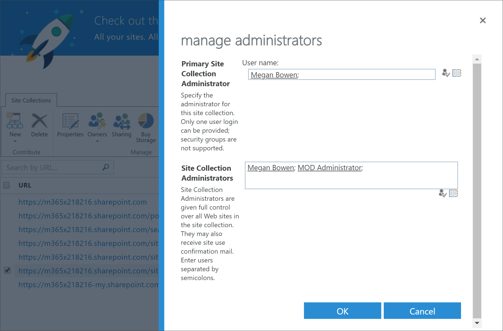
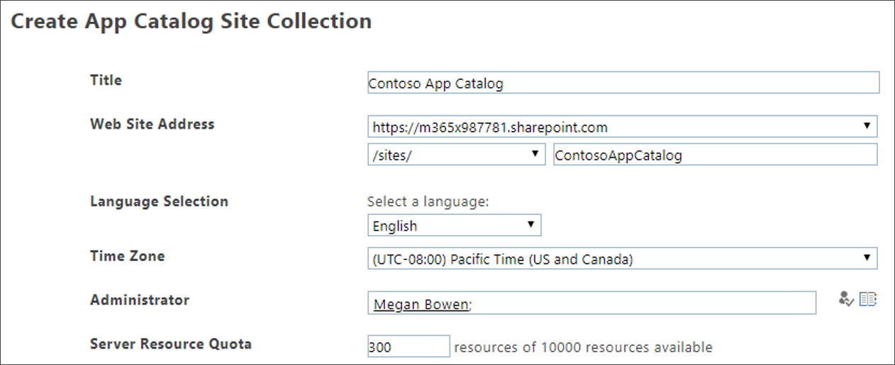

# Solucionar problemas de aprendizagem personalizadaTroubleshoot Custom Learning

Aqui estão dicas de solução de problemas que podem ocorrer com o aprendizado personalizado para o Office 365 ou o serviço de provisionamento do SharePoint Online.Here are troubleshooting tips for problems that may occur with Custom Learning for Office 365 or the SharePoint Online Provisioning Service.

## Como saber se você tem permissões de administrador de locatáriosHow to know if you have Tenant Admin permissions

Entrar no serviço de provisionamento do SharePoint Online e provisionar o aprendizado personalizado requer permissões de administração de locatários.Sign in to the SharePoint Online Provisioning Service and provisioning Custom Learning requires Tenant Admin permissions. Se você estiver tendo problemas de entrada com o serviço de provisionamento do SharePoint Online, verifique se você recebeu a função de administrador global.If you are experiencing sign in issues with the SharePoint Online Provisioning Service, make sure that you have been assigned the Global administrator role. A solução de aprendizado personalizada exige permissões de administrador de locatário, caso contrário, conhecida como função de administrador global do Office 365.The Custom Learning solution requires Tenant Admin permissions, otherwise known as Office 365 Global Administrator role. ConFira aqui como determinar se você recebeu a função de administrador global.Here’s how to determine if you have been assigned the Global Administrator role.

1.  Entre no Office.com.Sign in to Office.com.
2.  Clique em **administrador**Click **Admin**
3.  Em **usuários**, selecione **usuários ativos**Under **Users**, select **Active Users**
4.  Procurar seu nomeSearch for your name
5.  Clique no seu nome nos resultados da pesquisa.Click your name in Search results. Você deve ver administrador global para sua função.You should see Global administrator for your role.

### Se você não tiver a função de administrador globalIf you don’t have the Global administrator role
- Encontre um administrador global em sua organização e peça que a pessoa entre no serviço ou peça a ele para você atribuir a função de administrador global.Find a Global Administrator in your organization and have that person sign into the service or have them assign the Global administrator role to you.

## Solução de problemas do catálogo de aplicativos do locatárioTenant App Catalog Troubleshooting
O aprendizado personalizado exige que um catálogo de aplicativos seja provisionado no locatário de destino.Custom Learning requires an App Catalog to be provisioned in the target tenant. A criação de um catálogo de aplicativos requer permissões de administrador global.Creating an app catalog requires Global Administrator permissions. Veja a seguir as etapas de solução de problemas para problemas comuns do catálogo de aplicativos:Here’s are troubleshooting steps for common App Catalog issues:

### Como saber se você tem um catálogo de aplicativos do locatárioHow to know if you have a Tenant app catalog 
Para começar, verifique se você tem permissões de administrador global.For starters, ensure that you have Global administrator permissions. Consulte as etapas das permissões de administrador de locatário acima.See the steps for Tenant Admin permissions above.

1. no Office 365, clique em **administrador**, clique na seta para expandir >, clique em **mostrar todos os** > **centros** > de administração**do SharePoint**.From Office 365, click **Admin**, click the expand arrow >, click **Show all** > **Admin centers** > **SharePoint**.
2. Clique em catálogo de\*\*\*\* > **aplicativos**de **Administração clássica do SharePoint Center** > .Click **Classic Admin SharePoint Center** > **apps** > **App Catalog**.
3. Em **aplicativos**, você deve ver um bloco intitulado **distribuir aplicativos para SharePoint**.Under **Apps**, you should see a tile titled **Distribute apps for SharePoint**. Se você vir o bloco, você tem um catálogo de aplicativos de locatário.If you see the tile, you have a Tenant App Catalog. Consulte a seção **como verificar se você é um site do Colllection..** . abaixo.See the **How to ensure your are a Site Colllection...** section below. Se você não vir o bloco, será necessário criar um catálogo de aplicativos de locatário para o locatário.If you don’t see the tile you will need to create a tenant app catalog for your tenant. Consulte a seção **como criar um catálogo de aplicativos do locatário** abaixo.See the **How to create a Tenant App Catalog** section below .

### Como garantir que você seja proprietário do conjunto de sites no catálogo de aplicativos do locatárioHow to ensure you are a Site Collection Owner on the Tenant App Catalog 
Para provisionar o aprendizado personalizado para o Office 365, você precisará ser um proprietário do conjunto de sites no catálogo de aplicativos do locatário.To provision Custom Learning for Office 365, you will need to be a Site Collection Owner on the Tenant App Catalog. Veja como determina se você é proprietário.Here’s how to determin if you are an Owner.

1. no Office 365, clique em **administrador**, clique na seta para expandir >, clique em **mostrar todos os** > **centros** > de administração**do SharePoint**.From Office 365, click **Admin**, click the expand arrow >, click **Show all** > **Admin centers** > **SharePoint**.
2. Clique em **central de administração clássica do SharePoint**e selecione o **Catálogo de aplicativos**.Click **Classic Admin SharePoint Center**, and then select the **app catalog**.
3. Selecione **proprietário**e, em seguida, verifique se você é um proprietário de conjunto de sites.Select **Owner**, and then ensure you are a Site Collection Owner. Ele deverá ter uma aparência semelhante a esta.It should look something like this.
 

### Como criar um catálogo de aplicativos do locatário se não houver umHow to create a Tenant App Catalog if one doesn’t exists 
1. Entre no Office 365 com sua conta de administrador do SharePoint Online.Sign in to Office 365 with your SharePoint Online admin account.
2. Clique em **Administrador**.Click **Admin**.
3. Em **centros de administração**, clique em **SharePoint**.Under **Admin centers**, click **SharePoint**. 
4. Clique em**Catálogo**de aplicativos de **aplicativos** > .Click **Apps** > **App Catalog**.
5. Clique em **criar um novo site de catálogo de aplicativos**e clique em **OK**.Click **Create a new app catalog site**, and then click **OK**. 
6.  Insira as informações para o catálogo de aplicativos.Enter the information for the App Catalog. Talvez você queira incluir mais de um administrador.You may want to include more than one Administrator. O exemplo a seguir mostra um exemplo.The following shows an example.  

7.  É isso.That’s it. Você concluiu.You’re done. Mas antes de mudar para o provisionamento de aprendizado personalizado, você precisa aguardar pelo menos 30 minutos para garantir que a criação do catálogo de aplicativos esteja concluída.But before you move to provisioning Custom Learning, you need to wait at least 30 minutes to make sure the App Catalog creation is complete. 

> [!IMPORTANT]
> Aguarde pelo menos 30 minutos depois de criar o catálogo de aplicativos do locatário antes de provisionar o aprendizado personalizado.Wait at least 30 minutes after creating the Tenant App Catalog before provisioning Custom Learning. Isso garante que o processo de provisionamento do catálogo de aplicativos seja concluído no SharePoint.This ensures that the App Catalog provisioning process is complete within SharePoint. 