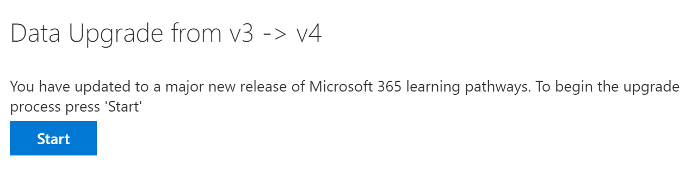

# Atualizar os caminhos de aprendizadoUpdate learning pathways
Se você tiver um site de cursores de aprendizado existente, poderá atualizá-lo para suporte multilíngue.If you have an existing Learning Pathways site, you can update it for multilingual support. Para atualizar os caminhos de aprendizado para a versão 4,0 multilíngue, você carrega o pacote de Web Parts, customlearning. sppkg, para o catálogo de aplicativos de locatários do SharePoint.To update learning pathways to the multilingual 4.0 version, you upload the web part package, customlearning.sppkg, to the SharePoint tenant App Catalog. Ao atualizar os caminhos de aprendizado:When you update learning pathways:  

- Todas as playlists e ativos personalizados criados anteriormente são mantidosAny previously created custom playlists and assets are maintained
- As configurações para ocultar ou Mostrar conteúdo são mantidasSettings to hide or show content are maintained
- O modelo de cursores de aprendizado do SharePoint permanece inalteradoThe learning pathways SharePoint template is left unchanged
- As páginas do site de cursores de aprendizado não são traduzidas.The learning pathways site pages aren't translated. Esse trabalho deve ser feito manualmenteThis work must be done manually

## Ler os caminhos de aprendizado visão geral multilíngueRead the learning pathways multilingual overview
Para saber mais sobre como o suporte multilíngue funciona para os caminhos de aprendizado, leia a [visão geral multilíngue dos caminhos de aprendizado](custom_overview.md).To learn about how multilingual support works for learning pathways, read the [Learning pathways multilingual overview](custom_overview.md). 

## Pré-requisitos para atualizarPrerequisites to update
Antes de atualizar os caminhos de aprendizado, o seguinte pré-requisito deve ser atendido:Before updating learning pathways, the following prerequisite must be met:
- A pessoa que está atualizando os caminhos de aprendizado deve ser um proprietário do conjunto de sites do catálogo de aplicativos do locatário.The person updating learning pathways must be a site collection owner of the tenant App Catalog. Se os caminhos de aprendizado de provisionamento de pessoa não forem proprietários de conjunto de sites do catálogo de aplicativos, [conclua estas instruções](addappadmin.md) e continue.If the person provisioning learning pathways isn't a site collection owner of the App Catalog, [complete these instructions](addappadmin.md) and continue. 

## Definir configurações de idiomaSet language settings 
Antes de atualizar os caminhos de aprendizado, defina as configurações de idioma do site.Before updating learning pathways, set the site language settings. Para habilitar o suporte multilíngue para o site de cursores de aprendizado, você pode definir as **páginas habilitadas e as notícias a serem traduzidas em vários idiomas** **e, em seguida, adicionar**os idiomas que você deseja dar suporte ao site.To enable multilingual support for the learning pathways site, you can set the **Enable pages and news to be translated into multiple languages** to **On**, and then add the languages you want to support for the site.
1.  No site de cursores de aprendizado, selecione **configurações** no canto superior direito e, em seguida, selecione **informações do site**.From the Learning Pathways site, select **Settings** from the top right, and then select **Site information**.
2.  Na parte inferior do painel de informações do site, selecione **Exibir todas as configurações do site**.At the bottom of the site information pane, select **View all site settings**.
3.  Em **Administração do site**, selecione **configurações de idioma**.Under **Site Administration**, select **Language settings**.
4.  Em **habilitar páginas e notícias a serem traduzidas em vários idiomas**, defina a opção Alternar.Under **Enable pages and news to be translated into multiple languages**, set the toggle switch. 
- Para um site do multiligual, deslize o botão para **Ativar**e, em seguida, prossiga para a seção Adicionar idiomas.For a multiligual site, slide the toggle to **On**, and then proceed to the Add Languages section. 
- Para um site somente em inglês, deslize a alternância para **desativar**.For an English-only site, slide the toggle to **Off**.

### Adicionar idiomasAdd languages
Os caminhos de aprendizado dão suporte a nove idiomas, você deve adicionar somente os idiomas necessários.Learning pathways supports nine languages, you should add only the languages you need. Nos exemplos usados nesta documentação, o italiano será adicionado.In the examples used in this documentation, Italian will be added. 
- Em **Adicionar ou remover idiomas do site**, comece a digitar o nome de um idioma em **selecionar ou digite um idioma**ou escolha um idioma na lista suspensa.Under **Add or remove site languages**, start typing a language name in **Select or type a language**, or choose a language from the dropdown. Você pode repetir essa etapa para adicionar vários idiomas.You can repeat this step to add multiple languages. Você pode adicionar ou remover idiomas do seu site a qualquer momento, voltando para esta página.You can add or remove languages from your site at any time by going back to this page.
 
### Atribuir tradutoresAssign translators
Ao definir as configurações de idioma para os caminhos de aprendizado, você pode atribuir tradutores.When defining Language settings for learning pathways, you can assign translators. Os tradutores devem ter um perfil de idioma estrangeiro configurado.Translators should have a foreign language profile set up. Para obter mais informações sobre perfis de idioma estrangeiros, consulte [criar sites de comunicação multilíngue, páginas e notícias](https://support.office.com/article/2bb7d610-5453-41c6-a0e8-6f40b3ed750c).For more information about foreign language profiles, see [Create multilingual communication sites, pages, and news](https://support.office.com/article/2bb7d610-5453-41c6-a0e8-6f40b3ed750c).  
- Para obter um idioma com suporte, clique em **selecionar ou digite um tradutor** e selecione um conversor.For a supported language, click **Select or type a translator** and then select a translator. 

## Atualizar o pacote de Web Part de cursores de aprendizadoUpdate the learning pathways web part package
Nesta etapa, você carrega a Web Part caminhos de aprendizado 4,0 para o catálogo de aplicativos do SharePoint e, em seguida, navega até a página de administração de caminhos de aprendizado para iniciar o processo de atualização.In this step, you upload the learning pathways 4.0 web part to the SharePoint App Catalog, and then navigate to the learning pathways Administration page to start the update process.

### Carregar o pacote de Web PartUpload the web part package
1.  Vá para o local de compartilhamento multilíngue no Microsoft Teams e baixe o **customlearning. sppkg** para uma unidade local em seu computador.Go to the multilingual share location in Teams and download **customlearning.sppkg** to a local drive on your PC. 
2.  Se você ainda não tiver entrado, entre em seu locatário com uma conta de administrador de locatário ou de administrador de conjunto de sites.If you’re not already signed in, sign into your tenant with a Tenant Admin or Site Collection Admin account. 
3.  Clique em **Administração**  >  **Mostrar todos os**  >  **recursos do SharePoint**  >  **More Features**.Click **Admin** > **Show All** > **SharePoint** > **More Features**. 
4.  Em **aplicativos**, clique em **abrir**.Under **Apps**, click **Open**. 
5.  Clique em **Catálogo**  >  **de aplicativos distribuir aplicativos para SharePoint**.Click **App Catalog** > **Distribute Apps for SharePoint**. 
6.  Clique em **carregar**  >  **escolher arquivos**.Click **Upload** > **Choose Files**. 
7.  Selecione o arquivo **customlearning. sppkg** que você baixou, clique em **OK**  >  **implantar**.Select the **customlearning.sppkg** file you downloaded, click **OK** > **Deploy**. 

### Concluir a atualizaçãoComplete the update
1.  No site de cursores de aprendizado, selecione **Administração de cursores de aprendizado** no menu **página inicial** .From the Learning Pathways site, select **Learning pathways administration** from the **Home** menu. 
2.  Você verá um prompt perguntando se você deseja atualizar.You’ll see a prompt asking if you want to update. 

3.  Clique em **Iniciar**.Click **Start**. 
4. Quando a atualização for concluída, clique em **fechar**.When the update is complete, click **Close**. 

### Próximas etapasNext Steps
- Explore o [conteúdo padrão](custom_exploresite.md) fornecido no site e na Web Part.Explore the [default content](custom_exploresite.md) provided in the site and web part.
- Para obter mais informações sobre a tradução de páginas de sites, consulte [traduzir páginas de sites](custom_translate_page_ml.md).For more information about translating site pages, see [Translate site pages](custom_translate_page_ml.md). 

