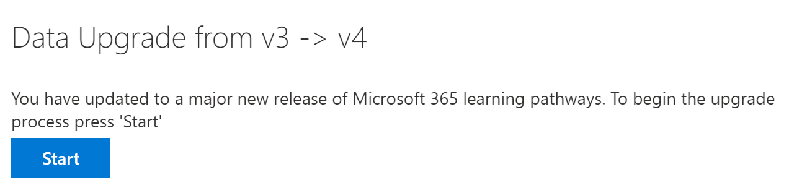

# Atualizar caminhos de aprendizado para suporte multilíngue
Se você tiver um site Learning de caminhos existente, poderá atualizá-lo para suporte multilíngue. Para atualizar os caminhos de aprendizado para a versão 4.0 multilíngue, você carrega o pacote de Web Part, customlearning.sppkg, para o Catálogo de Aplicativos SharePoint locatário. Quando você atualiza os caminhos de aprendizado:  

- Quaisquer playlists e ativos personalizados criados anteriormente são mantidos
- Configurações para ocultar ou mostrar o conteúdo são mantidos
- Os caminhos de aprendizagem SharePoint modelo permanecem inalterados
- As páginas do site de caminhos de aprendizado não são traduzidas. Esse trabalho deve ser feito manualmente

## Ler os caminhos de aprendizado visão geral multilíngue
Para saber como funciona o suporte multilíngue para caminhos de aprendizagem, leia o Learning de visão geral [multilíngue](custom_overview_ml.md)). 

## Pré-requisitos para atualização
Antes de atualizar os caminhos de aprendizado, os seguintes pré-requisitos devem ser atendidos:
- A pessoa atualizando os caminhos de aprendizado deve ser um proprietário do conjunto de sites do Catálogo de Aplicativos do locatário. Se a pessoa que provisiona os caminhos de aprendizado não for um proprietário do conjunto de sites do Catálogo de Aplicativos, [conclua essas instruções](addappadmin.md) e continue. 

## Definir configurações de idioma 
Antes de atualizar os caminhos de aprendizado, de definir as configurações de idioma do site. Para habilitar o suporte multilíngue para o  site de caminhos de aprendizado, você pode definir as páginas e notícias habilitar para serem traduzidas em vários idiomas como **Ativado** e adicionar os idiomas que você deseja dar suporte para o site.
1.  No site Learning Caminhos, selecione Configurações **a** partir da parte superior direita e selecione Informações do **site.**
2.  Na parte inferior do painel de informações do site, selecione **Exibir todas as configurações do site.**
3.  Em **Administração do Site,** selecione **Configurações de idioma.**
4.  Em **Habilitar páginas e notícias a serem traduzidas em vários idiomas,** de definir a opção de alternância. 
- Para um site multilíngue, deslize a alternância para **On** e prossiga para a seção Adicionar Idiomas. 
- Para um site somente em inglês, deslize a alternância para **Off**.

### Adicionar idiomas
Learning caminhos suportam nove idiomas, você deve adicionar apenas os idiomas necessários. Nos exemplos usados nesta documentação, o italiano será adicionado. 
- Em **Adicionar ou remover idiomas de site,** comece a digitar um nome de idioma em **Selecionar** ou digite um idioma ou escolha um idioma no menu suspenso. Você pode repetir esta etapa para adicionar vários idiomas. Você pode adicionar ou remover idiomas do seu site a qualquer momento, voltando para esta página.
 
### Atribuir tradutores
Ao definir configurações de idioma para caminhos de aprendizado, você pode atribuir tradutores. Os tradutores devem ter um perfil de idioma estrangeiro definido. Para obter mais informações sobre perfis de idiomas estrangeiros, consulte [Create multilingual communication sites, pages, and news](https://support.office.com/article/2bb7d610-5453-41c6-a0e8-6f40b3ed750c).  
- Para um idioma com suporte, clique em **Selecionar ou digite um tradutor** e selecione um tradutor. 

## Atualizar o pacote de Web Part de caminhos de aprendizado
Nesta etapa, você carrega a Web Part de caminhos de aprendizado 4.0 no Catálogo de Aplicativos do SharePoint e, em seguida, navegue até a página De administração dos caminhos de aprendizado para iniciar o processo de atualização.

### Upload pacote de Web Part
1.  Vá para o [repositório GitHub](https://github.com/pnp/custom-learning-office-365/tree/master/webpart)de aprendizado personalizado , selecione **customlearning.sppkg** e baixe-o para uma unidade local em seu computador. 
2.  Se você ainda não tiver entrado, entre no seu locatário com uma conta Administrador de Locatário ou Administrador do Conjunto de Sites. 
3.  Clique **em Admin** Show All  >    >  **SharePoint**  >  **Mais Recursos**. 
4.  Em **Aplicativos,** clique em **Abrir**. 
5.  Clique **em Catálogo de**  >  **Aplicativos Distribuir Aplicativos para SharePoint**. 
6.  Clique **Upload**  >  **Escolher Arquivos**. 
7.  Selecione o **arquivo customlearning.sppkg** baixado, clique em **OK**  >  **Implantar**. 

### Concluir a atualização
1.  No site Learning Caminhos, selecione Learning **administração de** caminhos **no** menu Home. 
2.  Você verá um prompt perguntando se deseja atualizar. 

3.  Clique em **Iniciar**. 
4. Quando a atualização for concluída, clique em **Fechar**. 

### Próximas etapas
- Explore o [conteúdo padrão](custom_exploresite.md) fornecido no site e na Web Part.
- Para obter mais informações sobre a tradução de páginas de site, consulte [Translate site pages](custom_translate_page_ml.md). 

