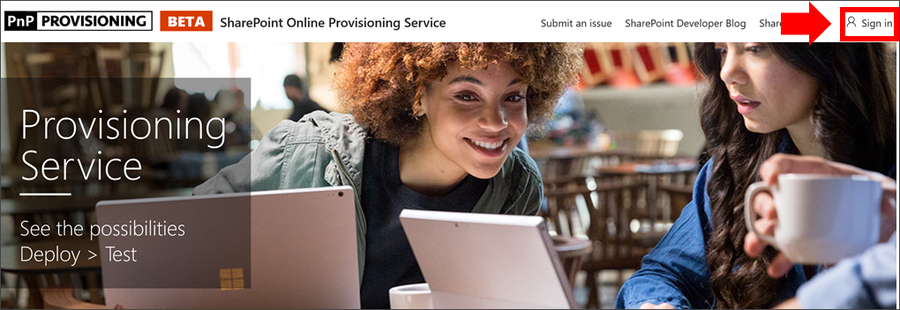
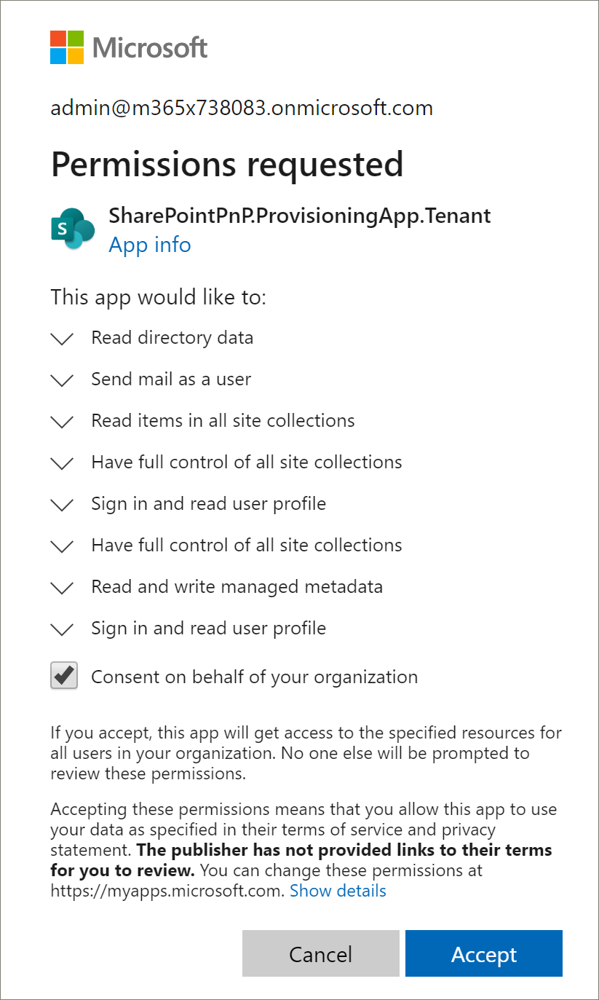
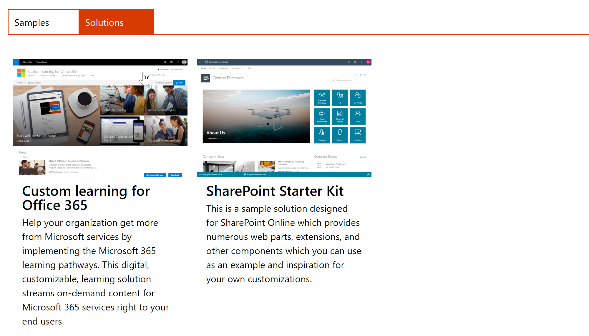
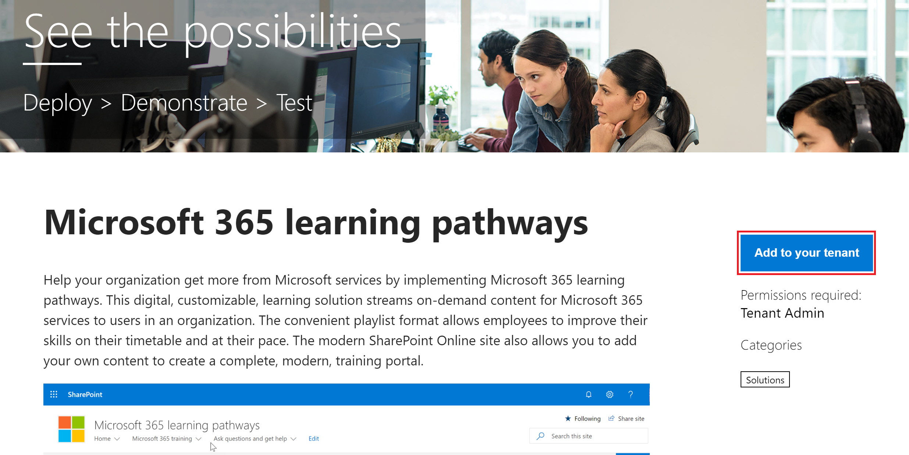
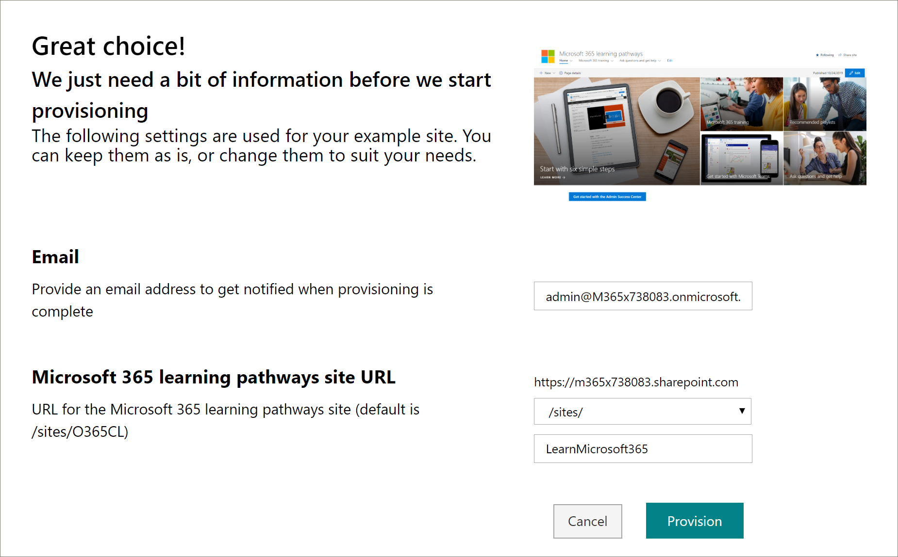

# Provisione o Learning

Com o SharePoint de Provisionamento Online, um administrador Office 365 locatário pode iniciar o processo de provisionamento com alguns cliques simples. O Serviço de Provisionamento é a maneira recomendada de provisionar Learning. É rápido, fácil e leva apenas alguns minutos para iniciar o processo. No entanto, antes de começar com o Serviço de Provisionamento, certifique-se de que você tenha atendido aos pré-requisitos para provisionamento.

## Pré-requisitos
 
Para configurar o Serviço Learning personalizado com o Serviço de [Provisionamento SharePoint Serviço](https://provisioning.sharepointpnp.com)de Provisionamento Online, a pessoa que está fazendo o provisionamento deve atender aos seguintes pré-requisitos: 
 
- A pessoa que provisiona Learning deve ser um Administrador de Locatários do locatário no qual o Learning personalizado será provisionado.  
- Um Catálogo de Aplicativos de locatário deve estar disponível na opção Aplicativos do SharePoint Admin Center. Se sua organização não tiver um catálogo de aplicativos SharePoint locatário, consulte a documentação SharePoint [Online](/sharepoint/use-app-catalog) para criar um.  
- A pessoa que provisiona Learning deve ser um Proprietário do Conjunto de Sites do Catálogo de Aplicativos de Locatário. Se a pessoa que provisiona Learning não for um Proprietário do Conjunto de Sites do Catálogo de [Aplicativos, conclua essas instruções](addappadmin.md) e continue. 

### Para provisionar Learning

1. Vá para http://provisioning.sharepointpnp.com e **entre** no canto superior direito da home page.  Entre com as credenciais do locatário direcionado onde você planeja instalar o modelo de site.

2. Limpe o **Consentimento em nome da sua organização e** selecione **Aceitar**.

   

3. Selecione **Custom Learning para Office 365** na galeria de soluções.

   

4. Na home page da solução, selecione **Adicionar ao locatário**

      

5. Preencha os campos na página de informações de provisionamento, conforme apropriado à sua instalação. No mínimo, insira o endereço de email para o qual você deseja receber notificações sobre o processo de provisionamento e a URL de destino para o qual seu site deve ser provisionado.  
   > [!NOTE]
   > Tornar a URL de destino do seu site algo amigável para seus funcionários, como "/sites/MyTraining" ou "/teams/LearnOffice365".

   

6. Selecione **Provisionar** quando estiver pronto para instalar o Learning personalizado em seu ambiente de locatário.  O processo de provisionamento levará até 15 minutos. Você será notificado por email (no endereço de email para receber notificação que você digitou na página de Provisionamento) quando o site estiver pronto para ser acessado.

> [!IMPORTANT]
> O Administrador de Locatários que provisiona o site Learning personalizado deve ir para o site e, em seguida, abrir CustomLearningAdmin.aspx para inicializar propriedades de Administrador Learning Personalizado. Neste momento, o Administrador de Locatários também deve atribuir Proprietários ao site. 

## Validar o sucesso do provisionamento

Quando o provisionamento é concluído, o Administrador de Locatário recebe um email do Serviço de Provisionamento PnP. O administrador pode copiar o link para o site fornecido no email e seguir as instruções para ir para o site. Como alternativa, o administrador do locatário pode navegar até YOUR-SITE-COLLECTION-URL/SitePages/CustomLearningAdmin.aspx. Isso inicializa o item de lista CustomConfig que configura o Learning personalizado para seu primeiro uso. A pessoa que abre esta página pela primeira vez deve ser um Administrador de Locatário, Administrador do Conjunto de Sites ou Proprietário do site. Você deve ver uma página com esta aparência: 

## Adicionar proprietários ao site
Como Administrador de Locatários, é improvável que você seja a pessoa que personalização do site, portanto, você precisará atribuir Proprietários ao site. Os proprietários têm privilégios administrativos no site para que possam modificar páginas do site e renomear o site. Eles também têm a capacidade de ocultar e mostrar o conteúdo fornecido por meio da Web Part Learning Custom. Eles também terão a capacidade de criar playlist personalizada e atribuí-las a subcategorias personalizadas.  

1. No menu SharePoint **Configurações,** clique em **Permissões do Site.**
2. Clique **em Permissão Avançada Configurações**.
3. Clique **Aprendizagem personalizada para Office 365 Proprietários**.
4. Clique **em Novo** Adicionar Usuários a esse  >  **grupo,** adicione as pessoas que você deseja que sejam Proprietários e clique em **Compartilhar**.

8. Clique na **opção** A seguir no canto superior direito da página para seguir o site.  
