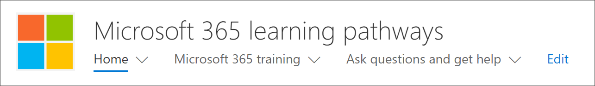
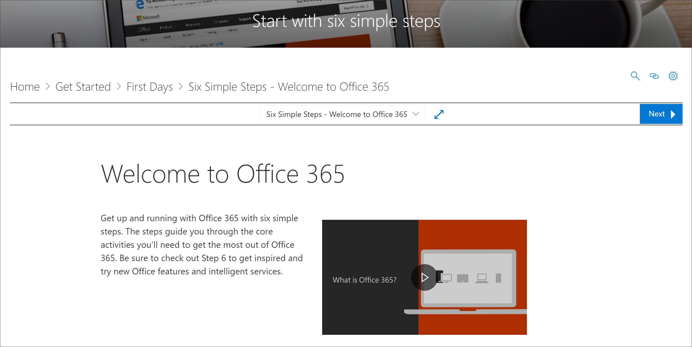
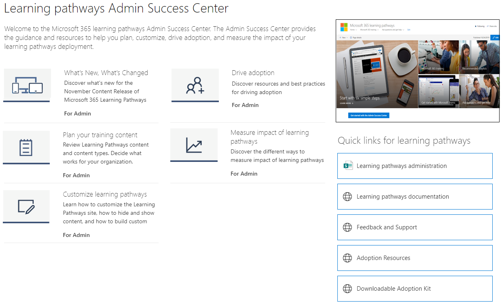

# Onde está a Web Part dos caminhos de aprendizagem do Microsoft 365 

Quando os caminhos de aprendizado são provisionados em sua organização, o site e a Web Part de cursores de aprendizado são adicionados ao locatário do SharePoint da sua organização. Como parte do provisionamento, a Web Part de aprendizado da Microsoft 365 é adicionada às seguintes páginas do site de cursores de aprendizado da Microsoft 365:

- Start-with-Six-Simple-Steps. aspx 
- Recommended-Playlists. aspx
- Introdução ao – Office 365. aspx
- Get-started-with-Microsoft-Teams. aspx
- Get-started-with-OneDrive. aspx
- Get-started-with-SharePoint. aspx
- Caminhos de aprendizagem centro de sucesso do administrador. aspx

Para cada página, a Web Part é configurada de forma diferente para mostrar as categorias, subcategorias, listas de reprodução ou ativos projetadas para dar suporte à intenção da página. A Web Part de cursores de aprendizado, como mostraremos em seções posteriores, pode ser adicionada a praticamente qualquer página do SharePoint e filtrada para mostrar categorias específicas, subcategorias, listas de reprodução ou apenas ativos. Vamos dar uma olhada. 

## Exibir playlists do Microsoft Teams

Veja um exemplo da página Introdução ao **Microsoft Teams** com a Web Part filtrada para mostrar as playlists de aprendizado para o Microsoft Teams. 

- Na home page de cursores de aprendizado, selecione **introdução ao Microsoft Teams**.

- Clique no menu **página inicial** no menu de cursores de aprendizado para retornar à Home Page do site.

## Exibir a lista de cinco etapas simples

A Web Part na página **Start-with-Six-Simple-Steps. aspx** é configurada para mostrar o primeiro ativo na lista de reprodução de etapas simples. 

- Na home page de cursores de aprendizado, clique em **Iniciar com seis etapas simples**. 

## Exibir todos os treinamentos do Microsoft 365

A Web Part na página de **treinamento do Microsoft 365** é configurada para mostrar todas as categorias e subcategorias disponíveis no catálogo de cursores de aprendizado. Isso inclui subcategorias da Microsoft junto com todas as subcategorias que você cria para sua organização.

- Na home page de cursores de aprendizado, clique em **treinamento do Microsoft 365**. A página aparecerá com a Web Part configurada para mostrar todas as categorias e subcategorias disponíveis no catálogo de aprendizado personalizado.

- Clique no menu **página inicial** no menu de cursores de aprendizado para retornar à Home Page do site.

## Exibir a Web Part na página do centro de sucesso do administrador

A Web Part na página **centro de sucesso do administrador** é configurada para filtrar todas as listas de reprodução disponíveis para o centro de sucesso do administrador. Conforme mostrado no exemplo a seguir, a Web Part é adicionada a uma página que também contém links rápidos para recursos de administração. 

- Na home page de cursores de aprendizado, clique em introdução **ao centro de sucesso do administrador**. botão. 

- Clique no menu **página inicial** no menu de cursores de aprendizado para retornar à Home Page do site.

