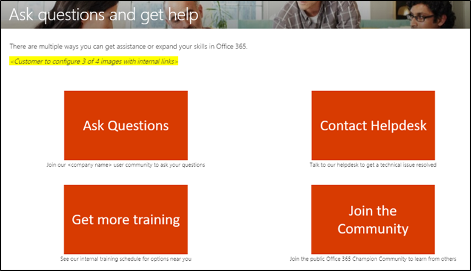
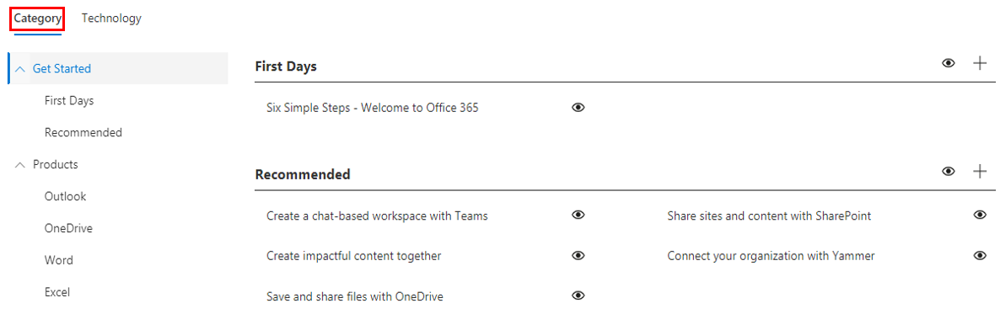

# Personalizar a experiência de treinamento

Este é um teste quatro. Por padrão, tanto a experiência do site quanto a Web Part incluem conteúdo para todos os Office 365 e Windows 10 serviços.  Se apenas todos ou alguns desses serviços estão disponíveis em sua empresa, você pode ajustar qual conteúdo está disponível para seus usuários.  

Há vários tipos de personalizações disponíveis para os proprietários deste site. 

- [Personalizar páginas da Web](#customizing-web-pages)
- [Personalizar serviços disponíveis](#customize-available-services)
- [Personalizar e compartilhar playlists](customplaylist.md)

Algumas ou todas essas personalizações podem ser concluídas antes de iniciar o site para sua comunidade de usuários.  

> [!TIP]
> Reúna comentários de seus funcionários e conclua periodicamente personalizações adicionais.  Adicionar playlists, páginas da Web de destino a funções específicas ou ativar novo conteúdo de treinamento ao iniciar novos serviços. 

## Personalização de páginas da Web

Você pode personalizar totalmente o site personalizado Learning site. Se você não estiver familiarizado com a criação de páginas em sites SharePoint online modernos, sugerimos que você revise Personalizar seu artigo SharePoint [site](https://support.office.com/article/customize-your-sharepoint-site-320b43e5-b047-4fda-8381-f61e8ac7f59b) no support.office.com. 

### Personalizar a **página Fazer Perguntas e** Obter Ajuda

Como ponto de partida para personalizar o site, selecione Fazer perguntas e obter ajuda na barra de menus, clique no botão Editar SharePoint e altere as imagens e os links. 

## Personalizar serviços disponíveis

1.  Navegue até a página Administração de Learning personalizada na página administrador 
1. Selecione **Tecnologia** para ver a lista completa de serviços incluídos na solução
1. Selecione uma tecnologia e **clique no símbolo dos olhos** para ocultar esse conteúdo.  Clique no símbolo dos olhos novamente para mostrar o conteúdo dentro da experiência. 

O mesmo processo pode ser repetido para categorias de playlists dentro da experiência.  Basta selecionar a opção Categoria para mostrar/ocultar playlists. 

### Próximas etapas

- [Personalizar e compartilhar playlists](customplaylist.md)
- [Adoção da Unidade](driveadoption.md) 
