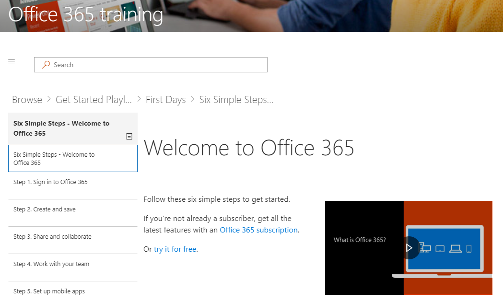

# Personalizar a experiência de treinamentoCustomize the Training Experience

Por padrão a experiência de site e a Web Part de incluem conteúdo para todos os serviços do Office 365.  Se apenas a todos ou alguns desses serviços estão disponíveis na sua empresa, você pode ajustar o conteúdo que está disponível para os usuários.By default both the site experience and the webpart include content for all Office 365 services.  If only all or some of these services are available in your company you can adjust what content is available to your users.  

Primeiro, podemos personalizará o conteúdo disponível a Web Part em si.  Essa informação é aplicável a uma instalação de Web Part sozinho stand ou usando a Web Part dentro da experiência de site de aprendizado de sinalizador.First we will customize the content available in the webpart itself.  This information is applicable to a stand alone webpart installation or using the webpart inside of the Custom Learning site experience. 

## Personalizando o conteúdo de treinamentoCustomizing the training content

Vá para iniciar com seis etapas de simplesGo to Start with six simple steps
- Na Home page, clique em Iniciar com seis etapas simples.From the Home page, click Start with six simple steps. 
- Você verá a página de treinamento do Office com a web part de aprendizado personalizado roteada para o início com a lista de reprodução seis etapas simples.You see the Office Training page with the Custom Learning web part routed to the Start with six simple steps playlist.  

