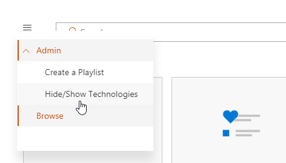
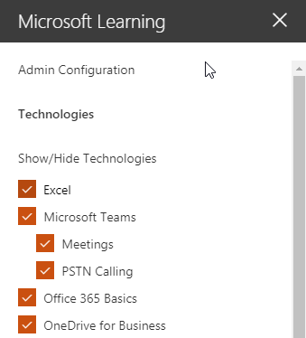
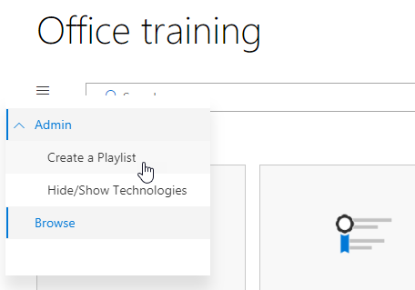
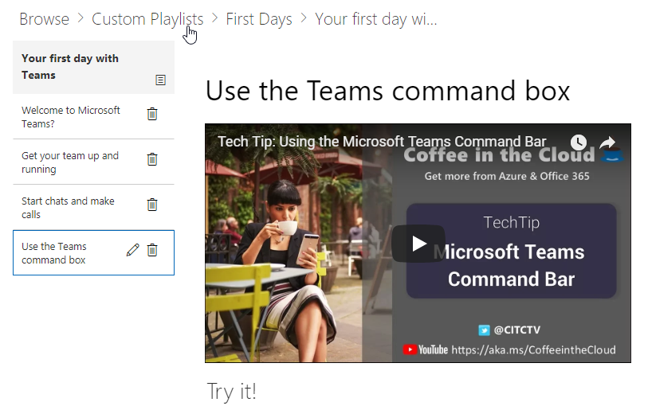

# Personalizar os serviços e as listas de reprodução

Por padrão a experiência de site e a Web Part de incluem conteúdo para todos os serviços do Office 365.  Se apenas a todos ou alguns desses serviços estão disponíveis na sua empresa, você pode ajustar o conteúdo que está disponível para os usuários.  Neste artigo, nós irá personalizar o conteúdo de Web Part.  

## Personalizando o conteúdo de Web Part

A Web Part de aprendizado personalizado oferece dois recursos cruciais:
- Mostrar/ocultar tecnologias
- Criar uma lista de reprodução

### Ocultar ou Mostrar categorias de tecnologia

Para ocultar e Mostrar conteúdo na Web part: 
1.  Clique no menu suspenso em que a Web Part e clique em Mostrar/ocultar tecnologias

2. Selecione um checkox para ocultar ou mostrar uma tecnologia e selecione **Aplicar**.

### Criar uma lista de reprodução

Uma lista de reprodução é um compliation de "ativos". Um "ativo" é uma página do SharePoint ou o item existente do conteúdo de treinamento do Microsoft. Quando você cria uma lista de reprodução você selecionar ativos que vá juntos para criar um plano de aprendizado para o usuário.  

O benefício da adição de páginas do SharePoint é que você pode criar páginas do SharePoint com um YouTube vídeos ou vídeos hospedados em sua organização. Você também pode criar páginas com formulários ou outros conteúdos do Office 365.  

#### Etapa 1: Criar uma página do SharePoint para sua lista de reprodução
Neste exemplo, vamos primeiro criar uma página do SharePoint para adicionar à lista de reprodução. Criaremos uma página com um YouTube vídeo de web part e a web part de texto.  Estas instruções pressupõem que você estiver usando o serviço do SharePoint Online. 

#### Criar uma nova página
1.  Selecione as configurações menu gt _ conteúdos do Site gt _ páginas do Site gt _ Novo gt _ página do Site.
2.  Na área de título, digite Use a caixa de comando de equipes
3.  Selecione Adicionar uma nova seção e, em seguida, selecione duas colunas.

4.  Na caixa à esquerda, selecione Adicionar uma nova web part e selecione Embed. 
5.  Em um navegador da Web, vá para essa URL https://youtu.be/wYrRCRphrp0 e obtenha o código de inserção para o vídeo. 
6.  Na parte da Web do SharePoint, selecione Adicionar incorporar código e cole-o na caixa Embed. 
7.  Na caixa direita, selecione Adicionar uma nova web part e, em seguida, selecione o texto. 
8.  Em um navegador da Web, vá para esta URL: https://support.office.com/en-us/article/13c4e429-7324-4886-b377-5dbed539193b e copie o bloco Try-lo! As instruções da página e colá-los em texto Web part. Sua página deve se parecer com o seguinte. 

9.  Clique em Publicar e, em seguida, copie a URL da página e cole-o no bloco de notas

#### Etapa 2: Criar a lista de reprodução
1.  Navegue até onde você instalou a Web Part de aprendizado personalizado. Na experiência completa do site está hospedado na página de treinamento do Office 365. 
2.  No menu suspenso, selecione Criar nova lista de reprodução. 

3.  Preencha os valores, conforme mostrado no exemplo a seguir e selecione **criar**. 

#### Etapa 3: Adicionar ativos à lista de reprodução
Nesta etapa, você adicionará ativos existentes da Microsoft e a página do SharePoint que você criou na lista de reprodução. 

1.  Clique no botão menu, clique em Adicionar ativo existente.

2.  Filtrar treinamento do Office 365 Apps gt _ equipes da Microsoft
3.  Adicionar bem-vindo ao Microsoft Teams, obter sua equipe em funcionamento e iniciar bate-papos e fazer chamadas.
4.  Selecione o de botão gt menu _ criar ativos.
5.  Tipo Use a caixa de comando de equipes na caixa Título ativos. 
6.  Cole o uso do SharePoint a URL da página equipes comando caixa você copiou no campo conteúdo ativo. 
7.  Agora navegue de volta para gt _ a Home Page gt _ listas de reprodução de sinalizador seu primeiro dias com gt _ de equipes usam a caixa de comando de equipes. Sua página deve se parecer com o seguinte. 

Sua lista de reprodução com esse conteúdo agora estará disponível em qualquer lugar você tiver instalado / incorporada a Web Part de aprendizado personalizado. 

#### Coisas a pense sobre

Listas de reprodução personalizadas podem ser usadas para ajudar seus usuários finais em um vareity de tarefas.  Você tem uma formulário de solicitação de folga?  Um formulário para solicitar o equipamento de hardware?  Qualquer ativos de treinamento existentes podem ser programados para a experiência.  
