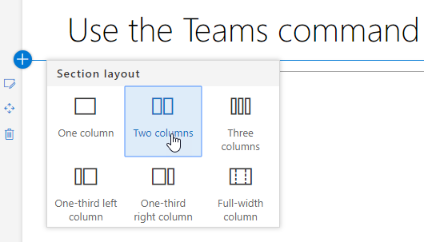
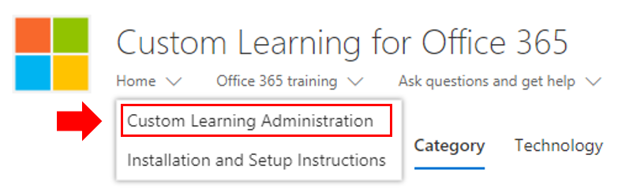
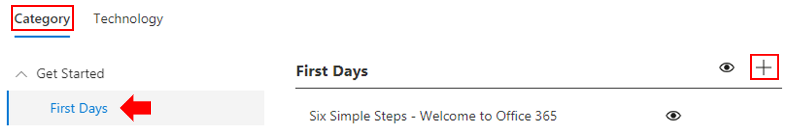
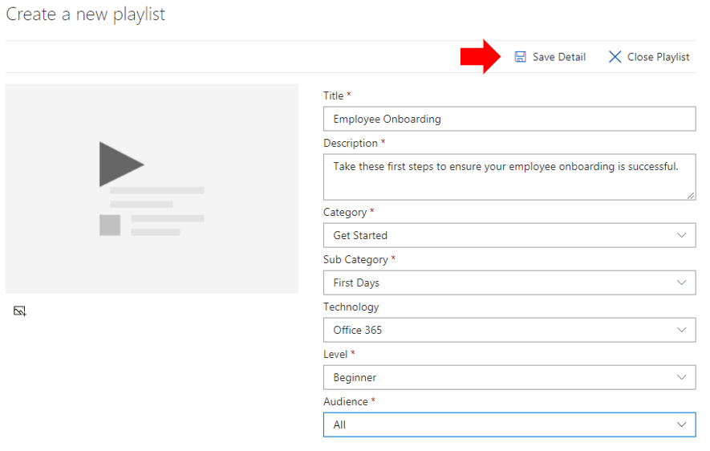
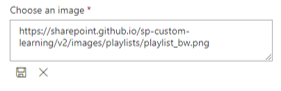
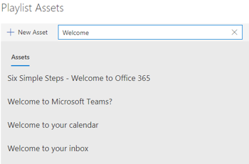
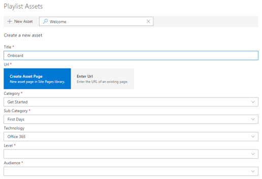

# Personalizar e compartilhar listas de reprodução

## Criar uma lista de reprodução

Uma lista de reprodução é uma compliation de "ativos". Um "ativo" é uma página do SharePoint ou um item existente de conteúdo de treinamento da Microsoft. Ao criar uma lista de reprodução, você seleciona ativos que se unem para criar um caminho de aprendizado para o usuário.  

O benefício de adicionar páginas do SharePoint é que você pode criar páginas do SharePoint com vídeos ou vídeos do YouTube hospedados na sua organização. Você também pode criar páginas com formulários ou outros conteúdos do Office 365.  

#### Etapa 1: criar uma página do SharePoint para sua lista de reprodução
Neste exemplo, primeiro criaremos uma página do SharePoint para adicionar à lista de reprodução. Criaremos uma página com uma Web Part de vídeo e texto do YouTube.  Estas instruções pressupõem que você esteja usando o serviço do SharePoint Online. 

#### Criar uma nova página
1.  Selecione o menu configurações > conteúdo do site > páginas do site > nova página do site do >.
2.  Na área título, digite usar a caixa de comando Teams
3.  Selecione a seção adicionar uma nova e, em seguida, selecione duas colunas.

4.  Na caixa à esquerda, selecione Adicionar uma nova Web Part e, em seguida, selecione incorporar. 
5.  Em um navegador da Web, acesse esta https://youtu.be/wYrRCRphrp0 URL e obtenha o código de inserção para o vídeo. 
6.  Na Web Part do SharePoint, selecione Adicionar código incorporado e cole-o na caixa incorporar. 
7.  Na caixa à direita, selecione Adicionar uma nova Web Part e, em seguida, selecione texto. 
8.  Em um navegador da Web, acesse esta URL https://support.office.com/en-us/article/13c4e429-7324-4886-b377-5dbed539193b : e copie o teste try! Instruções da página e cole-as na Web Part de texto. A página deve ter a seguinte aparência. 

9.  Clique em **publicar**e copie o URL da página e cole-o no bloco de notas

#### Etapa 2: criar a lista de reprodução

1. Navegue até a página de **Administração de aprendizado personalizada** em sua experiência de site. 
1. Certifique-se de que **categoria** esteja selecionada 
1. Clique na categoria onde você deseja que sua nova lista de reprodução seja exibida
1. Ao lado do nome da categoria, clique no símbolo 

1. Preencha os valores conforme mostrado no exemplo abaixo e selecione **criar**. 
- **Título** – nome de exibição da lista de reprodução
- **Descrição** -informações sobre o que será aprendido
- **Categoria** : selecionada com base na seleção inicial
- **Subcategoria** -selecionada com base na seleção inicial
- **Tecnologia** -selecione conforme aplicável
- **Level** -iniciante, intermidate ou avançado
- **Público** -alvo-permite direcionar o conteúdo com base em uma lista predefinida de funções fornecidas pela Microsoft.

6. Clique em **salvar detalhe**

> [!TIP]
> Você pode personalizar a imagem do ícone da sua lista de reprodução.  Clique no ícone de imagem e insira uma URL de uma imagem previamente carregada.  Verifique se a imagem está localizada dentro do conjunto de sites de aprendizado personalizado ou em outro local em que todos os usuários terão acesso ao arquivo.  

#### Etapa 3: Adicionar ativos à lista de reprodução
Nesta etapa, você adicionará ativos existentes da Microsoft e da página do SharePoint que você criou na lista de reprodução. 

1. Depois de salvar os detalhes da sua lista de reprodução, você poderá usar a pesquisa de ativos existentes.
1. **Insira em qualquer termo de pesquisa** para ver uma lista de ativos predefinidos que estão disponíveis a partir de outras listas de reprodução. **Clique no nome** de um ativo para incluí-lo em sua nova lista de reprodução. 

Você também pode adicionar a página do SharePoint que você criou anteriormente ou criar uma desde o início da experiência.

1. Clique na opção **novo ativo** da caixa de diálogo ativos da playlist
1. Dê um **título**ao seu ativo. Depois de inseridas, as opções 
1. Agora você pode criar uma nova página de ativo no SharePoint Online ou inserir a URL de uma página existente para adicioná-la à sua lista de reprodução personalizada. 
1. Os campos **categoria**, subcategoria e **tecnologia** serão preenchidos previamente com base em suas seleções anteriores para esta lista de reprodução. ****
1. Faça as seleções apropriadas para o nível e o público-alvo desse ativo individual.  
1. Clique em **salvar ativo** para adicioná-lo à playlist personalizada
1. Repita essas etapas, pesquisando ou adicionando páginas individuais até que a lista de reprodução esteja concluída. 
1. Clique em **fechar playlist** para salvar

A sua lista de reprodução com esse conteúdo estará disponível em qualquer lugar em que você instalou/incorporou a Web Part de aprendizado personalizada. 

> [!NOTE]
> Se você cometer um erro depois de fechar a lista de reprodução, você pode excluí-la da categoria clicando no X ao lado do nome da lista de reprodução.  

#### Coisas a considerar

As listas de reprodução personalizadas podem ser usadas para ajudar os usuários finais em várias tarefas.  Você tem um formulário de solicitação de folga?  Um formulário para solicitar equipamento de hardware?  Qualquer ativo de treinamento existente pode ser programado para a experiência.  

## Compartilhar listas de reprodução

1. Navegar para qualquer lista de reprodução dentro da Web Part ou experiência do site
1. No canto superior esquerdo, você verá três ícones
1. Clique no ícone que representa um link
1. Copiar a URL para a lista de reprodução

 essa URL agora pode ser inserida na sua navegação no site ou utilizada em outras comunicações para levar seus funcionários diretamente para essa lista de reprodução. 

### Próximas etapas- [adoção](driveadoption.md) de drives
