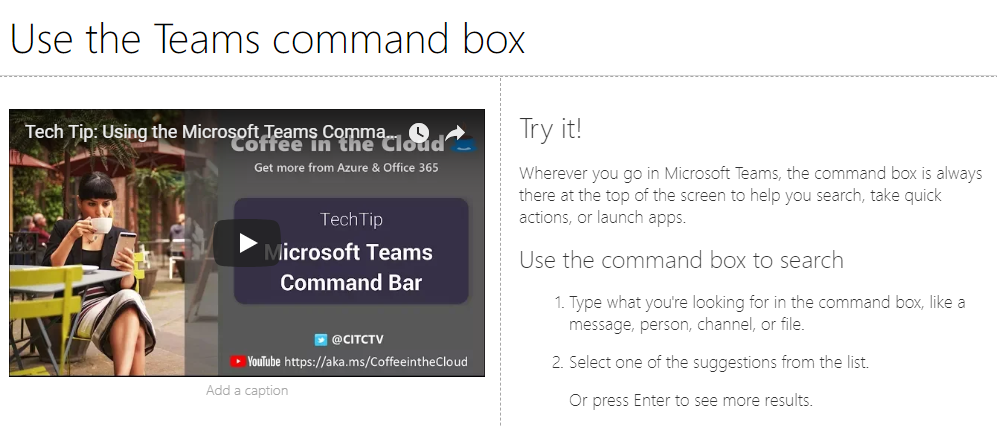

# Personalizar e compartilhar playlists

## Criar uma playlist

Uma playlist é uma compilação de "assets". Um "ativo" é uma página SharePoint ou item existente do conteúdo de treinamento da Microsoft. Ao criar uma playlist, você seleciona ativos que se juntam para criar um caminho de aprendizado para o usuário.  

O benefício de adicionar SharePoint páginas é que você pode criar páginas SharePoint com vídeos ou vídeos do YouTube hospedados em sua organização. Você também pode criar páginas com Formulários ou outros Office 365 conteúdo.  

#### Etapa 1: Criar uma página SharePoint para sua playlist
Neste exemplo, primeiro criaremos uma página SharePoint para adicionar à playlist. Criaremos uma página com uma Web Part de vídeo do YouTube e Uma Web Part text.  Estas instruções pressuem que você está usando o serviço SharePoint Online. 

#### Criar uma página
1.  Selecione o Configurações menu > Conteúdo do Site > Páginas do Site > Página > Site Novo.
2.  Na área título, digite Usar a caixa de Teams comando
3.  Selecione a seção Adicionar uma nova e selecione Duas Colunas.

    

4.  Na caixa à esquerda, selecione Adicionar uma nova Web Part e selecione Incorporar. 
5.  Em um navegador da Web, vá até essa URL e receba o código https://youtu.be/wYrRCRphrp0 de incorporar do vídeo. 
6.  Na web part SharePoint, selecione Adicionar código incorporar e, em seguida, colar-o na caixa Incorporar. 
7.  Na caixa à direita, selecione Adicionar uma nova Web Part e selecione Texto. 
8.  Em um navegador da Web, acesse esta URL: https://support.office.com/article/13c4e429-7324-4886-b377-5dbed539193b e copie o Try it! Instruções da página e colar-as na Web Part texto. Sua página deve ter a seguinte aparência. 
   
9.  Clique **em** Publicar e, em seguida, copie a URL da página e a colar em Bloco de notas

#### Etapa 2: Criar a playlist

1. Navegue até **a página Administração Learning personalizado** em sua experiência de site.
   
1. Certifique-se **de que Category** está selecionado 
1. Clique na categoria na qual você gostaria que sua nova playlist fosse exibida
1. Ao lado do nome da categoria, clique no símbolo de adição 

1. Preencha os valores conforme mostrado no exemplo abaixo e selecione **Criar**. 
  
- **Título** - Nome de exibição da playlist
- **Descrição** - Informações sobre o que será aprendido
- **Categoria** - Pré-selecionado com base em sua seleção inicial
- **Sub Category** - Pré-selecionado com base em sua seleção inicial
- **Tecnologia** - Selecione conforme aplicável
- **Nível** - Iniciante, Intermediário ou Avançado
- **Público-** Isso permite direcionar conteúdo com base em uma lista pré-definida de funções fornecidas pela Microsoft.

6. Clique **em Salvar Detalhes**

> [!TIP]
> Você pode personalizar a imagem do ícone da sua playlist.  Clique no ícone da imagem e insira uma URL de uma imagem carregada anteriormente.  Certifique-se de que a imagem está localizada no conjunto Learning site personalizado ou em outro local que todos os usuários terão acesso ao arquivo.  

#### Etapa 3: Adicionar ativos à playlist
Nesta etapa, você adicionará ativos existentes da Microsoft e a página SharePoint que você criou à playlist. 

1. Depois de salvar os detalhes da playlist, você pode usar a Pesquisa de Ativos Existentes.
1. **Insira em qualquer termo de pesquisa** para ver uma lista de ativos predefinidos que estão disponíveis em outras listas de reprodução. **Clique no nome de** um ativo para incluí-lo em sua nova playlist.

    

Você também pode adicionar a página SharePoint criada anteriormente ou criar uma do zero na experiência.

1. Clique na opção **Novo Ativo** na caixa de diálogo Ativos de Playlist
1. Dê a seu ativo um **Título**. Depois de inserido, opções adicionais exibirão 
1. Agora você pode criar uma nova página de ativos no SharePoint Online ou inserir a URL de uma página existente para adicioná-la à sua playlist personalizada. 
1. **Os** campos Categoria **, Sub** Categoria e **Tecnologia** serão pré-preenchidos com base em suas seleções anteriores para esta playlist.
1. Faça as seleções apropriadas para Nível e Audiência para esse ativo individual.  
1. Clique **em Salvar Ativo** para adicioná-lo à playlist personalizada
1. Repita estas etapas, pesquisando ou adicionando páginas individuais, até que sua playlist seja concluída. 
1. Clique **em Fechar Playlist** para salvar

Sua playlist com esse conteúdo agora estará disponível em qualquer lugar em que você instalou/insiou a Web Part Learning Custom. 

> [!NOTE]
> Se você cometer um erro depois de fechar a playlist, poderá excluí-la da categoria clicando no X ao lado do nome da playlist.  

#### Coisas para pensar

Listas de reprodução personalizadas podem ser usadas para ajudar os usuários finais em várias tarefas.  Você tem um formulário de solicitação de tempo de folga?  Um formulário para solicitar equipamento de hardware?  Todos os ativos de treinamento existentes podem ser programados na experiência.  

## Compartilhar Playlists

1. Navegue até qualquer playlist dentro da web part ou experiência do site
1. No canto superior esquerdo, você verá três ícones
1. Clique no ícone que representa um link
1. Copie a URL para a playlist

    diretamente para essa playlist. 

### Próximas etapas - [Impulsionar a adoção](driveadoption.md)
