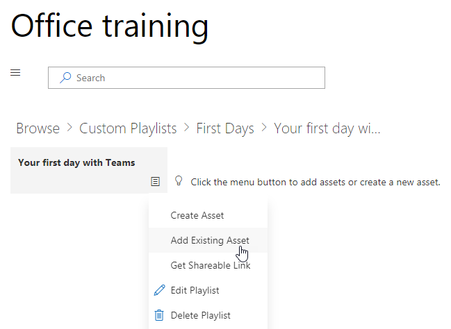

# Personalizar os serviços e as listas de reproduçãoCustomize the Services and Playlists

Por padrão a experiência de site e a Web Part de incluem conteúdo para todos os serviços do Office 365.  Se apenas a todos ou alguns desses serviços estão disponíveis na sua empresa, você pode ajustar o conteúdo que está disponível para os usuários.  Neste artigo, nós irá personalizar o conteúdo de Web Part.By default both the site experience and the webpart include content for all Office 365 services.  If only all or some of these services are available in your company you can adjust what content is available to your users.  In this article we will customize the webpart content.  

## Personalizando o conteúdo de Web PartCustomizing the webpart content

A Web Part de aprendizado personalizado oferece dois recursos cruciais:The Custom Learning webpart provides two key features:
- Mostrar/ocultar tecnologiasHide/Show Technologies
- Criar uma lista de reproduçãoCreate a Playlist

### Ocultar ou Mostrar categorias de tecnologiaHide or Show Technology Categories

Para ocultar e Mostrar conteúdo na Web part:To hide and show content in the Web part: 
1.  Clique no menu suspenso em que a Web Part e clique em Mostrar/ocultar tecnologiasClick the dropdown menu on the webpart, then click Hide/Show Technologies

2. Selecione um checkox para ocultar ou mostrar uma tecnologia e selecione **Aplicar**.Select a checkox to hide or show a technology and select **Apply**.

### Criar uma lista de reproduçãoCreate a Playlist

Uma lista de reprodução é um compliation de "ativos". Um "ativo" é uma página do SharePoint ou o item existente do conteúdo de treinamento do Microsoft. Quando você cria uma lista de reprodução você selecionar ativos que vá juntos para criar um plano de aprendizado para o usuário.A playlist is a compliation of "assets". An "asset" is a SharePoint page or existing item of Microsoft training content. When you create a playlist you select assets that go together to create a learning path for your user.  

O benefício da adição de páginas do SharePoint é que você pode criar páginas do SharePoint com um YouTube vídeos ou vídeos hospedados em sua organização. Você também pode criar páginas com formulários ou outros conteúdos do Office 365.The benefit of adding SharePoint pages is that you can create SharePoint pages with a YouTube videos or videos hosted in your organization. You can also create pages with Forms or other Office 365 content.  

#### Etapa 1: Criar uma página do SharePoint para sua lista de reproduçãoStep 1: Create a SharePoint page for your playlist
Neste exemplo, vamos primeiro criar uma página do SharePoint para adicionar à lista de reprodução. Criaremos uma página com um YouTube vídeo de web part e a web part de texto.  Estas instruções pressupõem que você estiver usando o serviço do SharePoint Online.In this example, we’ll first create a SharePoint page to add to the playlist. We’ll create a page with a YouTube video web part and Text web part.  These instructions assume you are using the SharePoint Online service. 

#### Criar uma nova páginaCreate a new page
1.  Selecione as configurações menu gt _ conteúdos do Site gt _ páginas do Site gt _ Novo gt _ página do Site.Select the Settings menu > Site Contents > Site Pages > New > Site Page.
2.  Na área de título, digite Use a caixa de comando de equipesIn the title area, type Use the Teams command box
3.  Selecione Adicionar uma nova seção e, em seguida, selecione duas colunas.Select the Add a new section, and then select Two Columns.

4.  Na caixa à esquerda, selecione Adicionar uma nova web part e selecione Embed.In the left-hand box, select Add a new web part, and then select Embed. 
5.  Em um navegador da Web, vá para essa URL https://youtu.be/wYrRCRphrp0 e obtenha o código de inserção para o vídeo.In a Web browser, go to this URL https://youtu.be/wYrRCRphrp0 and get the embed code for the video. 
6.  Na parte da Web do SharePoint, selecione Adicionar incorporar código e cole-o na caixa Embed.In the SharePoint Web part, select Add Embed code and then paste it into the Embed box. 
7.  Na caixa direita, selecione Adicionar uma nova web part e, em seguida, selecione o texto.In the right-hand box, select Add a new web part, and then select Text. 
8.  Em um navegador da Web, vá para esta URL: https://support.office.com/en-us/article/13c4e429-7324-4886-b377-5dbed539193b e copie o bloco Try-lo! As instruções da página e colá-los em texto Web part. Sua página deve se parecer com o seguinte.In a Web browser, go to this URL: https://support.office.com/en-us/article/13c4e429-7324-4886-b377-5dbed539193b and copy the Try it! Instructions from the page and paste them into the Text Web part. Your page should look like the following. 

9.  Clique em Publicar e, em seguida, copie a URL da página e cole-o no bloco de notasClick Publish, and then copy the URL of the page and paste it in Notepad

#### Etapa 2: Criar a lista de reproduçãoStep 2: Create the Playlist
1.  Navegue até onde você instalou a Web Part de aprendizado personalizado. Na experiência completa do site está hospedado na página de treinamento do Office 365.Navigate to where you have installed the Custom Learning webpart. In the full site experience it is hosted on the Office 365 training page. 
2.  No menu suspenso, selecione Criar nova lista de reprodução.From the dropdown menu select Create New Playlist. 

3.  Preencha os valores, conforme mostrado no exemplo a seguir e selecione **criar**.Fill in the values as shown in the example below and select **Create**. 

#### Etapa 3: Adicionar ativos à lista de reproduçãoStep 3: Add assets to the playlist
Nesta etapa, você adicionará ativos existentes da Microsoft e a página do SharePoint que você criou na lista de reprodução.In this step, you’ll add existing assets from Microsoft and the SharePoint page you created to the playlist. 

1.  Clique no botão menu, clique em Adicionar ativo existente.Click the menu button, then click Add Existing Asset.

2.  Filtrar treinamento do Office 365 Apps gt _ equipes da MicrosoftFilter on Office 365 Apps > Microsoft Teams Training
3.  Adicionar bem-vindo ao Microsoft Teams, obter sua equipe em funcionamento e iniciar bate-papos e fazer chamadas.Add Welcome to Microsoft Teams, Get your team up and running, and Start chats and make calls.
4.  Selecione o de botão gt menu _ criar ativos.Select the menu button > Create Asset.
5.  Tipo Use a caixa de comando de equipes na caixa Título ativos.Type Use the Teams command box in the Asset title box. 
6.  Cole o uso do SharePoint a URL da página equipes comando caixa você copiou no campo conteúdo ativo.Paste the SharePoint Use the Teams command box page URL you copied in the Asset content field. 
7.  Agora navegue de volta para gt _ a Home Page gt _ listas de reprodução de sinalizador seu primeiro dias com gt _ de equipes usam a caixa de comando de equipes. Sua página deve se parecer com o seguinte.Now navigate back to the Home Page > Custom Playlists > Your first days with Teams > Use the Teams command box. Your page should look like the following. 

Sua lista de reprodução com esse conteúdo agora estará disponível em qualquer lugar você tiver instalado / incorporada a Web Part de aprendizado personalizado.Your playlist with this content will now be available anywhere you have installed / embedded the Custom Learning webpart. 

#### Coisas a pense sobreThings to Think About

Listas de reprodução personalizadas podem ser usadas para ajudar seus usuários finais em um vareity de tarefas.  Você tem uma formulário de solicitação de folga?  Um formulário para solicitar o equipamento de hardware?  Qualquer ativos de treinamento existentes podem ser programados para a experiência.Custom playlists can be used to assist your end users in a vareity of tasks.  Do you have a time off request form?  A form to request hardware equipment?  Any existing training assets can be programmed into the experience.  
